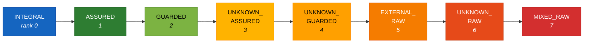

---
tags:
  - architect
  - specification
---

# Wardline: An As-Built Specification

!!! info "Wardline as-built specification"
    This is the full as-built specification (Part I), describing wardline v1.5.0 as it ships — the trust lattice, the boundary declarations, the rule catalogue, the gate semantics, and the verification properties. For the practitioner reference (installation, decorators, `weft.toml`, the command surface, suppression file formats) see the [Python reference](python-binding.md). For a short orientation, see the [Wardline overview](index.md). The complete companion document is also available as a [PDF](../pdf/wardline-companion-community.pdf).

*Semantic Trust-Boundary Enforcement*

**Date:** 8 August 2026
**Status:** DRAFT v1.0.0-draft — as-built
**Describes:** wardline v1.5.0 (plus current `release/1.5.0` branch behaviour, marked where it applies)
**Prepared by:** John Morrissey
**Document type:** As-built specification of a shipped static analyser — trust lattice, boundary declarations, rule catalogue, gate semantics, and verification properties
**Parent paper:** *Semantic Defects in AI-Generated Code: Assurance Frameworks for AI-Assisted Development in High-Stakes Code Paths*
**Implementation:** `wardline` on PyPI; repository `foundryside-dev/wardline`. Pure Python, `requires-python >= 3.12`, zero-dependency base package.
**Language frontends:** Python (full analyser), Rust (preview — command-injection slice)

---

## Version history

This table versions *the document*. Document versions and implementation versions are unrelated and unfortunately overlap — the specification had a 0.2.0 and so did the tool, about ten weeks apart and with nothing to do with each other. Implementation releases are dated in the growth arc below.

| Document version | Date | Status | Nature |
|---|---|---|---|
| 0.2.0 | 18 Mar 2026 | Superseded — archived 8 Aug 2026 | Designed specification, written before any implementation existed: four-tier authority model, eight-state machine, eight pattern rules, seventeen annotation groups, governed exception register, conformance profiles, Python and Java bindings. |
| 1.0.0-draft | 8 Aug 2026 | Current | As-built rewrite. Describes the implementation that exists, records what was designed and never built, and drops what the implementation did not need. |

The 0.2.0 documents are retained in the repository archive and are referred to throughout as *the designed specification (archived)*. They are cited as a record of design intent only. They are never evidence of behaviour: where this document and the archive disagree, the implementation governs, and where this document and the implementation disagree, the implementation governs.

---

## Designed, built, grown

The designed specification was written before a line of the tool existed. It reasoned from a four-tier authority model outward: tiers, then an eight-state enforcement machine, then eight pattern rules, then a governed exception register with reviewer identity and temporal separation, then conformance profiles for a multi-tool ecosystem that had no tools in it. It specified a manifest format, a cross-language taint propagation contract, a type-system enforcement layer, and a runtime structural layer. It was, in the author's own later assessment, a monument to complexity — internally coherent, externally unbuilt, and sized for an organisation rather than a repository.

What was built began as a deliberate retreat. Version 0.1.0 shipped on 30 May 2026 — ten weeks after the designed specification was dated — and it was small: the taint engine and trust lattice, decorator-based trust markers, **four** rules (`PY-WL-101` through `104`), JSONL and SARIF output, baselines and waivers with expiry, and, from day one rather than as later growth, the opt-in LLM triage judge. No manifest of trust topology, no governance register, no conformance scheme, no Java.

It then grew organically rather than by specification. Fourteen further releases between 30 May and 31 July 2026 — nine weeks, fifteen entries in the changelog counting 0.1.0 itself, with no 1.0.0 and no 1.4.0 — took it to v1.5.0: four rules became twenty-eight, and the tool acquired an MCP server, an agent-install command, a Rust preview frontend, trust-grammar packs, attestation and rekeying, FastAPI and Pydantic source coverage, and a steady progression of enforcement-honesty controls. The current `release/1.5.0` branch carries two more that no release has: a second judge transport and the inertness gate described in §3.1. The growth was driven by defects found in real code and by what the analyser could be made to prove, not by working through the designed backlog. Roughly half the rule set that exists today — deserialisation, dynamic execution, path traversal, SSRF, SQL injection, XXE, template injection, native-library loading — is classic sink analysis the designed specification never imagined, arrived at because the engine that tracked trust across boundaries turned out to be the same engine that tracks untrusted data into sinks. **The whole implementation is about ten weeks old**, and maturity claims anywhere in this document should be read against that.

Some of the design survived intact: the eight-state lattice is the designed §5.1 state machine, renamed and shipped. Some of it was implemented, measured, and *falsified* — the designed join algebra ran in production, produced false positives on correct code, and was replaced by a simpler operator, with a dated audit and an architecture decision record as the account (§4.3). And some of it did not survive at all: the governed exception register, the type-system and runtime enforcement layers, the trusted restoration boundaries, the conformance profiles, and the flagship `.get()`-default rule the parent paper leads with. Those are not quietly dropped. They are inventoried in §10 with their original intent recorded, because several remain worth building and none should be mistaken for shipped behaviour.

The pattern across all of it is worth stating in one line, because it is the most useful thing this rewrite has to say to anyone writing a specification ahead of an implementation. **The designed specification was a good threat model and a poor implementation plan.** Its threat identification survived almost entirely — manifest poisoning, coverage blindness leading to a green gate over nothing, governance fatigue, exception sprawl, and the evasion trajectory were all real, and all of them got answered. Its mechanism design survived almost nowhere. And in every case where a threat was answered, the built answer was a *mechanical* control where the specification had proposed a *procedural* one: two-person review of a manifest became caller-granted trust packs (§5); governance capacity planning became a CI test that fails when the waiver count outgrows the rule count (§8); coverage ratio reporting became a fail-closed inertness trip (§3.1). Cheaper, narrower, and enforced by the toolchain rather than by an organisation that has to keep caring.

The bar for this document is simple and enforceable: a reader who opens the repository must find every claim in it true.

---

## How to read this document

This document has two parts: Part I (this specification) and [Part II](python-binding.md) (a Python practitioner reference derived from the implementation). There is no Java binding — no Java implementation exists, and none is planned.

**Adopters** (putting wardline on a project)
→ §1 (what it is), §2 (the problem), §3 (non-goals — read this before adopting), §5 (declarations and trust grants), §7 (gates and suppression) → [Part II-A](python-binding.md) (install, decorators, configuration, CLI).

**Reviewers and assessors** (evaluating a wardline deployment)
→ §3 (non-goals), §4 (the trust lattice), §6 (rules and severity), §7 (gate, suppression channels, the "no governance" design position), §8 (verification properties), §9 (residual risks).

**Tool and frontend implementers**
→ §4 (lattice, operators, reachability invariant), §6 (rule catalogue and severity model), §11 (frontend registry and how a new language plugs in).

**Readers of the parent paper** (arriving with four-tier authority vocabulary)
→ §4.5 maps the four tiers onto the implemented lattice states. Read that first, then §6. The coding-posture and authority-collapse material that the designed specification carried is parent-paper doctrine and is not restated here; see *Semantic Defects in AI-Generated Code* (§5).

**Anyone deciding whether to trust this document**
→ §8 (how the implementation's claims are verified: labelled corpus, false-positive rate gate, sentinels, byte-identity goldens, self-hosting CI) and §10 (what was designed and never built).

---

## Contents

**Part I — Wardline: An As-Built Specification**

1. [What a Wardline is](#1-what-a-wardline-is)
2. [The problem a Wardline solves](#2-the-problem-a-wardline-solves)
3. [Non-goals](#3-non-goals)
4. [The trust lattice](#4-the-trust-lattice)
5. [Declarations and trust grants](#5-declarations-and-trust-grants)
6. [Rules and severity](#6-rules-and-severity)
7. [Gates, suppression, and the judge](#7-gates-suppression-and-the-judge)
8. [Verification properties](#8-verification-properties)
9. [Residual risks](#9-residual-risks)
10. [Roadmap: the unbuilt](#10-roadmap-the-unbuilt)
11. [Language frontends](#11-language-frontends)

**Part II — Practitioner Reference**

A. [Python reference](python-binding.md)

---
## 1. What a Wardline is

A wardline is the set of declarations an application makes about where its trust boundaries are — which functions take untrusted data in, which functions raise trust by validating it, and which functions are entitled to assume they are working on trusted data. Everything else in this specification follows from those declarations: the lattice (§4) is what a declaration assigns, the rules (§6) are what a declaration makes checkable, and the gate (§7) is what a declaration makes enforceable.

The declarations live in the source, on the functions they describe, as three decorators (§5). There is no manifest. The implementation requires no project-level policy file to scan a codebase; configuration under `weft.toml [wardline]` is optional and, where it names trust-extending packs, is subordinate to what the caller grants at the command line (§5). This is a deliberate reversal of the designed specification (archived), which made a root `wardline.yaml` manifest the primary artefact and the annotations a secondary binding. A `wardline.yaml` does exist in the implementation's own repository root, and it is worth knowing what it is not: roughly a hundred bytes of federation endpoint URLs for the surrounding tool suite, carrying no policy, no boundary declarations, and no trust topology. (Early releases did use a `wardline.yaml` as the tool's own configuration file before that moved to `weft.toml [wardline]`; a reader who finds it in the changelog should not mistake it for the designed manifest either. It configured the scanner. It never declared a trust topology.) The designed manifest schema was never built.

The consequence of putting the declarations in the source is that a wardline is not a document about a codebase; it is a property of one. It cannot drift from the code it describes without the drift being a code change, visible in the same diff and reviewed by the same reviewer.

**Normative language.** This specification uses MUST, MUST NOT, SHALL, SHALL NOT, SHOULD, SHOULD NOT, MAY, REQUIRED, RECOMMENDED, and OPTIONAL as defined in RFC 2119 and clarified in RFC 8174. Because this is an as-built document, most of it is indicative: it describes what the implementation does, in the present tense, and those passages carry no normative force. Uppercase keywords appear only where the text states a contract the implementation is committed to holding — an invariant a frontend, a pack, or a downstream consumer may rely on. Lowercase equivalents describe expected behaviour of user code under enforcement, not requirements on implementations.

### 1.1 Terms and definitions

The following terms carry specific meaning in this document. Where a term is used in its everyday sense it appears in lowercase without emphasis.

| Term | Definition |
|---|---|
| **Taint state** | The trust level the engine assigns to a value or to a function's return. One of the eight members of `TaintState`. See §4. |
| **Trust lattice** | The eight taint states together with their trust ranking (`TRUST_RANK`) and combination operators. See §4.1–§4.3. |
| **Reachable set** | The five taint states any source can introduce into the live pipeline: `INTEGRAL`, `ASSURED`, `GUARDED`, `EXTERNAL_RAW`, `UNKNOWN_RAW`. The remaining three states are declared but not produced: two have no producer under any configuration, and `MIXED_RAW` becomes producible only under a non-default configuration key. See §4.3–§4.4. |
| **Boundary** | A function carrying one of the three trust decorators. An *external boundary* introduces untrusted data; a *trust boundary* raises trust by validating; a *trusted producer* asserts that it both works on and returns trusted data. See §5. |
| **Anchored function** | A function whose taint is fixed by its own declaration rather than inferred from its callees. Anchored functions are authoritative and are not refined by the project-level fixed point. See §4.3. |
| **Developer-freedom zone** | Undecorated code. It resolves to `UNKNOWN_RAW`, and the tier-modulated rules suppress on it. Wardline is silent until a declaration opts a function in. See §3 and §6. |
| **Inert scan** | A scan that recognised zero trust boundaries over at least five analysed functions — a gate that passes green while enforcing nothing. Detected by `core/resolution_posture.py`. See §7. |
| **Trust-grammar pack** | An installable Python package that extends the recognised declaration vocabulary beyond the three built-in decorators. A repository may *declare* which packs it uses; only the caller may *grant* them. See §5. |
| **Trust grant** | A caller-supplied authorisation (`--trust-pack`, `--allow-custom-packs`) that permits a declared pack to take effect. Absent the grant, configuration that names the pack is a hard configuration error, not a warning. See §5. |
| **Finding** | One record emitted by a scan. Every finding carries a rule identifier, a location, a fingerprint, a kind, a severity, and a suppression state. |
| **Kind** | What a finding *is*: `defect`, `fact`, `classification`, `metric`, or `suggestion`. Only defects can trip the gate; facts and metrics are engine observations and carry severity `NONE`. |
| **Severity** | `CRITICAL`, `ERROR`, `WARN`, `INFO`, or `NONE`, in that order. A rule declares a base severity which is then modulated by the resolved taint tier of the function it fired in. See §6. |
| **Gate** | The pass/fail decision a scan renders, controlled by `--fail-on` (a severity threshold) and by the inertness and unanalysed trips. Exit 0 is clean, 1 is a tripped gate, 2 is a wardline error. See §7. |
| **Fingerprint** | The stable identity of a finding, and the join key for all three suppression stores. A single join predicate (`core/finding_identity.py`) resolves a fingerprint against waivers, judged records, and the baseline, in that precedence. See §7. |
| **Suppression state** | `active`, `baselined`, `waived`, or `judged`. Only `active` findings can trip the gate. |
| **Baseline** | A fingerprint snapshot of the findings present at a point in time, stored under `.weft/wardline/`, used to adopt the tool on an existing codebase without an immediate gate failure. See §7. |
| **Waiver** | An explicit, human-authored suppression carrying a mandatory reason and an optional expiry date. Expired waivers resurface. See §7. |
| **Judged record** | A suppression written by the opt-in LLM triage command when it labels a finding a false positive. Judging is never automatic; its effect on later scans is. See §7. |
| **Attestation** | A signed posture bundle produced by `wardline attest`, using HMAC-SHA256 under a shared project key. Tamper-evidence within a key-holding trust domain, not non-repudiable proof. See §7. |
| **Frontend** | A language plug-point implementing the `LanguageFrontend` Protocol — a name, a set of file suffixes, and an analyser constructor. Currently `python` and `rust`. See §11. |
| **Enforcement perimeter** | The set of functions the engine analysed *and* that carry, or transitively derive from, a recognised declaration. Code outside it resolves to `UNKNOWN_RAW`, which the severity model treats as the freedom zone and suppresses to `NONE` — including for the sink rules, which are tier-modulated on the containing function's resolved tier like every other rule family (§6). |

### 1.2 What a wardline declares, and what it does not

A wardline declares four things, all of them local to a function:

- that a function's return is raw and untrusted, because the data crosses into the system there;
- that a function validates, and what trust level its output has earned;
- that a function is entitled to assume trusted data, and at what level;
- by omission, that a function is in the developer-freedom zone and is not being asserted about at all.

It does not declare what the data *means*. The designed specification (archived) attempted this: named boundary contracts, bounded contexts, declared domain defaults, institutional evidence categories for restoring serialised artefacts. None of it was built, and §10 records why the ideas remain interesting. The implemented model is narrower and correspondingly more defensible — it decides whether a function's actual trust matches its declared trust, and whether untrusted data reaches a dangerous sink. It cannot decide whether a validator checks the *right* predicate; that limit is stated explicitly in §9.

The distinction that survived from the designed specification is the one between the declaration and the tool that enforces it. The declarations are three decorators from a tiny marker package (`weft-markers`) whose runtime behaviour is to do nothing. They survive uninstalling wardline. What they cost the application is three import lines; what they buy is that the institutional knowledge of where the trust boundaries are stops living in reviewers' heads.
## 2. The problem a Wardline solves

There is a structural gap between what automated tooling checks and what high-stakes code requires. The standard assurance stack — linters, type checkers, SAST, DAST, unit tests, conventional peer review — verifies *syntactic* and *conventional* correctness: Does the code parse? Does it conform to style rules? Are types consistent? Do tests pass? These checks are necessary but insufficient. They cannot determine whether a fallback default is institutionally appropriate, whether an exception handler preserves the audit trail, or whether data crossing a trust boundary has actually been validated on the way through.

Agent-generated code exploits this gap systematically. The parent paper's case study (*Semantic Defects in AI-Generated Code*, §8) presents empirical evidence of approximately one to two such violations detected per day on a single project under specific conditions — one developer, a codebase of roughly 80,000 lines, purpose-built enforcement tooling — all caught before entering the codebase, none of them detectable by the standard assurance stack. The rate is a detection measure, not a defect accumulation rate. Agents produce code that follows established good practice — defensive programming, graceful error handling, sensible defaults — applied without contextual judgement. The patterns are individually correct and collectively dangerous. A `.get("security_classification", "OFFICIAL")` is syntactically identical to `.get("city", "Sydney")`. The first silently downgrades a document's classification; the second supplies a location default that may be harmless. No tool in the standard assurance stack distinguishes them, because the distinction is *semantic*: it depends on what the field means in the application's institutional context, not on how the code is structured.

A wardline closes part of that gap by supplying the context the tool cannot infer. Once a function declares that it produces trusted data, the analyser has something to check against — it can decide whether the data actually reaching that function's return has been through a validating boundary, or whether it arrived raw from outside and was simply relabelled. The declaration is the missing premise. Without it, every function looks alike; with it, a specific and checkable claim exists to be falsified.

**Where the implementation lands relative to that ambition.** The implemented tool answers a narrower question than the paragraph above implies, and the narrowing is worth stating plainly at the outset rather than discovering in §6. Wardline does not decide whether a *particular field* may carry a fallback default; the rule that was designed to do that (WL-001, the parent paper's flagship `.get()` example) was never built, and it is recorded as such in §10. What the implementation does decide is whether *trust flows are consistent with declarations* — whether untrusted data reaches a trusted producer, whether a boundary that claims to validate is capable of rejecting anything, whether an exception handler in a trusted function silently destroys the failure it caught — and, through the same taint engine, whether untrusted data reaches a dangerous sink. That is less than the designed specification promised and considerably more than it delivered, since it delivered nothing.

**What is and is not novel here.** Roughly half of the implemented rule set is classic sink analysis: command execution, deserialisation, dynamic code and dynamic import, path traversal, SSRF, SQL injection, XML external entities, server-side template injection, native-library loading, log-format injection, SMTP send. Any competent SAST product covers this ground, and this document makes no claim of novelty for it — those rules exist because the trust-taint engine already had to track untrusted data, and pointing it at sinks was nearly free. The part that is not standard is the annotation-driven trust model underneath: severity is modulated by the *declared* trust tier of the function a finding fires in, so the same pattern is an error in a trusted producer, a downgraded warning in a partially-validated function, and silent in undecorated code. That is the mechanism that lets a scanner run over a large existing codebase and say nothing at all until someone opts a function in.

The designed specification (archived) claimed a stronger and different novelty: not the detection primitives but "the governance topology that surrounds them" — a severity matrix varying by declared context, an exceptionability model, a fingerprint baseline making governance erosion visible, and institutional integration connecting enforcement to organisational policy. Half of that claim survives. The tier-modulated severity model and the fingerprint baseline exist and work. The governance topology does not: the implementation's suppression files carry no ownership, no reviewer identity, and no signatures, and their source modules say "No governance" in as many words. That is a deliberate design position rather than an omission, and §7.4 argues it on the merits along with the controls that make it tolerable — primarily that the suppression files carry no authority over the gate unless the caller grants it, and secondarily a waiver discipline enforced as a test rather than as a review process.

**Why now.** The emergence of a semantic boundary layer fits a longer progression in software abstraction: machine operations gave way to source code, source code gave way to frameworks and modules, frameworks gave way to infrastructure-as-code. Each step moved human effort into a layer where leverage is greater, enabled by the layer below becoming cheap enough to automate. The next layer is boundary and trust as code — machine-readable encodings of where data may be believed. This layer is emerging now because AI-assisted development is making implementation cheap enough that the bottleneck shifts from code production to semantic intent. Once implementation approaches a compilation target, the scarce thing is no longer code. It is risk posture and institutional constraint.

### 2.1 Coverage against the ACF taxonomy

Wardline addresses part of the semantic-boundary gap. It does not address all of the parent paper's ACF failure modes, and the table below is written against what the implementation actually ships (§6) rather than against the designed rule set. "Not covered" means exactly that: no rule fires, and no inference in the engine addresses the mode.

| ACF entry | Wardline coverage as built |
|---|---|
| ACF-S1 (Fabricated Default) | **Not covered.** The designed WL-001 member-access-with-fallback-default rule was never built (§10). This is the largest single gap between the parent paper's argument and the tool. |
| ACF-S2 (Spurious Field Access) | **Not covered.** WL-002 (existence-checking as gate) and the type-system enforcement layer were both designed and not built (§10). |
| ACF-S3 (Structural Identity Spoofing) | **Not covered directly.** `PY-WL-123` (reflective `setattr`/`getattr`, CWE-915) fires on tainted-data-driven attribute access, which is adjacent but is a sink rule, not a structural-identity rule. |
| ACF-T1 (Authority Tier Conflation) | **Covered.** This is the core case: `PY-WL-101` (untrusted data reaches a trusted producer) and `PY-WL-105` (untrusted data reaches a trusted callee), over the project-level taint fixed point. |
| ACF-T2 (Silent Coercion) | **Not covered.** Default-based coercion was WL-001's territory; broader coercion — numeric, encoding, date/timezone — was out of scope in the design and remains so. |
| ACF-R1 (Audit Trail Destruction) | **Partially covered.** `PY-WL-103` (broad exception handler in a trusted-tier function) and `PY-WL-104` (silently swallowed exception in a trusted-tier function) cover the form where an audit-critical failure is caught and execution continues. The form where audit-critical operations propagate failures as untyped exceptions is not covered. |
| ACF-R2 (Partial Completion) | **Partially covered**, by the same two exception rules. The designed audit-primacy and atomicity annotations were not built (§10.8). |
| ACF-R3 (Verification Displacement) | **Not covered.** Test-structure analysis — mock provenance, factory bypass — is outside the implementation's scope. |
| ACF-I1 (Verbose Error Response) | **Not covered.** The designed secret-handling and data-sensitivity annotation groups were not built. `PY-WL-125` (log format string, CWE-117) touches the logging path but targets injection, not disclosure. |
| ACF-D1 (Finding Flood) / ACF-D2 (Review Capacity Exhaustion) | **Not addressable by rules** — these are process threats. The implementation attacks them from the other side: a corpus-enforced false-positive rate gate of ≤ 5%, clean-shape sentinels that must stay silent, and the opt-in posture that keeps undecorated code silent (§8). Reducing the flood is a design constraint, not a rule. |
| ACF-E1 (Implicit Privilege Grant) | **Covered**, by the same trust-flow enforcement as ACF-T1. |
| ACF-E2 (Unvalidated Delegation) | **Partially covered.** The sink family — `PY-WL-106`/`107`/`108`/`112`/`115`/`124` — catches untrusted data reaching deserialisation, dynamic execution, command execution, dynamic import, and native-library loading. Authorisation-check-before-action is not modelled. |
| ACF-S4 (Type Annotation Erosion) *[provisional]* | **Not covered.** S4 degrades a type system the implementation does not use for enforcement — the analysis is annotation-driven, not type-driven. |
| ACF-S5 (Type Structure Avoidance) *[provisional]* | **Not covered**, for the same reason as S4. |
| ACF-T3 (Unstructured Signal Parsing) | **Not covered.** Substring matching on exception text inside audit-critical handlers has no rule. |
| ACF-T4 (Safety Guard Erosion) *[provisional]* | **Not covered.** T4 is a diff-level pattern across commits; wardline analyses a tree, not a history. |
| ACF-R4 (Context Handover Assumption) *[provisional]* | **Not covered** — a workflow pattern, not a code pattern. |
| ACF-R5 (Remediation-Induced Violation) | **Indirect only.** Wardline catches a new violation introduced by a fix if it falls under an existing rule, but does not target remediation as a source. |
| ACF-R6 (Scope-Limited Triage) *[provisional]* | **Not covered** — requires transcript-level analysis. |

Five entries are covered or partially covered — ACF-T1, ACF-R1, ACF-R2, ACF-E1, and ACF-E2 — and they cluster tightly around trust flow and exception handling, which is precisely where the implemented engine has purchase. That is the honest arithmetic, and it is the arithmetic a reader should carry into §10, where the unbuilt design that would have addressed several of the others is inventoried.
## 3. Non-goals

The following are explicitly outside the scope of the implementation. They are stated early and stated flatly, because most of the ways a wardline deployment can produce false assurance begin with someone assuming one of them is in scope.

1. **Wardline does not prove semantic correctness.** It detects structural proxies for semantic violations in declared contexts — signals that correlate with semantic errors, not the errors themselves. It can decide whether a validating boundary is *capable of rejecting anything*; it cannot decide whether it rejects the *right* thing. A validator that has a rejection path but checks the wrong predicate passes every rule in §6. This limit is a property of the model, not a defect in it, and it is restated in §9.

2. **Wardline does not replace human judgement.** It structures what judgement must address: where the boundaries are, which of them are load-bearing, and which findings are worth a waiver. It does not resolve those questions and does not record who resolved them (§7).

3. **Wardline does not establish provenance across storage boundaries.** The designed specification (archived) proposed trusted restoration boundaries with four categories of provenance evidence, one of which was explicitly institutional and unverifiable by any tool. None of it was built (§10). What exists is `PY-WL-120`, which flags stored or persisted taint reaching a trusted state — a conservative rule, not a provenance model.

4. **Wardline does not eliminate the need for ordinary assurance controls.** It supplements them. Linters, type checkers, general-purpose SAST, DAST, tests, and peer review all remain necessary. Roughly half of wardline's rule set overlaps with what a mature SAST product already covers (§2); the half that does not is the trust-declaration layer, and that layer assumes the rest of the stack is doing its job.

5. **Wardline is static only.** There is no type-system enforcement layer and no runtime structural layer; both were designed and neither was built (§10). Nothing wardline says is enforced at runtime. The decorators are runtime no-ops by design — they mark, they do not check.

6. **Wardline does not guarantee coverage of risky code paths, and by design it does not try to.** Coverage is a function of declaration investment, and undeclared code is outside the enforcement perimeter as a matter of definition, not oversight.

7. **Wardline does not replace software design.** It constrains part of the search space — where data is validated, what a function may assume, how failures propagate through trusted code. It says nothing about performance trade-offs, library choices, concurrency models, deployment constraints, or operational assumptions.

### 3.1 The opt-in corollary

Non-goal 6 deserves its own statement, because it is the deliberate design position that most distinguishes the implementation from the designed specification, and because it is the one most easily mistaken for a weakness.

Wardline is silent until you opt in. The README states it directly: "Wardline is silent until you opt in. Undecorated code sits in the developer-freedom zone." Mechanically, undecorated code resolves to `UNKNOWN_RAW`, and the tier-modulated severity model treats that state as the freedom zone and suppresses to `NONE` (§6). This applies to the sink rules as well as the boundary rules — the sink family runs the same modulation, and its own source describes the path as "undecorated → `UNKNOWN_RAW` → modulate → `NONE`". A scan over a large untouched codebase therefore produces no policy findings at all; the severity model's docstring names freedom-zone suppression as what keeps wardline self-host clean, and its CI scans its own source on every run (§8). You declare trust on the functions that matter, and only then does anything get enforced.

This is the opposite of the usual static-analysis posture, which is to fire on everything plausible and let the team suppress the noise. It buys two things: adoption without a suppression bankruptcy on day one, and findings that are about a claim someone actually made rather than about a pattern someone might not have intended. A separate and independently enforced control — a labelled-corpus false-positive rate gate of ≤ 5% (§8) — constrains precision on the code that *has* opted in.

It costs one thing, and the cost is severe: **a project that declares nothing gets a green gate that is enforcing nothing.** `wardline scan . --fail-on ERROR` over an unannotated codebase exits 0. That is not a bug — there are no declarations to violate — but it is indistinguishable, from the outside, from a codebase that passes because it is clean. The designed specification never confronted this, because its manifest-first model assumed a manifest would always exist.

The implementation's answer is the inertness trip: a scan that recognises no trust boundaries over a non-trivial amount of code is *inert*, and `--fail-on-inert` turns that verdict into a gate failure that no suppression can clear. §7.2 owns the mechanics, the released-versus-branch status of the flag, and the reason nothing can clear the trip. What matters to the non-goal is the default. The flag is off, alongside its sibling `--fail-on-unanalyzed`, so the compensating control is a switch a deploying team throws rather than a posture the tool ships with.

The non-goal and the compensating control belong together. Wardline declines to guess what should be enforced, and in exchange it offers a way to fail loudly when nothing is being enforced at all. A deployment that adopts the first half without the second has bought a green light and nothing else.
## 4. The trust lattice

The lattice is the foundation of everything that follows. A declaration (§5) assigns a state in it; a rule (§6) reads a state out of it and compares two of them; the severity model modulates by it; the gate (§7) fires on the result.

It is also the single largest piece of the designed specification (archived) that survived contact with implementation — the eight-state machine of the designed §5.1 shipped one-for-one, under different names. What did *not* survive is the operator that combines those states. The designed join algebra was not skipped, deferred, or judged too expensive: it was implemented, run against real code, found to produce false positives on correct code, and taken off the default path, with a dated audit and an accepted architecture decision record as the account. That is the most instructive passage in this document, and §4.3 tells it at length. A specification that is precise enough to be falsified by its own implementation is doing better than most.

### 4.1 The eight states

`src/wardline/core/taints.py` defines `TaintState` as, in its own docstring, "The 8 canonical taint states". Values are explicit uppercase strings so that serialised findings, cache keys, and conformance fixtures stay stable across releases.

`TRUST_RANK` totally orders them from most trusted (0) to least trusted (7):

| Rank | State | Set by | Meaning |
|---:|---|---|---|
| 0 | `INTEGRAL` | You — `@trusted` (default) | Fully trusted data the application produces and relies on. |
| 1 | `ASSURED` | You — `@trusted(level="ASSURED")`, `@trust_boundary(to_level="ASSURED")` | Trusted after validation; a notch below integral. |
| 2 | `GUARDED` | You — `@trust_boundary(to_level="GUARDED")`; also the bundled stdlib table | Partially checked: passed a shape or format guard, not fully assured. |
| 3 | `UNKNOWN_ASSURED` | The engine (never produced — see §4.4) | Semantically validated, provenance unestablished. |
| 4 | `UNKNOWN_GUARDED` | The engine (never produced — see §4.4) | Shape-validated, provenance unestablished. |
| 5 | `EXTERNAL_RAW` | You — `@external_boundary`; also the stdlib table | Raw untrusted data crossing into the system from outside. |
| 6 | `UNKNOWN_RAW` | The engine | Trust could not be established: undecorated code, an unresolved call, the fail-closed fallback. This is the developer-freedom zone. |
| 7 | `MIXED_RAW` | The engine (not produced under the default configuration — see §4.3–§4.4) | Values of incompatible trust origins were combined. Absorbing top. |

Four states are *declared* — the ones a developer writes with a decorator. Four are *inferred* — the engine's honest record of what it could and could not establish. No decorator can assign an `UNKNOWN_*` or `MIXED_RAW` state; there is no syntax for it.



`RAW_ZONE` — `{EXTERNAL_RAW, UNKNOWN_RAW, MIXED_RAW}` — is defined in the same module as the single source of truth for the raw-tier gates in `PY-WL-101`, `106`, `107`, `108`, and `109`, so that a future raw-zone state cannot drift between rule modules.

### 4.2 The renaming, and what it changed

The designed specification's eight effective states map one-for-one onto the implemented ones:

| Designed specification (archived) | Implementation | Changed? |
|---|---|---|
| `AUDIT_TRAIL` | `INTEGRAL` | Name only |
| `PIPELINE` | `ASSURED` | Name only |
| `SHAPE_VALIDATED` | `GUARDED` | Name only |
| `UNKNOWN_SEM_VALIDATED` | `UNKNOWN_ASSURED` | Name only |
| `UNKNOWN_SHAPE_VALIDATED` | `UNKNOWN_GUARDED` | Name only |
| `EXTERNAL_RAW` | `EXTERNAL_RAW` | Unchanged |
| `UNKNOWN_RAW` | `UNKNOWN_RAW` | Unchanged |
| `MIXED_RAW` | `MIXED_RAW` | Unchanged |

The renaming was not cosmetic drift. The designed names encoded a *derivation story* — `AUDIT_TRAIL` meant "Tier 1, produced under institutional rules", `SHAPE_VALIDATED` meant "Tier 4 that has passed structural validation" — and the designed specification then had to spend a paragraph explaining that `AUDIT_TRAIL` did not actually mean audit trails and `PIPELINE` did not mean pipelines. The implemented names describe the *state of the value*, which is what a rule can actually read. The change also drops the two-dimensional derivation (trust classification × validation status) that produced twenty-four theoretical combinations of which sixteen had to be argued impossible or collapsed. The implementation has one dimension: trust rank.

### 4.3 Combination: the operator the engine uses

Two binary operators exist over `TaintState`. They are **not** interchangeable, and the difference between them is the single most consequential engineering decision in the codebase.

**`least_trusted` — the rank meet. This is the operator the engine uses.**

```python
least_trusted(a, b) = a if TRUST_RANK[a] >= TRUST_RANK[b] else b
```

It returns the less-trusted of its two inputs — always one of the inputs, never a new state. It is commutative, associative, and idempotent, so folding a set of states with it gives a result independent of visitation order. Every combination, merge, aggregation, and alternative site in the live engine resolves to it under the default configuration — see *The switch, and why it is off*, below. Three shapes of program point all resolve to it:

| Shape | Example | Why the weakest link is right |
|---|---|---|
| **Alternative** — the value is exactly one of N | `x = a if c else b`; `if`/`else`; loop back-edges; `try`/`except`; `match` arms | At the merge the variable holds exactly one branch's value; weakest-link is the sound and precise bound. |
| **Aggregation** — a summary of a set | a function's callee-set taint; container literals | Summarising the influence of a set of callees is a weakest-link summary, not a merge of provenances. |
| **Value-merge** — one value built from several | `a + b`; `",".join(parts)`; f-strings; `.format()` | See below. |

**`taint_join` — the provenance-clash join. Documented, and off by default.**

```python
taint_join(INTEGRAL, ASSURED) == MIXED_RAW    # different families clash
least_trusted(INTEGRAL, ASSURED) == ASSURED   # weakest link wins
```

`taint_join` models provenance *compatibility*: same-family values yield that family's weaker member, different-family values are a clash and collapse to the absorbing top `MIXED_RAW`. Any pair touching `MIXED_RAW` yields `MIXED_RAW`; within the `UNKNOWN_*` family the join demotes to the weaker validation; every other distinct pair not in its small table collapses to `MIXED_RAW`. This is, almost exactly, the join table of the designed specification's §5.1 — the designed model's general rule was that any merge across trust classifications produces `MIXED_RAW`.

It has **no call site under the default configuration.** Three migrations replaced every combination site with `least_trusted` — the L2 expression combiners, the L2 control-flow merges, and the L3 callee combinations — and it is retained deliberately as the documented contrast operator. The account is `docs/audits/2026-05-31-taint-combination-audit.md` and the accepted architecture decision record `docs/decisions/2026-05-31-wardline-taint-lattice-retain.md`, which resolves that audit's findings F1, F3, F4, and F5. Around eighteen regression-guard comments across the test suite cite `taint_join` by name as the operator the engine deliberately does *not* use, and eight unit-test references pin the clash semantics those comments cite.

**The switch, and why it is off.** Retained is not the same as unreachable, and the distinction should be stated rather than left for a reader to find in the source. Every combination site calls a third function, `combine`, which returns `taint_join(a, b)` when a provenance-clash flag is set and `least_trusted(a, b)` otherwise. The flag is a configuration key — `provenance_clash` in the `[wardline]` table of `weft.toml`, schema-legal and defaulting to `false`. There is no command-line switch for it, and under `--strict-defaults` (§5.7) the configuration file is never read at all, so in that mode it cannot be set. Enabling it does not buy a stricter analysis. It re-creates precisely the false-positive class the migrations removed — `MIXED_RAW` becomes producible, and a clean value-merge of two different families lands in the firing raw zone — while at the same time *suppressing* findings in any function whose own resolved tier collapses to `MIXED_RAW`, which the severity model treats as the freedom zone (§4.4, §6.2). It moves the analysis in both directions at once, and neither direction is an improvement. The key exists so that the falsified operator can still be run against real code for experiment and regression contrast rather than being embalmed as a comment; the default is the analysis this document describes, and [Part II-A](python-binding.md)'s operating advice — treat the key as experimental and leave it alone — is the right one.

**Why the designed join was wrong.** The non-obvious case is the genuine value-merge. Provenance-clash semantics look more correct for `a + b`; they are not, and using them there was the false-positive class the migrations fixed. Two *clean* operands of different families — an `ASSURED` validated value concatenated with an `INTEGRAL` constant separator — clash to `MIXED_RAW` under `taint_join`. `MIXED_RAW` is rank 7, inside the firing raw zone, so the rule fired `PY-WL-101` on validated, correct code. A value built from an `ASSURED` part and an `INTEGRAL` part is no more trusted than `ASSURED`, and no less trusted either; there is no honest reason to treat a benign literal as contaminating. A genuinely raw operand still propagates at its precise rank and still fires. The precision win carries no soundness cost.

**Why this matters more than the outcome.** The designed join table is the one mechanism in the entire specification that was specified precisely enough to be *tested*. Everything else that failed to survive — the governance register, the conformance profiles, the enforcement layers — failed by never being built, which teaches nothing. This one was built, deployed, run against real code, and shown to be wrong, in a way that produced a dated audit, four numbered findings, an ADR with its rejected alternative recorded, and a permanent regression-guard trail in the test suite. Its designer had modelled provenance mixing as the dangerous case; real code showed that the dangerous case is *raw data*, and that mixing clean data of different origins is ordinary programming. The correction was not more states, a finer matrix, or a ninth tracked state — all of which the designed specification had already begun sketching. It was a simpler operator that returns one of its inputs.

The generalisable lesson is that specifications ahead of implementations should be written to be falsifiable, and that when one is falsified the record of the falsification is worth more than the mechanism it replaced.

**Clamps, floors, and anchors.** All clamps move toward less-trusted, never toward more-trusted:

- A **floor** pins a function's refined taint to be no more trusted than its L1 seed — its body-evaluation tier. Floors clamp down; they never promote.
- The L3 project fixed point is **monotone**: a non-anchored function only ever moves toward less-trusted during propagation. A strict move toward more-trusted indicates a transfer-function bug, trips the `L3_MONOTONICITY_VIOLATION` diagnostic (surfaced as `WLN-L3-MONOTONICITY-VIOLATION` at `ERROR`), and pins the function at its older, safer value.
- **Anchored** functions — those carrying a declaration — are never refined by L3. Their declared tier is authoritative and is asserted after the fixed point converges.

### 4.4 Reachability: five states, not eight

The implementation declares eight states and produces five. This is stated here rather than buried, because a reader who assumes all eight are live will misread §6 and §9.

The only states any source can introduce into the live pipeline are:

```
{INTEGRAL, ASSURED, GUARDED, EXTERNAL_RAW, UNKNOWN_RAW}
```

They arrive from exactly four entry points: the decorator provider (`EXTERNAL_RAW`, `GUARDED`, `ASSURED`, `INTEGRAL`), the L1 fail-closed fallback (`UNKNOWN_RAW`), the bundled `stdlib_taint.yaml` table (`ASSURED`, `GUARDED`, `EXTERNAL_RAW`, `UNKNOWN_RAW`), and the serialisation-sink override (`UNKNOWN_RAW`). Because `least_trusted` always returns one of its inputs, its closure over that set *is* that set. The remaining trio — `MIXED_RAW`, `UNKNOWN_GUARDED`, `UNKNOWN_ASSURED` — is not produced, and the two halves of that statement are not equally strong. `UNKNOWN_GUARDED` and `UNKNOWN_ASSURED` have no producer under any configuration: no source mints them, and no operator yields them from inputs that themselves cannot exist. `MIXED_RAW` is unproduced *under the default configuration*; the `provenance_clash` key of §4.3 is the single switch that makes it producible again, which is why every reachability claim below is scoped to the default and why the switch is off.

Three mechanisms hold the invariant rather than leaving it to luck:

- **Operator closure.** `least_trusted` returns an input, by construction.
- **Parser guards at the two dynamic entry points.** `stdlib_taint.py` accepts only `{ASSURED, GUARDED, EXTERNAL_RAW, UNKNOWN_RAW}` — a standard-library call cannot mint your `INTEGRAL` data. `summary_cache.py`'s deserialiser accepts the full reachable set, because a `@trusted` function legitimately caches `INTEGRAL`, and rejects the trio — with one deliberate carve-out, that it admits a cached `MIXED_RAW` when `provenance_clash` is on, so that a cache written under the switch is not mistaken for a tampered one. A corrupt cache file is dropped with a warning, never injected.
- **Invariant tests.** `tests/unit/core/test_taint_invariants.py` pins both the operator closure and the end-to-end pipeline property: no scan output is ever `MIXED_RAW`, `UNKNOWN_GUARDED`, or `UNKNOWN_ASSURED`. The tests do not set `provenance_clash`, so what they pin is the default posture — which is the posture the tool ships with and the one every claim in this document is made against.

**Why the two `UNKNOWN_*` validated states have no producer.** `MIXED_RAW` is out of reach at the default because the operator that would have produced it was falsified and taken off the default path (§4.3). `UNKNOWN_GUARDED` and `UNKNOWN_ASSURED` are unreachable in a stronger and more interesting sense — no configuration brings them back: the mechanism designed to produce them was never built. In the designed specification (archived), the states now called `UNKNOWN_GUARDED` and `UNKNOWN_ASSURED` were the output of a *trusted restoration boundary* — a declared function reconstituting a serialised artefact, whose restored trust level depended on which of four categories of provenance evidence were present. Data that passed structural checks but carried no institutional attestation of its origin landed in `UNKNOWN_SHAPE_VALIDATED`; data that also passed semantic checks landed in `UNKNOWN_SEM_VALIDATED`. Those two rows of the designed §5.3 evidence table were the states' only producer. Restoration boundaries were never built (§10), so the states have no way to come into existence. The rooms were specified; the staircase to them never was.

**Why the trio's unreachability matters.** If `MIXED_RAW` became reachable, two rule families would disagree about it. The tier-modulated severity model treats it as the freedom zone and suppresses to `NONE`; `PY-WL-101` fires on it as the actual return of a trusted producer, because at rank 7 it is strictly less trusted than any clean declared tier and the rule's comparison is on rank. So the same state silences findings *in* a function and generates one *about* it. That disagreement is latent under the default configuration, and it is the sharpest reason the `provenance_clash` switch stays off: turning it on activates a real inconsistency between two rule families rather than a finer analysis. `MIXED_RAW`'s membership in `RAW_ZONE` is inert but carried under either setting — that set gates the *declared* tier, and no one can declare `MIXED_RAW`.

The trio and the falsified operator were kept deliberately rather than deleted. The recorded reasons are that the regression-guard record across the test suite depends on `taint_join` remaining nameable, that an enforced invariant is stronger evidence than an absence, and that the `UNKNOWN_*` family and clash semantics stay available should a future value-level provenance analysis need them without re-litigating the lattice. The accepted cost is an operator no default-configuration scan ever reaches — a documented exception to an otherwise strict no-dead-code stance.

### 4.5 Interpretation for readers of the parent paper

The parent paper reasons in four authority tiers (*Semantic Defects in AI-Generated Code*, §5.1), and the designed specification (archived) built its whole structure on them. The implementation does not use tier vocabulary anywhere. Readers arriving with the tier model can map it onto the lattice directly:

| Parent-paper tier | Lattice state | How it is declared |
|---|---|---|
| Tier 4 — raw observation | `EXTERNAL_RAW` | `@external_boundary` |
| Tier 3 — shape-validated representation | `GUARDED` | `@trust_boundary(to_level="GUARDED")` |
| Tier 2 — semantically validated representation | `ASSURED` | `@trust_boundary(to_level="ASSURED")` or `@trusted(level="ASSURED")` |
| Tier 1 — trusted assertion | `INTEGRAL` | `@trusted` |

The mapping is a reading aid, not a specification. Three cautions apply. First, the tier model's transition semantics — that shape validation must precede semantic validation, that Tier 2 does not automatically upgrade to Tier 1, that serialisation sheds authority — are *not* enforced by the implementation; nothing stops a function declaring `@trust_boundary(to_level="ASSURED")` directly over raw input, and `PY-WL-102`, `111`, `113`, and `119` check only that such a boundary is capable of rejecting something. Second, the designed model's fifth and sixth classifications, UNKNOWN and MIXED, are engine-inferred states here and not tiers anyone can assign. Third, the coding-posture material that the designed specification attached to the tiers — offensive, confident, guarded, sceptical — is parent-paper doctrine and has no representation in the implementation at all.
## 5. Declarations and trust grants

A wardline deployment has to answer two separate questions, and the designed specification only ever answered one of them well.

The first question is *what does this repository declare?* — where the boundaries are, which functions produce trusted data, which levels they claim. The implementation answers it with three decorators and nothing else.

The second question is *who decides that those declarations mean anything?* The designed specification (archived) assumed the repository decided, and then spent a governance chapter trying to stop the repository from lying. The implementation reverses the assumption: the **caller** who invokes the scanner decides which repository-supplied trust semantics are permitted to load, and refuses to run when the repository asks for something the caller did not grant. That inversion is the strongest idea in the codebase, so this section leads with it.

### 5.1 The threat the designed specification named

Section 9.3.2 of the designed specification identified an attack it called **manifest poisoning**:

> Corrupting tier assignments so that agents generate code compliant with the wrong policy. A tier assignment that classifies external API data as Tier 1 (AUDIT_TRAIL) causes downstream code to treat unvalidated input as authoritative — and the code will be structurally correct against the declared wardline. **The poisoning is invisible to enforcement because enforcement faithfully implements the policy it is given.**

The diagnosis is exactly right, and the last sentence is the whole problem: a scanner that reads its policy from the repository it is scanning cannot detect a repository that has written itself a favourable policy. The finding is not suppressed; it is never generated.

The designed answer was procedural. Tier changes were to require two-person review, be tracked as a distinct category in a fingerprint baseline diff, trigger impact assessments, and carry a documented `rationale` field. All of these depend on sustained human attention to a policy artefact that changes constantly — the resource the governance model was itself designed to economise. The designed specification's own residual-risk chapter conceded the point.

### 5.2 The answer the implementation gives

The implementation answers the same threat mechanically, and it is a strictly better answer because it does not depend on anyone reading anything.

A repository may declare a **trust-grammar pack** — an importable Python module that extends wardline's vocabulary, adds rules, and merges its own configuration over the project's. It declares packs in the `packs` key of the `[wardline]` table in `weft.toml`. That declaration, on its own, does nothing at all. To load, each pack must additionally be granted by the invoking operator:

```bash
wardline scan . --trust-pack myorg.trustpack --fail-on ERROR
```

`--trust-pack` is repeatable. A pack that lives inside the scanned checkout needs a second, separate grant, `--allow-custom-packs`, because importing it means executing code from the repository under analysis. Both grants default to off, and enforcement is fail-closed in `core/config.py` (lines 271–288): an ungranted pack raises `ConfigError` before any analysis begins, as does a project-local pack without `--allow-custom-packs`. The error messages name the missing grant rather than degrading quietly:

```
trust-grammar pack 'myorg.trustpack' is not trusted. Grant it with
--trust-pack myorg.trustpack (CLI or `wardline mcp` launch flag) or the
`trust_packs` MCP tool argument.
```

```
loading trust-grammar pack 'myorg.trustpack' from local project directory is
disabled for security. Grant it with --allow-custom-packs (CLI or `wardline
mcp` launch flag) or the `trust_local_packs` MCP tool argument.
```

The consequence is the one that matters for the poisoning threat. A repository can *ask* for arbitrary trust semantics. It cannot *obtain* them. The gate that decides is on the caller's side of the boundary, and the failure mode when the two disagree is a hard exit, not a silently weaker policy. Wardline's own documentation states the division plainly: `wardline install <pack>` only *emits guidance* to add a pack to `weft.toml`; it never writes the file on the operator's behalf.

This does not make the declarations *correct* — a granted pack can encode a bad trust model just as a hand-written manifest could, and the residual risk survives (§9). What it removes is the class of attack where the repository upgrades its own policy without anyone choosing to let it.

### 5.3 The declaration surface: three decorators

Everything a project declares about its own trust topology goes through three decorators, defined in `src/wardline/decorators/trust.py`. There is no fourth, and there is no manifest equivalent.

| Decorator | Arguments | Meaning |
|---|---|---|
| `@external_boundary` | none | An external entry point. Its return value carries `EXTERNAL_RAW`. |
| `@trust_boundary(to_level=…)` | `to_level` ∈ {`GUARDED`, `ASSURED`} | A validation or sanitisation boundary that raises trust on its return to `to_level`. |
| `@trusted` / `@trusted(level=…)` | `level` ∈ {`INTEGRAL`, `ASSURED`}, default `INTEGRAL` | A trusted producer or sink: it operates on, and returns, data at `level`. |

Application code should import them from the standalone marker package, not from wardline itself:

```python
from weft_markers import trusted, trust_boundary, external_boundary

@external_boundary
def read_request(req):
    return req.body                      # EXTERNAL_RAW

@trust_boundary(to_level="ASSURED")
def validate(raw):
    if not raw:
        raise ValueError("empty body")
    return raw                           # ASSURED

@trusted(level="ASSURED")
def build_record(req):
    return validate(read_request(req))   # claim matches actual
```

`pip install weft-markers` pulls a marker-only runtime package with no dependency on the scanner, which is the point: an application that wants trust markers in its source should not thereby acquire a static-analysis toolchain. Wardline still recognises the equivalent `wardline.decorators` imports for backward compatibility and for projects that already depend on wardline directly, and it resolves aliased imports — `from wardline.decorators import trusted as t` is recognised as the builtin marker, which is what allows `PY-WL-114` to catch a typo'd level on an aliased decorator instead of silently treating it as a foreign decorator (§6).

Three properties of this surface are worth stating explicitly, because each is a deliberate reversal of the designed specification.

**The decorators are runtime no-ops.** `decorators/_base.py` stamps `_wardline_*` attributes onto the target function and returns the function *unchanged* — no wrapper, no runtime tier-stamping, no enforcement. Its docstring names this "the deliberate lightweight departure from wardline.old's runtime-enforcing factory". The analyser reads the decorators from the AST; nothing is checked at runtime, ever (§3).

**The level vocabularies are asymmetric, and the asymmetry is load-bearing.** A boundary may raise trust to `GUARDED` or `ASSURED` but never to `INTEGRAL`; a producer may claim `INTEGRAL` or `ASSURED` but never `GUARDED`. Validation therefore cannot manufacture the top of the lattice (§4) in one step — `INTEGRAL` is a claim a producer makes about data it is already working with, not a level a validator can promote input into. This is the one surviving fragment of the designed specification's invariant that Tier 1 must be reached through composed steps rather than a skip-promotion.

**Bad levels fail twice, in two different registers.** `coerce_level` raises `ValueError` at decoration time for an unknown state name or a level outside the permitted set — that is a Python error in the annotated project, not a wardline finding. Statically readable but invalid levels are *also* a rule (`PY-WL-114`), because the static path is the one that matters when a level comes from a constant the analyser can resolve but the interpreter never evaluates in the scanner's process.

### 5.4 The canonical vocabulary

The three decorators are canonicalised in `src/wardline/core/vocabulary.yaml`, a fourteen-line file carrying `schema: wardline.vocabulary/v1` and `version: wardline-generic-2`. Each entry names the canonical decorator, its group (all three are group 1), and its declared attributes (`_wardline_to_level` and `_wardline_level`, both typed `TaintState`).

`apply_marker` validates every decoration against this registry: an unknown decorator name, a group mismatch, or an attribute the registry does not declare is a `ValueError`. `wardline vocab` emits the descriptor as YAML, so a consuming tool can read the vocabulary instead of importing wardline to discover it.

This is what the designed specification's seventeen annotation groups became. Sixteen of them were never built (§10.8). The surviving one — the generic trust boundary — is the whole vocabulary, and it fits in a page.

### 5.5 Trust-grammar packs

A pack is the extension point: an importable module that may carry a `config` attribute (a dictionary deep-merged over the project's `[wardline]` table) and may register additional rules on the same config-gated path as the builtins. Packs are how an organisation encodes vocabulary its own domain needs without a fork.

Because a pack imports and executes code, the documentation classifies packs as **operator-authored**, and the two grants of §5.2 apply. The load sequence is worth stating in order, because the order is the security property:

1. Read `[wardline]` from `weft.toml` (or the file named by `--config`).
2. For each name in `packs`: refuse unless the caller granted it with `--trust-pack`; refuse a project-local pack unless the caller also granted `--allow-custom-packs`.
3. Import each granted pack, deep-merge its `config` over the project's table.
4. Validate the merged result against the JSON Schema (draft 2020-12) — `additionalProperties: false`, so a typo'd key after merging is a hard error, not a silent default.

Steps 2 and 4 are both fail-closed, and step 2 precedes any import. A repository cannot get its code executed by wardline before the grant check runs.

### 5.6 The pattern generalises

Caller-granted trust is not a one-off answer to manifest poisoning. It is the design principle the CLI surface is built on. It covers three domains — vocabulary, judge behaviour, and suppression state — across five flags, each defaulting to off and each granted from the caller's side:

| Grant | What the repository may otherwise supply | Default |
|---|---|---|
| `--trust-pack <name>` (repeatable) | Trust-grammar packs named in `weft.toml` | ungranted |
| `--allow-custom-packs` | Packs resolved from inside the scanned checkout | ungranted |
| `--trust-judge-config` | Project-supplied judge transport, models, context radius, finding cap, write-confidence floor | ungranted |
| `--trust-judge-policy` | A project `policy_file` appended to the judge prompt — passed to the model only as *untrusted context* | ungranted |
| `--trust-suppressions` | Repository-controlled baseline, waiver, and judged files clearing the `--fail-on` gate | ungranted |

The last of these is the second fully mechanical instance of the principle. Wardline's three suppression channels — baseline, waiver, judged — are all committed repository content, so a pull request could otherwise add a suppression entry keyed to the fingerprint of its own new defect and clear the gate with it. Since v1.0.1 it cannot: the gate evaluates a separately built **unsuppressed** population, and a repository's suppression records annotate the emitted findings without touching the exit code. §7.3 owns the mechanics, the two caller-side escapes, and the migration signal that explains a repository going red with no code change.

The judge grants are the same shape a third time. A repository may declare judge settings and a judge policy file in its own `weft.toml`; neither reaches the model unless the caller passes `--trust-judge-config` or `--trust-judge-policy`, and even then the policy file's contents are supplied to the model as *untrusted context* rather than as instructions.

Read together, these are one principle applied three times over: **the caller grants trust semantics — vocabulary, suppressions, judge policy — and the repository only ever requests them.** Every artefact the scanned repository controls, from vocabulary and rules through judge configuration and prompt material to suppression state, is treated as a *request*, and every request needs a caller-side grant before it changes what the gate does. §7 covers the gate decision model, the three suppression channels, and the judge in full.

### 5.7 `--strict-defaults`

`--strict-defaults` is the blunt instrument at the end of the same axis, and its mechanism is stronger than its help text suggests. `core/config.py` short-circuits at the top of `load()`: with `--strict-defaults` set, the config file is *never read*. Wardline runs on built-in defaults — `source_roots = ["."]`, all rules enabled, no severity overrides, no packs.

The distinction matters. Under `--strict-defaults`, packs are not merely ungranted; they are unreachable, because the list that would name them is never parsed. There is no partial-trust mode to reason about.

The flag is accepted by `scan`, `judge`, `baseline create`, `baseline update`, `attest`, `rekey`, `scan-job`, and `scan-file-findings`. Those same eight commands are the ones that accept `--trust-pack` and `--allow-custom-packs` — as does `wardline mcp`, which takes the two grants as launch flags but has no strict-defaults switch. The other policy-loading commands (`fix`, `findings`, `explain-taint`, `dossier`, `decorator-coverage`) take `--config` but neither the grants nor the strict-defaults switch, so in a project that declares packs they fail closed with `ConfigError`. The error tells the caller to pass `--trust-pack`, which those commands do not accept; the only routes open are a `--config` pointing at a pack-free policy, or fixing `weft.toml`. The grant surface is narrower than the policy-loading surface — a rough edge, not a security hole, since the failure direction is refusal.

### 5.8 Where grants reside

One caveat limits how the guarantee should be phrased, and it should be stated rather than glossed.

Grants have **residency**. On the CLI they live in the invocation and nowhere else. For the MCP server they live in the server's launch arguments — `wardline mcp --trust-pack myorg.trustpack` in the `args` array of `.mcp.json` — so that agent tool calls need not re-pass `trust_packs` on every call. But `.mcp.json` is a file inside the repository, and `install/mcp_json.py` deliberately preserves the grant arguments it finds there across `wardline install` and `wardline doctor --repair` runs, on the stated reasoning that stripping a grant would silently return a working taint gate to inert.

The one place wardline *reads* grants back out of that repository file is `install/doctor.py`, which loads the project config using the grants recorded in `.mcp.json` so that `wardline doctor` reports the health of the configuration as it will next spawn, rather than reporting a false "pack not trusted" error against a granted, working setup. That is a diagnostic path. It is not the scan gate: `wardline scan` takes its grants from its own invocation, and no code path lets `weft.toml` grant itself anything.

The accurate formulation is therefore narrower than "the repository cannot grant trust", and worth using precisely: **repository *configuration* cannot self-authorise the scan gate.** A repository that also controls the MCP launch entry an agent host reads is a different, and weaker, position — one that belongs to whoever provisions the agent's tooling, not to wardline.

### 5.9 No manifest is required

The designed specification's §13 defined a root `wardline.yaml` manifest with tier definitions, boundary declarations, dependency taint entries, and rule overrides — a substantial schema, and the artefact the entire governance model was built around. It was never built (§10). A file called `wardline.yaml` does exist in the implementation's repository; it is 101 bytes of federation URLs and has nothing to do with the designed schema.

The tool requires no manifest to scan. `weft.toml` is optional operator configuration, shared across the Weft federation, of which wardline reads only its own `[wardline]` table and which it never writes. Wardline's own repository does not ship one. Run without it and the tool boots on built-in defaults and says so:

```
warning: no weft.toml found; using built-in source_roots=['.'], which can make
project-root scans broad and slow. Run `wardline doctor --repair --root <proj>`
to create a bounded default policy, or `wardline scan-job start <path>` for a
pollable long-running scan.
```

That warning is a performance advisory, not a policy failure — a scan with no configuration at all is a supported mode, and the declarations in the source are the only policy input that is genuinely required. The full configuration surface is in [Part II-A](python-binding.md).
## 6. Rules and severity

The implementation ships **26 Python policy rules** (`PY-WL-101` … `PY-WL-126`) and **2 Rust preview rules** (`RS-WL-108`, `RS-WL-112`) — twenty-eight in total — plus a small set of engine-emitted `WLN-ENGINE-*` findings that report on the scan itself rather than on the code. Each Python rule is one module under `src/wardline/scanner/rules/`, carrying a `RuleMetadata` descriptor with its identifier, base severity, kind, one-line description, and worked violating and clean examples.

The designed specification (archived) defined eight abstract pattern rules, `WL-001` … `WL-008`. Three survive in recognisable form: WL-003 (catching all exceptions broadly) as `PY-WL-103`, WL-004 (catching exceptions silently) as `PY-WL-104`, and WL-007 (boundary with no rejection path) as `PY-WL-102` and `PY-WL-119`. The other five — including WL-001, the parent paper's flagship member-access-with-fallback-default — were never built (§10). What arrived instead was something the designed specification never contemplated: roughly half the catalogue is classic sink analysis — command execution, deserialisation, SQL, SSRF, XXE, template injection — the kind of coverage a general-purpose SAST product provides. That half exists because the taint machinery built to answer the trust-declaration question turned out to answer the sink question for free, and it would have been perverse not to use it.

The catalogue grew rather than being designed. Version 0.1.0, released 30 May 2026, shipped four rules — `PY-WL-101` through `PY-WL-104`, precisely the trust-declaration and exception-flow core. The remaining twenty-two Python rules and both Rust rules arrived over roughly ten weeks to v1.5.0, and the six most recent (`PY-WL-121`–`126`) shipped as `preview`. Reading the catalogue as a designed whole would therefore misread it: the boundary family is the original thesis, and the sink family is what the engine turned out to be capable of once it existed.

### 6.1 Scope: what the analysis is, and what it is not

The project's own roadmap states the boundary in one sentence, and it is the honest one:

> Wardline is deliberately **L1–L2 with an L3 project fixed point**, not an exhaustive path-sensitive whole-program prover, and Python-first (with a Rust preview, `wardline scan --lang rust`). We favor a small, precise, opt-in rule set over broad SAST coverage.

The three levels are not marketing tiers; they name three real stages in `src/wardline/scanner/taint/`:

- **L1 — function level** (`function_level.py`). For each discovered function, ask the taint-source provider for a declared taint; when the provider has no opinion, fall back to `UNKNOWN_RAW`. The module's docstring states the entire precedence: `provider > UNKNOWN_RAW`. That fail-closed fallback is what puts undeclared code in the freedom zone (§3).
- **L2 — variable level** (`variable_level.py`). Walk a function body tracking taint per variable through assignments, control-flow joins, and call sites. Both value combiners (`BinOp`, `IfExp`, `BoolOp`, containers, `.get` defaults, `+=`, container writes) and control-flow merges (if/else, loop back-edges, match arms, except handlers) use the rank-meet `least_trusted` — the weakest branch wins. An unknown non-call expression inherits the function's L1 taint; an unresolved bare-name call propagates the worst of the caller seed and its argument taints, so a trusted seed cannot launder a raw argument through an unmodelled callee.
- **L3 — project fixed point** (`project_resolver.py`, `callgraph.py`). Assemble per-module data into an inter-module call graph and run a strongly-connected-component fixed-point kernel over it. Call resolution covers local bare names, imported aliases, `self`/`cls` method calls, same-project classmethod calls through a class object, and variable-typed dispatch through a flow-sensitive reaching-definitions pass; everything else counts as unresolved and raises the caller's pessimistic floor.

Supporting machinery: `stdlib_taint.yaml` is a curated, versioned, auditable table of the taint carried by common stdlib call returns, applied at call resolution rather than at L1 seeding, so that unresolved cross-module calls do not inflate `UNKNOWN_RAW` rates. `fastapi_sources.py` and `pydantic_discovery.py` recognise framework-specific entry points and models. `summary_cache.py` memoises the per-module taint contract; the resolver always recomputes edges and call counts fresh, so a warm run is byte-identical to a cold run. `reverse_edge_index.py` inverts the call graph at module granularity for incremental dirty-set propagation.

Two properties of that cache are worth naming because they are of a piece with §5. It carries **no repository governance** — the docstring records that the designed CI-attestation path was discarded outright. And disk cache files are integrity-checked with an operator-held HMAC key before they can rehydrate summaries, "so repository-controlled JSON cannot become analyzer truth." Caller-granted trust again, one layer down.

Star imports are not yet materialised for edge resolution. This is a known gap, tracked, and it means a trust marker reached only through `from x import *` can be missed.

### 6.2 Severity is a product, not a table

Every rule declares a `base_severity`. What a finding actually carries is that base modulated by the resolved taint tier of the function it fires in. `rules/severity_model.py` implements this in about ten lines — the designed specification's eighty-cell rule × taint matrix, compressed:

| Resolved tier of the enclosing function | Effect on base severity |
|---|---|
| `INTEGRAL`, `ASSURED` | base severity, unchanged |
| `GUARDED`, `UNKNOWN_ASSURED`, `UNKNOWN_GUARDED` | one step down (`CRITICAL`→`ERROR`→`WARN`→`INFO`), with `INFO` as the floor |
| `EXTERNAL_RAW`, `UNKNOWN_RAW`, `MIXED_RAW` | `NONE` — suppressed |

The severity ladder is `INFO < WARN < ERROR < CRITICAL`, plus a non-gating `NONE` used for engine facts and for suppressed modulation results.

`MIXED_RAW` appears in the third row for completeness only. §4.3–§4.4 is this document's authority on taint combination and states the position: the live pipeline combines with the rank-meet `least_trusted` by default, and the states producible under that default are `INTEGRAL`, `ASSURED`, `GUARDED`, `EXTERNAL_RAW`, and `UNKNOWN_RAW`. `MIXED_RAW` is carried but not produced under the default configuration. One configuration key qualifies that — `provenance_clash`, default `false` — and §4.3 sets out what it does and why it is off; [Part II-A §A.3](python-binding.md#a3-configuration-wefttoml) records the key itself. Because the state sits in the freedom zone either way, nothing in this section's severity arithmetic depends on the setting.

The third row is the mechanism behind the whole opt-in posture. Undecorated code resolves to `UNKNOWN_RAW`, lands in the freedom zone, and is suppressed to `NONE` — which is what lets wardline scan its own source cleanly in its own CI (§8) and what lets a team adopt it without a suppression bankruptcy on day one (§3).

The claim is **total**, not confined to the trust-declaration rules. The shared sink machinery in `rules/_sink_helpers.py` calls `modulate` twice — once to skip an entity outright when the modulated severity would be `NONE` for every base, and again per resolved sink call — and its docstring names the path in so many words: "the developer-freedom zone (undecorated → `UNKNOWN_RAW` → `modulate` → `NONE`)". So the fourteen sink rules of §6.4, which look like ordinary SAST checks and would fire everywhere in a conventional scanner, are silent in undeclared code for exactly the same reason the boundary rules are. "Silent until you opt in" covers the whole catalogue.

Two consequences are checkable and worth stating.

**No rule ships at `CRITICAL`.** Fourteen rules carry base `ERROR`, eleven carry `WARN`, one (`PY-WL-125`) carries `INFO`. `CRITICAL` is reachable only through a `rules.severity` override in `weft.toml` — that is, only when an operator deliberately promotes a rule.

**A rule's severity in a report is not its severity in this catalogue.** The tables below give base severities. A `WARN` rule firing inside a `GUARDED` function reports at `INFO`; the same rule firing inside an undecorated function does not report at all.

### 6.3 Family one — boundary, declaration, and exception discipline (12 rules)

These are the rules that exist because someone made a trust declaration. They have no counterpart in a general-purpose scanner, because a general-purpose scanner has nothing to check the declaration against. This is the family the designed specification was actually about.

| ID | Base | Maturity | What it detects |
|---|---|---|---|
| `PY-WL-101` | ERROR | stable | A trust-anchored function returns data less trusted than the level it declares — untrusted data reaches a trusted producer with no validation. |
| `PY-WL-102` | ERROR | stable | A trust boundary (a function that raises declared trust on its return) has no rejection path — no `raise`, no falsy-constant return — so it cannot validate. |
| `PY-WL-103` | WARN | stable | A broad exception handler (bare `except` / `Exception` / `BaseException`) in a trusted-tier function. |
| `PY-WL-104` | WARN | stable | An exception handler that silently swallows the error — body is only `pass`/`...`/`continue`/`break` or a bare constant expression. |
| `PY-WL-105` | ERROR | stable | Untrusted data is passed as an argument to a trusted producer at a call site (CWE-501). |
| `PY-WL-109` | WARN | stable | A trusted producer has both a value-bearing return and a `None`-yielding return — `None` leaks from a function declaring trusted output (CWE-394). |
| `PY-WL-110` | WARN | stable | An entity carries two or more distinct trust markers (e.g. `@trusted` + `@external_boundary`) — a contradictory declaration the engine resolves silently. |
| `PY-WL-111` | ERROR | stable | A trust boundary's only rejection path is `assert`, which `python -O` strips — the validation silently vanishes in production (CWE-617). |
| `PY-WL-113` | ERROR | stable | A trust boundary fails open — an exception handler swallows the failure and returns a substitute value instead of re-raising, so the boundary can be bypassed by triggering the exception (CWE-636). |
| `PY-WL-114` | ERROR | stable | A builtin trust decorator (`@trusted` or `@trust_boundary`) has a level argument that is statically readable but invalid or out of range. |
| `PY-WL-119` | ERROR | preview | No-op validator boundary where the return is equivalent to the input. |
| `PY-WL-120` | ERROR | preview | Stored or persisted taint reaches trusted state without validation. |

`PY-WL-101` is the flagship, and the README's worked example is exactly it: a function decorated `@trusted(level="ASSURED")` that returns the output of an `@external_boundary` function without validation. The finding names both halves of the contradiction — the declared level and the actual one — which is why it can be explained to a code author in one sentence.

`PY-WL-111` and `PY-WL-113` are the two rules that catch a boundary which *looks* like it validates. Both are cases where the rejection path exists in the source and does not exist in the deployed behaviour: stripped by `python -O`, or swallowed by the handler wrapped around it. `PY-WL-111` is careful about the claim it makes — it fires only when `assert` is the *sole* rejection path, because a `raise` alongside it survives `-O` and the CWE-617 claim would then be factually false. Credit where it is due: the archived WL-007 commentary had both of these. It excluded assertions from its list of rejection paths on exactly the `-O` reasoning that `PY-WL-111` now encodes, and it called for a separate advisory finding where a boundary contains no success path — the shape `PY-WL-119` sits next to. The rules were built from the code rather than from the archive, and arrived at the same two places.

`PY-WL-114` is the rule that keeps §5's decorator contract honest at analysis time. Its own violating examples include an *aliased* import (`from wardline.decorators import trusted as t`, then `@t(level='ASURED')`), because the alias resolves to the builtin and a typo there would otherwise silently disable the gate. Its clean examples include a decorator that merely happens to be spelled `trusted` but is not the builtin marker — a foreign decorator with an invalid level is not this rule's business.

### 6.4 Family two — sink rules (14 rules)

These fire when untrusted data reaches a dangerous operation inside a trusted-tier function. Every one of them is tier-modulated in exactly the way §6.2 describes, which is what distinguishes them from the equivalent rules in a general-purpose scanner: they are silent unless somebody has declared that the surrounding function is trusted.

| ID | Base | Maturity | Sink family |
|---|---|---|---|
| `PY-WL-106` | WARN | stable | Deserialisation — `pickle`/`Unpickler`/`marshal`/`yaml.load`/`shelve`, plus a curated third-party table (`dill`, `jsonpickle`, `joblib`, `torch.load`, `numpy.load(allow_pickle=True)`) (CWE-502). |
| `PY-WL-107` | WARN | stable | Dynamic code execution — `eval`/`exec`/`compile` (CWE-95). |
| `PY-WL-108` | ERROR | stable | Command/program execution — `os.system`/`os.popen`/`subprocess.getoutput`, `os.exec*`/`os.spawn*`/`os.posix_spawn`/`pty.spawn` (CWE-78). |
| `PY-WL-112` | ERROR | stable | A subprocess call with a literal `shell=True` — conditionally-shell OS command injection (CWE-78). |
| `PY-WL-115` | WARN | stable | Dynamic code/module load — `importlib.import_module`, `__import__`, `runpy.run_path`, `runpy.run_module`, `importlib.util.spec_from_file_location` (CWE-829 / CWE-94). |
| `PY-WL-116` | WARN | preview | Path/filesystem traversal — `open`/`os.path.join`/`pathlib.Path`, filesystem mutation via `os.remove`/`os.rename`/`shutil.*`, methods on a tainted `pathlib.Path`, and `tarfile`/`zipfile` extraction (Zip Slip) (CWE-22). |
| `PY-WL-117` | WARN | preview | The URL slot of an HTTP client sink — `requests`/`httpx`/`aiohttp`/`urllib`, module-level calls, constructed client/session methods, and client `base_url=` (SSRF, CWE-918). |
| `PY-WL-118` | ERROR | preview | SQL/database execution — `execute`/`executemany`/`executescript` (CWE-89). |
| `PY-WL-121` | ERROR | preview | XML parsing — XXE and billion-laughs (CWE-611). |
| `PY-WL-122` | ERROR | preview | Server-side template compilation — `jinja2.Template`/`Environment.from_string`, mako `Template` (SSTI, CWE-1336). |
| `PY-WL-123` | WARN | preview | Untrusted data used as the attribute *name* in `setattr`/`getattr` — dynamic attribute injection / mass assignment (CWE-915). |
| `PY-WL-124` | ERROR | preview | Native-library load — `ctypes.CDLL`/`WinDLL`/`OleDLL`/`PyDLL`, `ctypes.cdll.LoadLibrary` (CWE-114 / CWE-829). |
| `PY-WL-125` | INFO | preview | Untrusted data used as the log *message format string* — log injection (CWE-117). |
| `PY-WL-126` | WARN | preview | Untrusted recipient or message reaching `smtplib.SMTP.sendmail` — mail and header injection (CWE-93). |

The precision work in this family is in the clean examples, and it is where the false-positive gate of §8 gets earned. Three illustrations, all from the rules' own metadata:

- `PY-WL-118` does not fire on untrusted data in a **bound-parameter** position. Parameterised queries are the canonical mitigation; SQL injection is a property of the SQL string alone.
- `PY-WL-122` does not fire on untrusted data passed as a **render variable**. Only a tainted template *source* is SSTI.
- `PY-WL-125` does not fire on logging's own lazy `%`-parameterisation — `logging.info('user input = %s', raw)` is the safe idiom and is never a finding.

`PY-WL-121` reports at two severities from one base. Its metadata declares base `ERROR`, but internally `lxml.etree` sinks emit at `ERROR` and stdlib `etree`/`minidom`/`sax` sinks at `WARN`, reflecting the different default entity-resolution behaviour. A reader comparing the table above to a report should expect that one divergence.

`PY-WL-125`'s `INFO` base is a deliberate calibration, not an oversight: log injection sits below the family's working ceiling of `WARN`, so it annotates without gating at the default `--fail-on ERROR`.

### 6.5 De-confliction

Several rules deliberately partition territory so that one defect yields one finding. These relationships are documented in the rule sources and are the clearest evidence that the catalogue was built as a set rather than accumulated one rule at a time.

- **`PY-WL-102` and `PY-WL-119`** partition the broken-validator space. A boundary with no rejection path at all is 102; the bare `return p` shape — a validator that is a no-op — is 119. `boundary_without_rejection.py` carries the comment marking the split.
- **`PY-WL-108` and `PY-WL-112`** are calibrated against each other and against `PY-WL-118`: tainted command execution and tainted SQL are treated as the same exploit class in blast radius, so they carry the same base severity.
- **`PY-WL-120` delegates to `PY-WL-101` per finding, and only when the delegate will actually pick the defect up.** On the return arm — a producer whose *return* carries stored taint — `stored_taint.py` suppresses its own finding in `PY-WL-101`'s favour when 101 fires on that same return, so one defect yields one finding. The suppression is conditional on 101 being able to fire: `_return_delegated_to_101` mirrors 101's own gate, including enablement, and returns `False` when `rules.enable` has excluded `PY-WL-101`. Disabling 101 therefore makes 120 *keep* the return finding rather than drop it (the rule source cites a review of 10 June 2026 for exactly this reasoning). The defect is never lost by turning a rule off; the de-confliction runs in the direction that fails safe.
- **`RS-WL-108` and `RS-WL-112`** de-conflict identically on the Rust side (§6.6).

### 6.6 The Rust preview rules

`wardline scan --lang rust` runs two rules over `.rs` trees. They are not defined through `RuleMetadata`; they are small classes in `src/wardline/rust/rules.py` carrying `rule_id` and `base_severity` directly, and they use the same `modulate` function as the Python family — an unmarked or fail-closed function yields `NONE` and is suppressed.

| ID | Base | What it detects |
|---|---|---|
| `RS-WL-108` | ERROR | Untrusted data reaches the *program* of `Command::new` — an attacker chooses which executable runs (CWE-78). |
| `RS-WL-112` | WARN | Untrusted data reaches a `sh -c` style shell command line (CWE-78). |

`RS-WL-112` recognises a shell by basename, case-folded, against a fixed set (`sh`, `bash`, `zsh`, `dash`, `ksh`, `fish`, `cmd`, `cmd.exe`, `powershell`, `powershell.exe`, `pwsh`), so `/bin/sh`, `C:\Windows\System32\cmd.exe`, and `BASH` are all shells. A non-shell program with a tainted argument never fires — that shape is the argv-list flood, and it is a hard false positive. When the program itself is tainted, `RS-WL-112` stays silent and `RS-WL-108` reports.

Two limits are surfaced by the tool itself. `wardline scan --lang rust` prints to stderr:

```
note: --lang rust covers the command-injection slice (RS-WL-108/112);
config severity overrides do not yet apply to Rust findings.
```

Rust finding *identity* is graduated — crate-prefixed, frozen, and baseline-eligible, so an `RS-WL` finding enters the suppression stores like any other and migrates under `rekey`. Rule *coverage* is the command-injection slice and nothing else. The frontend architecture that would let this grow is §11.

### 6.7 Engine findings

Not everything wardline emits is a policy rule. A separate `WLN-ENGINE-*` family reports on the scan rather than on the code, and a reader counting rule identifiers in a report will meet them.

The clearest example is `WLN-ENGINE-POLICY-CONFIG`, defined in `rules/__init__.py`: a `DEFECT` at `ERROR` severity that fires when project policy configuration weakens or disables wardline's own rules. It is emitted when `rules.enable` selects no rules, when a pattern matches no known rule, when a severity override names an unknown rule, when an override is not a valid severity, and when an override tries to set a defect rule to `NONE`. In each case the offending directive is *not honoured* — the finding is raised and the configuration is rejected, rather than the rule set quietly shrinking.

That is §5's posture applied to the rule set itself. A repository can misconfigure wardline; it cannot misconfigure wardline into silence without saying so out loud. Other engine identifiers include `WLN-ENGINE-PARSE-ERROR` (a file that could not be parsed), `WLN-ENGINE-NESTED-SCAN-ROOT` (a subdirectory scan that will mint identities the rest of the toolchain will not match), `WLN-ENGINE-FINGERPRINT-COLLISION` (two distinct findings sharing a fingerprint — a gate-tripping defect, so one can never silently mask the other on the cross-tool joins), `WLN-ENGINE-METRICS`, and `WLN-L3-LOW-RESOLUTION` (a function whose calls the resolver could not resolve, reported as an analysis-confidence signal rather than a policy defect). The `--fail-on-unanalyzed` sub-gate keys on the scan's *unanalyzed count* — files discovered but never analysed, excluding benign no-module skips — not on the presence of any one of these findings.

Engine findings of kind `FACT` or `METRIC` carry severity `NONE` and never gate. The README's worked example makes the distinction concrete: two findings, one active defect and one `NONE`-severity engine fact.

### 6.8 Selecting and re-weighting the rule set

Two keys under `[wardline.rules]` control the catalogue, both optional, both validated with `additionalProperties: false` so a typo is a hard error:

```toml
[wardline.rules]
enable = ["*"]
severity = { "PY-WL-103" = "WARN", "PY-WL-104" = "INFO" }
```

`enable` is an fnmatch include list over rule identifiers; `"*"` — the default — selects everything, and a pattern such as `"PY-WL-1*"` selects a family. `severity` overrides a rule's base severity, applied *before* tier modulation, which is the only route to a `CRITICAL` finding.

Both keys live in the repository's own `weft.toml`, which is exactly why `WLN-ENGINE-POLICY-CONFIG` exists and why every rejection path in `build_default_registry` fails loud rather than degrading. The eleven `preview` rules are enabled by default alongside the stable fifteen; maturity is a stability signal about the rule's interface and false-positive profile, not a switch.
## 7. Gates, suppression, and the judge

The lattice (§4) assigns trust, the declarations (§5) fix it, the rules (§6) make it checkable. This section is about the last step: turning a stream of findings into a decision a pipeline can act on, and about what may and may not overturn that decision.

The single organising idea is the same one that governs §5. A repository may say a great deal about how it wishes to be assessed — which packs define its trust vocabulary, which findings it considers settled, which judge policy should inform triage. None of that binds the assessment. The caller decides what the repository's own content is allowed to do to the gate. In §5 the mechanism is `--trust-pack` and `--allow-custom-packs`; here it is `--trust-suppressions`, and the default is that repository-resident suppression files have no authority over the gate at all.

### 7.1 The gate decision

A scan produces a `GateDecision` (`core/run.py`). It is a data object, not an exception: a tripped gate is an ordinary outcome the surfaces render, never an error the tool raises. Both the CLI and the MCP server call the same `gate_decision()` factory over the same `ScanResult`, so the two surfaces cannot drift — the CLI exits on `tripped` and the MCP gate block serialises the identical decision.

The decision carries three fields a consumer reads in order:

| Field | Meaning |
|---|---|
| `verdict` | `NOT_EVALUATED`, `PASSED`, or `FAILED`. |
| `tripped` | Whether any sub-gate fired. `exit_class` mirrors it (0 or 1). |
| `reason` | A human-readable sentence naming the count and class of defects that decided it, and the population it judged. |

`verdict` exists because `tripped: false` is not the same statement as "this tree is clean". A scan invoked with no threshold has not been assessed; a scan over zero discovered files has assessed nothing. Both are `NOT_EVALUATED`. The dataclass makes the dishonest combinations unconstructible: `PASSED` requires a configured gate, `PASSED` over zero scanned files raises, `FAILED` holds if and only if the gate tripped, and every decision must carry a reason. These are `__post_init__` guards rather than conventions, so a second construction site cannot reintroduce a tripped gate that serialises as a pass.

Alongside the verdict, every decision reports `would_trip_at` — the highest severity at which the gate *would* have tripped on the population it saw, computed in every branch including the no-threshold one. A first bare `wardline scan` therefore cannot read as a green light: it says it did not evaluate, and it names the worst thing it found.

Three independent sub-gates compose into the single `tripped` flag, and the decision decomposes it so a consumer can attribute a trip without parsing prose (`severity_tripped`, `unanalyzed_tripped`, `inert_tripped`).

**The severity gate — `--fail-on`.** Takes a threshold from `CRITICAL`, `ERROR`, `WARN`, `INFO`; there is no default, so enforcement is an explicit act. It trips when any active finding of kind `defect` carries a severity at or above the threshold. Severity `NONE` — the engine's own facts, metrics, and classifications — is absent from the ordering and can never gate (§6). Rule maturity does not affect gating: a `preview` rule gates exactly like a `stable` one, and is baselineable on the same terms. That was corrected in v1.2, when it was found that the gate had been ignoring any rule of `preview` maturity — a scan could pass green with an active `ERROR` defect present. Maturity is now purely informational, and `UPGRADING.md` records that there is no configuration flag to restore the old behaviour.

**The unanalysed gate — `--fail-on-unanalyzed`.** Trips when any file was discovered but never analysed despite being analysable: a parse error, a recursion-depth skip, a missing source root. Benign no-module skips are excluded. Default `False`. Note the asymmetry the implementation already builds in: parse errors and file failures are themselves gate-eligible `ERROR` defects, on the fail-closed principle that unscanned code must not read green, so part of this territory is covered by `--fail-on` alone.

**The inertness gate — `--fail-on-inert`.** Trips when the scan recognised *zero* trust boundaries over a non-trivial amount of code. Default `False`.

### 7.2 Inertness

Inertness detection answers the failure mode that the opt-in posture creates. Wardline fires only where untrusted data violates a *declared* trust tier, so a codebase with no recognised boundaries produces no defects no matter what it does, and `wardline scan . --fail-on ERROR` over it passes green while checking nothing. The module docstring in `core/resolution_posture.py` states the problem in those terms and adds the detail that makes it dangerous: before this existed, the only hint was `INFO`-severity `WLN-L3-LOW-RESOLUTION` noise — "exactly the severity an agent filters out."

The mechanism is deliberately cheap. It reads no new analysis; it folds the `WLN-ENGINE-METRICS` finding the engine already emits. That finding carries a per-function provenance histogram whose total is the number of functions analysed and whose `anchored` and `config` buckets count functions seeded from a recognised boundary or a configured source. A scan is inert when the recognised-boundary count is zero and at least five functions were analysed. The five-function floor exempts a single crafted temporary file — an exploration is not a gate. `low_resolution_ratio` is reported alongside as a secondary health number and deliberately does not drive the verdict, because a framework-heavy application legitimately resolves few of its library calls.

The property that makes the trip meaningful is that nothing can clear it. `core/agent_summary.py` says so to the agent in as many words: the gate failed because the scan is inert, and "suppressions cannot clear this trip." An inert trip means the gate had nothing to enforce; a suppression store is a statement about findings, and there are none. The only resolutions are to declare boundaries, bind a trust vocabulary with a pack (§5), or drop the flag.

The detection arrived before the gate. Inertness *visibility* shipped in v1.1.0: scan output has carried a `resolution.inert` posture field since then, and an armed `--fail-on` gate that passes while recognising zero boundaries prints a stderr banner, calibrated to stay silent on bare or advisory scans and on legitimately boundary-free pure-logic code. Turning that verdict into an exit code is the newer step.

!!! note "Release status"
    `--fail-on-inert` is present on the `release/1.5.0` branch and does not appear in the CHANGELOG. It should be read as current-branch behaviour, not as shipped in v1.5.0 — unlike the inert posture field and banner, which are released. Its sibling `--fail-on-unanalyzed` is also released. Both flags default to `False`, so the compensating control for the opt-in posture exists but is not on by default — recorded as a residual risk in §9.

This is the parent paper's seventh verification property, implemented (*Semantic Defects in AI-Generated Code*, §7.2). §8 treats it as such.

### 7.3 What the gate judges

This is the part of §7 most likely to be misread, so it is stated flatly before anything else in it.

**By default, repository-resident suppression files annotate findings but cannot clear the gate.**

`run_scan` takes `trust_suppressions`, defaulting to `False`, and the CLI flag is `--trust-suppressions`. When it is off — the default — the scan builds two populations from one analysis. The *emitted* findings have baseline, waiver, and judged records applied, so every finding carries an accurate suppression state and its reason: this is what a developer reads, what a report shows, and what the counts in the summary line partition. The *gate* population is built by the same structural path with zero suppression applied, and that is what `--fail-on` evaluates.

The threat this closes is explicit in the changelog that introduced it. Baseline, waivers, and judged records are all committed repository content, so a malicious pull request could add an entry keyed to the fingerprint of its own new defect and clear the gate. Under the secure default it cannot: the entry is honoured in the display, ignored in the decision.

Two escapes exist, and the difference between them is the whole point.

- **`--trust-suppressions`** hands authority back to the repository's files. It is an explicit operator trust decision, appropriate for a trusted local checkout and for the judge workflow's own internals, and never appropriate for enforcement over untrusted pull-request content.
- **`--new-since <ref>`** is the CI ratchet. It scopes both the emitted findings and the gate to what is new since an operator-supplied reference. The reference comes from the pipeline, not from the tree, which is what makes it unforgeable in a way a committed file is not.

The gate's own `reason` string is written to make the situation legible rather than mysterious. When suppressed findings are what drove the trip, it says so and names the escape: `N suppressed ERROR+ defect(s) (baseline/waiver/judged) not cleared; pass --trust-suppressions (trusted checkout) or --new-since <ref> (PR)`. Because the escape guidance is generated from the actual gate population rather than from the display set, a delta scan cannot misreport a repository-suppressed defect as active and swallow the guidance.

There is even a migration signal. `baseline_migration_hint` fires in exactly one situation — a committed baseline exists, the gate tripped, the trip is driven *solely* by baselined defects re-entering the unsuppressed population, and neither escape was passed — and prints a one-line explanation of why the repository went red with no code change. A genuine active trip, a waiver-only trip, or a trusted run all return `None`, so the hint cannot become background noise. The secure default and its hint shipped in v1.0.1 (`UPGRADING.md` records the breaking change).

The gate is also robust to scoping, in three separate ways. `--fail-on` cannot be armed in `--affected` mode at all: composing them is a hard error and exit 2, on the reasoning that an advisory delta analysing part of the tree cannot certify a green gate. The population that the verdict and the opt-in sub-gates do evaluate is never narrowed by the scope filter — the emitted findings are narrowed to the affected entities, but a producer-supplied scope cannot hide a co-located finding from the gate. And a clean delta subset is reported as `NOT_EVALUATED`, not `PASSED`, because analysing 40 of 900 files does not certify the other 860. An empty or wholly unresolvable scope falls back to a full scan.

Read together with §5, the pattern is one mechanism applied twice. A repository declares its trust vocabulary; the caller grants it. A repository records its settled findings; the caller grants them. In neither case is the repository's own content the authority on its own assessment.

### 7.4 Three suppression channels

There are three stores, all under `.weft/wardline/`, all keyed on a finding's fingerprint, and all resolved by a single join predicate in `core/finding_identity.py` with the precedence **waiver > judged > baseline**. An active waiver — explicit human intent, carrying an expiry — beats a judge's `FALSE_POSITIVE` verdict, which beats a silent baseline match. Factoring the join into one predicate means the suppression layer asks a question rather than re-implementing precedence at each call site.

Each channel resolves a finding's *suppression state* on the emitted stream. Whether that state also clears the gate is decided entirely by §7.3.

| Channel | File | Written by | Carries |
|---|---|---|---|
| Baseline | `baseline.yaml` | `wardline baseline create` / `update` | Fingerprint, plus rule, path, and message for git-diff legibility. Only the fingerprint is loaded into the match set. No reason, no expiry. |
| Waiver | `waivers.yaml` | the `waiver_add` MCP tool | Fingerprint, **mandatory** reason, optional ISO `expires`, optional SEI entity identity. |
| Judged | `judged.yaml` | `wardline judge --write` | Fingerprint, rule, path, message, model rationale, `model_id`, transport, confidence, `recorded_at`, `policy_hash`. |

**Baseline** is the accept-the-past channel: a snapshot of what the tree currently produces, so that enforcement can begin at the current line without a remediation project first. It is deliberately the weakest record. The committed file carries each entry's rule, path, and message so that a human can read the file in a git diff, but only the fingerprint is loaded into the match set, and no rationale is captured — a baseline match is a silent membership test. That is why it sits lowest in the precedence order.

**Waivers** are the deliberate-exception channel. They are fingerprint-keyed machine-written state — there is no waiver CLI command; the writing path is the `waiver_add` MCP tool over the core `add_waiver` function, which is why the store lives in wardline's own state directory rather than in the operator-authored `weft.toml`. The reason field is not advisory: `parse_waivers` raises `ConfigError` on a missing or blank reason, and it does so both on load and *before* any write, so a reasonless waiver cannot be created and cannot be honoured if hand-inserted. Expiry is optional but real: a waiver is active through its expiry day and stops suppressing strictly after it, so the finding resurfaces rather than being permanently forgotten. The optional `entity_sei` binds the waiver to a rename-surviving identity for the code entity it covers, so a suppression survives a move; it is carried verbatim and never parsed. A malformed entry anywhere in the store is a hard load error — the design rule being that a finding must never be silently suppressed by a bad record. (One caveat for a reader checking this against the source: `judged.py`'s docstring draws a contrast with "hand-authored waivers", which is stale. `waivers.py` is the authority on its own store and states the opposite — waivers are "fingerprint-keyed entries an operator never hand-authors", written through the MCP tool, which is why they live in wardline's state directory rather than in operator configuration.)

**Judged** records are the machine-triage channel, described in §7.5. Two integrity properties are worth stating here. A judged record suppresses only as a `FALSE_POSITIVE` verdict: the field is required and any other value is rejected on load, so a hand-edited `TRUE_POSITIVE` cannot be smuggled in as a silent suppression. And the provenance fields — `model_id`, `judge_transport`, `policy_hash`, `confidence`, `rationale` — are all required, never defaulted, on the stated grounds that a judged record with no attributable model, policy, or confidence is an unauditable suppression.

#### The "No governance" position

The module docstrings of all three stores — `baseline.py`, `waivers.py`, and `judged.py` — carry the same two-word verdict: **"No governance."**

That is a design position, not an oversight, and it is worth naming precisely. There is no owner field, no approver, no reviewer identity, no temporal separation between author and approver, no signature on either file, and no exceptionability classes determining which findings may be suppressed at all. The designed specification (archived) proposed all of it — a governed exception register with reviewer identity, temporal separation, four exceptionability classes and an eight-by-eight severity/exceptionability matrix. None of it was built (§10).

The position is defensible because the implementation answers the same threat by a different route, and it is worth being clear about which control does the work.

1. **The primary control is mechanical: the files have no authority over the gate.** An ungoverned suppression store that cannot clear a gate is a very different object from one that can. Governance apparatus on these files would be protecting an authority the files do not, by default, hold. This is the point at which the "No governance" position stops being a gap and starts being a consequence: authority was moved to the caller instead of being administered inside the repository.
2. **Provenance is required where it is available.** A waiver must carry a reason; a judged record must carry its model, transport, policy hash, confidence, and the model's verbatim rationale, which `judged.py` calls "the audit primitive." Neither file records *who*, but both record *why*.
3. **Debt is surfaced rather than dropped.** The `assure` posture carries a `waiver_debt` entry per configured waiver with `days_left`, which may be negative for a lapsed waiver — "surfaced honestly, never dropped, so accepted debt that has lapsed its acceptance window stays visible." That debt sits inside the signed attestation payload (§7.6).
4. **A test constrains accumulation.** `tests/corpus/test_waiver_discipline.py` asserts that every waiver in the tool's own repository carries a reason and that the waiver count does not exceed the built-in rule count — a false-positive-economics tripwire, on the reasoning that suppression outgrowing the rule set that justifies it is a signal about the rules. §8 records what that test does and does not currently exercise.

What remains genuinely absent is accountability for the decision. Nothing in the implementation records that a named person accepted a risk, nothing prevents the same actor from raising and approving a suppression, and nothing signs either file. In a setting that requires an attributable acceptance record, that record must live outside the tool — in the review that admits the commit which adds the entry. §9 records this as a residual risk.

### 7.5 The judge

`wardline judge` submits one active `defect` finding, with a code excerpt, to a language model and asks for a single label: `TRUE_POSITIVE` or `FALSE_POSITIVE`. It is triage, not analysis — the judge never produces findings, only verdicts about findings the engine already produced.

The judge is not a later addition. It shipped in v0.1.0 on 30 May 2026, in the first release, alongside the taint engine, decorator-based trust markers, four rules, and baselines and waivers with expiry — described there in the same terms it holds today: an opt-in layer that "reads each active finding cold and labels it true/false positive with a rationale", over a dependency-free stdlib transport. The design position that a model may adjudicate findings but never generate them, and that its rationale is the record, is original to the implementation rather than something it grew into. What grew was the surrounding rigour: the Codex transport, the sealed execution environment, the required provenance fields, and the caller-granted trust over judge policy and configuration.

!!! note "Release status"
    The Codex transport, the `AUTO` / `CODEX_CLI` / `OPENROUTER` selector, and version-2 judged records carrying `judge_transport` are all `[Unreleased]` on the current `release/1.5.0` branch. Released code writes version-1 judged records, whose provenance is OpenRouter. Read the transport material below as current-branch behaviour; the fail-loud contract, the opt-in write, and the caller-granted judge trust are released.

**Transports.** `AUTO`, `CODEX_CLI`, `OPENROUTER`. The OpenRouter path is a stdlib `urllib` POST, keeping the base package dependency-free. The Codex path runs the model as a sealed subprocess: a bounded execution environment with no ambient state roots, a bounded process runner with output byte limits, and a small read-only tool surface (`read_file`, `grep_files`, `glob_files`) capped at `max_calls = 24` per judgement. The judge may read the repository to reach its verdict; it cannot write to it.

**Fail-loud contract.** Malformed model output raises `JudgeContractError` and the run crashes. This is the single most consequential design decision in the module, and it is applied with unusual thoroughness — non-UTF-8 output, output over the byte limit, duplicate JSON object keys, non-finite JSON numbers, a malformed JSONL event, an error or failed event, a missing final agent message, more or fewer than exactly one `turn.completed` event: each is a contract error rather than a value to coerce. The rationale is stated in the module docstring: the model's verbatim rationale is the audit primitive, and a malformed response "crashes rather than being coerced." A judge that quietly recovers from a broken response is a judge whose suppressions cannot be trusted, because the recovery path is precisely where an unaudited default would be invented.

**Writing is opt-in.** `--write` is a flag; the default is a dry run that reports verdicts and persists nothing. `FALSE_POSITIVE` verdicts appended to `judged.yaml` are the only judge output with any persistence.

**Caller-granted trust extends to the judge.** A repository may supply a judge policy file and judge configuration in `weft.toml`, and neither takes effect unless the caller grants it: `--trust-judge-policy` admits the project's policy file as untrusted judge context, and `--trust-judge-config` permits project configuration to select the transport, models, excerpt size, finding cap, and write-confidence floor. Without those grants a repository cannot influence how it is judged — the same mechanism as §5, applied to the triage surface.

#### The asymmetry

**The judge is never invoked automatically.** `core/run.py` — the module both the CLI and the MCP server call to scan — does not import `core.judge`. It imports `core.judged`, the record store. No scan can reach a model. That separation is structural rather than conventional: a scan is a pure function of disk and configuration, and its network-touching relatives (Loomweave SEI enrichment, Filigree emission, the judge) are all injected or invoked by the caller.

**Judged records, however, are applied automatically and forever.** `run_scan` calls `load_judged` on every scan that applies suppression at all. A finding a model labelled a false positive once carries that label on every subsequent scan, with no expiry field and no re-judgement trigger. Waivers are the only channel with an expiry mechanism, so unlike a waived finding a judged one never resurfaces of its own accord.

Name the shape plainly: **judging is manual and opt-in; its consequences are automatic and persistent.** A single interactive decision, made by a model, becomes standing policy for the repository.

Two things bound the asymmetry, and neither dissolves it. First, the bound from §7.3: under the default, a judged record is applied to the annotated stream, not to the gate — its standing effect is on what a developer sees, and it becomes an effect on enforcement only under `--trust-suppressions` or inside a `--new-since` scope. Second, the provenance requirements make the standing decision inspectable: every judged entry names the model, the transport, the policy hash, the confidence, and the rationale, so a reviewer can read *what was decided and on what basis* even years later. What is not bounded is drift. The engine changes; the rules change; the policy hash is recorded but nothing acts on a mismatch. A judged record minted against one version of a rule continues to suppress that fingerprint under later versions. §9 records this.

### 7.6 Attest, assure, and rekey

Three commands sit above the gate and answer questions a pass/fail decision cannot.

**`wardline assure`** reports trust-surface *coverage* rather than defect count. Its framing question is the prior one a fail-closed tool must own: how much of the declared trust surface did the engine reach a definite verdict on, and how much is honestly unknown? The denominator is the anchored — trust-declared — entities only, because undecorated code is the developer-freedom zone and never counts. Coverage means "verdict reached either way", so a defect is *covered*: the engine reached a definite negative verdict. The honesty gap is the `unknown` set: entities whose trust could not be proven, because there is no computed return taint, because the tier is undeclared or `UNKNOWN_*`, or because the engine under-scanned. Files discovered but never analysed each count as at least one uncovered surface item, since the declarations inside them are unknown. Per-entity verdicts are delegated wholesale to `classify_entity_trust`, the single source of truth, so an `assure` rollup and a `dossier` trust section cannot disagree.

**`wardline attest`** builds and signs a reproducible posture bundle: the `assure` posture including its waiver debt, the declared boundaries, the ruleset hash, the git commit and dirty flag. The CLI is fail-closed on a dirty tree unless `--allow-dirty` is passed, so a bundle's commit truthfully pins its source. Determinism is a hard requirement of the format: every list in the payload is sorted on a stable key so the test suite's randomised ordering cannot perturb the bytes, and the only date-sensitive field is the waiver debt's `days_left` — a waiver-free tree's payload is fully date-independent. The HMAC binds the outer envelope schema as well as the payload, so a future schema relabel cannot verify against the wrong wire contract.

The signature is where the honesty matters, and the module states it before anything else:

> The signature is **HMAC-SHA256 with a SHARED PROJECT KEY**. That makes it *tamper-evidence within a key-holding trust domain* … NOT public, asymmetric, non-repudiable proof.

Verification requires possessing the same secret used to sign. Anyone holding the project key can both produce and verify a bundle, so the bundle does not bind itself to a specific signer — it establishes that the content has not changed since signing, and nothing about who signed it. Asymmetric signing would prove authorship without sharing a secret, but it requires a non-stdlib dependency, which the zero-dependency base forbids. The docstring's own summary is the one to carry forward: **HMAC is forced, not chosen.** A bundle MUST NOT be presented as cryptographic proof of *who* produced it. §9 records the limit; §10.8 records asymmetric signing as designed-not-built.

**`wardline rekey`** exists because fingerprints are the join key for all three stores, so changing how a fingerprint is computed orphans every suppression in the repository. Rekey computes both the old and the new fingerprint for every finding from a single scan and produces the remap that re-keys the stores, carrying baseline, waiver, and judged verdicts across the migration. It never touches the production hash, the analyser, or the rules. It is included here because it is the operational consequence of fingerprint-keyed suppression: the identity scheme is a frozen contract (§8), and a tool for moving verdicts across a deliberate break is what makes freezing it survivable.

### 7.7 How the gate learned to be honest

Almost nothing in this section was in the first release. The gate machinery described above — the explicit verdict, the two populations, the sub-gate decomposition, the inertness trip — accumulated over about ten weeks, and it accumulated in one direction. Each step closed a way for the tool to report a pass it had not earned. The sequence is worth recording because it is the clearest evidence in the implementation that *enforcement honesty* is a distinct engineering concern from detection quality, and one that only becomes visible under real use.

| Step | Shipped | What it closed |
|---|---|---|
| Explicit gate verdict — "no vacuous green" | v1.0.1, 17 Jun 2026 | A bare scan with no `--fail-on` exited 0 and read as a pass. `GateDecision` gained `verdict` and `would_trip_at`, so an unevaluated scan says so and names the worst thing it found. |
| Parse failures become gate-eligible (breaking) | v1.0.1, 17 Jun 2026 | A file that could not be read or parsed was a silent skip. `WLN-ENGINE-PARSE-ERROR` became an `ERROR` defect — unscanned code must not read green. Later generalised as `--fail-on-unanalyzed`. |
| The gate stops honouring committed suppressions (breaking) | v1.0.1, 17 Jun 2026 | A pull request could add a suppression keyed to its own new defect's fingerprint and clear the gate (§7.3). |
| Inert-gate visibility — "enforcement-posture honesty" | v1.1.0, 29 Jun 2026 | A scan recognising zero trust boundaries passed green while checking nothing. The `resolution.inert` posture field and the stderr banner made it visible. |
| Zero scanned files is `NOT_EVALUATED` | v1.3.0, 3 Jul 2026 | A configured gate over an empty discovery — a mis-pointed source root, an exclude-all config — reported an authoritative `PASSED` over nothing. (v1.5.0 added a regression pin for it, without behaviour change.) |
| `--fail-on-inert` | current branch | An inert scan becomes an exit code rather than a banner. |

Two observations follow, and both belong in an as-built document rather than a marketing one.

The first is that three of these were **breaking changes accepted deliberately**, on the reasoning that a gate which reports a pass it has not earned is worse than a gate that goes red on upgrade. The migration hint of §7.3 exists because the third one predictably turned repositories red with no code change, and the response was to explain the redness rather than to soften the default.

The second is that this progression is an argument for the parent paper's seventh verification property from the inside. Every step above was a *false-green* discovered after shipping, not designed for in advance — and the designed specification (archived), for all its length, anticipated none of them. It specified determinism, precision floors, and a corpus schema; it did not specify that the gate must be able to say "I did not look." That property had to be learned. §8.7 treats it as the property it became.
## 8. Verification properties

The parent paper (*Semantic Defects in AI-Generated Code*, §7.2) sets out seven verification properties against which any semantic enforcement tool proposed for a high-assurance environment should be assessed. They are evaluation criteria, not product features: they define what an independent evaluator can check, not what a vendor should claim.

This section works through all seven against the implementation. Where a property is implemented, it names the machinery. Where it is partly implemented, it says which part. Where it is absent, it says so — because a verification chapter that overstates its own evidence is the one place in a specification where dishonesty is self-defeating.

The chapter's summary:

| # | Property | Status |
|---|---|---|
| 1 | Golden corpus | Implemented — labelled corpus with bidirectional reconciliation |
| 2 | Self-hosting gate | Implemented — gated CI scan, zero committed suppressions |
| 3 | Measured precision | Partly — aggregate FP-rate gate; no per-rule or per-state measurement |
| 4 | Measured recall | **Not implemented** |
| 5 | Deterministic output | Implemented — byte-identity goldens, cross-process and cross-interpreter |
| 6 | Taint propagation correctness | Partly — exercised throughout the corpus; no dedicated propagation suite |
| 7 | Inertness detection | Implemented — see §7.2; the flag is opt-in |

The suite these properties live in is approximately 4,050 test functions across 330 files, with a CI coverage gate of `--cov-fail-under=90`.

One caveat frames everything below. The implementation is about ten weeks old: v0.1.0 shipped on 30 May 2026 and v1.5.0 on 31 July 2026, fourteen releases apart. The verification machinery is correspondingly young — the golden corpus, the byte-identity contract, and the gated self-hosting scan are all more recent than the engine they check. Nothing here should be read as a track record. It should be read as what an evaluator can check today, which is the only claim a verification chapter is entitled to make.

### 8.1 Property 1 — Golden corpus

The designed specification (archived) devoted several pages to a corpus format: a YAML specimen schema with a dozen fields, a directory layout of rule × taint state, a nominal floor of 126 specimens, mandated adversarial categories, a SHA-256 integrity manifest, separate publication, and a `wardline corpus verify` command. The implementation built something considerably smaller and, in one respect, stronger.

**What exists.** `tests/corpus/` holds Python fixture files and a single ground-truth file, `MANIFEST.yaml`. Each entry is keyed on `(path, rule_id, qualname)` and labelled `TRUE_POSITIVE` (the engine correctly fires) or `FALSE_POSITIVE` (the engine wrongly fires), with a short note recording *why* the specimen is what it is. There are 29 `TRUE_POSITIVE` entries across 14 fixture files and 5 `FALSE_POSITIVE` entries across 4 sentinel files — 34 labelled expectations in total.

The specimens are not textbook examples. Several are explicitly discriminating — chosen so that they vanish if a specific fix regresses. Two entries testing laundering through a shadowed stdlib module carry the note "discriminating: vanishes if the fix regresses"; others pin control-flow joins in `if`/`else`, `try`/`except`, and `match` arms, single- and two-hop variable indirection, f-string interpolation, container aggregation carrying the weakest element, and a boundary that declares `ASSURED` but re-derives raw data in its body.

**The reconciliation property.** This is the part worth leading with, because it is a stronger guarantee than the rate computed on top of it. The corpus is reconciled *bidirectionally* against a real analyser run, and both directions are failures:

- **Unaccounted** — the engine fired an active defect with no manifest entry. This fails the gate. It is how a clean-shape regression surfaces: a rule that starts firing somewhere new cannot slip in unnoticed.
- **Stale** — a manifest entry that no finding matched. This fails the gate. It is how a silently-lost detection surfaces: a rule that stops firing cannot be masked by the aggregate number staying green.

Together they mean the corpus and the engine must agree *exactly*, in both directions, on every fixture. A corpus that only ratchets a rate can drift on both sides at once; this one cannot drift on either.

**Sentinels.** `tests/corpus/sentinels/` holds four clean-shape files the engine must stay silent on: parameterised SQL with the raw value confined to the parameter tuple, a boundary with a genuine raise-on-invalid rejection path, `eval` over a constant-only argument, and `os.system` over a literal command plus a `shlex`-quoted constant through `subprocess.run(shell=True)`. These are exactly the adversarial-false-positive category the designed specification asked for — code that looks like a violation and is not.

The sentinel semantics are deliberate. A silent sentinel is *passing*, not stale, and the reconciler is tested to treat it that way. A fired sentinel is a live false positive counted against the budget. The sentinels deliberately live outside `fixtures/` so that the byte-identity goldens frozen over `fixtures/` keep their substrate undisturbed.

**Non-vacuity guards.** The corpus tests guard against the corpus itself becoming meaningless. `test_corpus_carries_false_positive_sentinels` requires at least three `FALSE_POSITIVE` sentinels, so the false-positive rate is computed over a mixed corpus rather than a vacuous all-true-positive one. `test_fired_sentinel_counts_against_budget` proves the fired-sentinel path end to end by relabelling a known-firing entry in a scratch manifest and asserting the finding is counted as a live false positive rather than reported stale or unaccounted. `test_reconciliation_fp_rate_arithmetic` exercises the rate computation directly on the false-positive path the live corpus never reaches, including the zero-denominator case. The identity goldens carry a matching `test_corpus_surface_non_vacuous`.

**What is absent.** Three things the designed specification required do not exist, and their absence should be stated rather than glossed:

- **No corpus independence machinery.** `MANIFEST.yaml` is a labelled ground-truth file, not a hash manifest — there are no per-specimen SHA-256 digests, no separate versioned publication of the corpus as an artefact obtainable without the tool, and no `wardline corpus verify` command. The corpus is maintained in-tree by the implementer.
- **No CODEOWNERS protection.** The designed specification and the parent paper both place the corpus behind CODEOWNERS-style review, on the reasoning that an agent must not be able to resolve a failing verification run by editing the expectations. There is no `CODEOWNERS` file in the repository. The compensating control is weaker and procedural: the reconciliation invariants make an expectations edit *visible* in the diff as a deliberate act, but nothing structurally requires a second reviewer.
- **No rule × taint-state coverage floor.** The corpus covers many rules well and others not at all; there is no per-cell minimum and no filesystem layout that makes coverage gaps visible, as the designed specification's `corpus/{rule}/{taint_state}/` layout was intended to.

### 8.2 Property 2 — Self-hosting gate

The CI workflow runs a job named `self-hosting-scan`, dependent on the test job:

```
wardline scan src/ --format sarif --output results.sarif --fail-on ERROR
```

The `--fail-on ERROR` is load-bearing and was added deliberately: the inline comment records that the dogfood scan previously uploaded its SARIF without gating, so a genuinely-introduced `ERROR` trust-boundary finding in the tool's own source would have been "silently uploaded" rather than turning the build red. The SARIF is preserved as an artefact and uploaded to code scanning on pushes to the default branch, through a separate job holding the elevated permissions, so the scanning job itself runs with read-only credentials.

The strongest evidence here is not the job but what it passes with. `git ls-files .weft` returns nothing: **the repository carries no committed baseline and no committed waivers.** The self-hosting scan is green at `--fail-on ERROR` with zero suppressions of any kind. Under the secure gate default (§7.3) a committed baseline would not have cleared the gate anyway, but the point stands independently — there is nothing to clear.

The wider layering discipline belongs to the same property. CI enforces import-linter contracts as a gating step, so the engine and policy tiers cannot import up into orchestration, output, or federation. `mypy` runs in strict mode. `ruff` check and format both gate. A tool that enforces trust-boundary discipline while violating its own layering discipline would have the credibility problem the parent paper's property 2 is about.

### 8.3 Property 3 — Measured precision

**What exists.** `tests/corpus/test_fp_rate.py` gates the false-positive rate at 5%: false positives divided by total active defects over the corpus, computed from the reconciliation. Two guards keep the number from being trivially satisfiable. The corpus must carry at least 20 active defects, so a single mislabel cannot breach the budget by arithmetic accident. And the mixed-corpus requirement above ensures the denominator and numerator are both real.

The measured rate today is 0%: per the recorded 2026-05-31 taint-combination audit the engine has no live false positive over the corpus, so every sentinel is expected to stay silent. The budget is therefore headroom rather than a measurement of current noise.

**What is absent.** The parent paper asks for precision to be measured, tracked, and published; the designed specification went further and required it per cell, rule by taint state, with an 80% floor applied to each cell individually and the argument that "the averaged number hides the context where trust is being lost." The implementation measures one aggregate number over one corpus. There is no per-rule rate, no per-taint-state rate, no published time series, and no mechanism that demotes a rule whose precision falls in a particular context. The tiering that would make per-cell measurement meaningful exists in the severity model (§6); the measurement over it does not.

There is also a scope limit worth naming, and it is the same one that chapter of the designed specification named: this is *corpus* precision. It measures the engine against 34 curated expectations over 18 files, not against the distribution of code patterns in any real codebase. Operational precision is not measured at all, and the designed specification's proposal to segment operational precision by code origin — agent-generated versus human-written — was never built.

### 8.4 Property 4 — Measured recall

**Not implemented.** There is no recall measurement in the repository: no known-bad corpus held separately for the purpose of counting misses, no false-negative rate, no floor, and no tracking. A search for the concept across the source tree and the suite returns only per-test commentary about specific gaps that were closed — for example "A is still raw (would still fire) — no false negative introduced" — never a measurement.

This is the largest gap in the chapter and it should not be softened. What the implementation has instead is a set of properties that are *adjacent* to recall without being it:

- The **stale** direction of corpus reconciliation catches a *regression* in recall — a rule that stops firing on a specimen it used to catch fails the gate. That guards against losing detections the corpus already knows about. It says nothing about detections the corpus never knew about, which is what recall measures.
- The discriminating specimens noted in §8.1 are recall guards for specific closed evasions: two laundering shapes that "vanish if the fix regresses" are, in effect, single-specimen recall assertions for those shapes.
- The coverage gate (`--cov-fail-under=90`) measures code coverage, which is not detection coverage and must not be presented as a proxy for it.

The parent paper's justification for the property applies directly to this implementation: a tool with high precision and unmeasured recall may be missing the violations that matter most. The designed specification's proposed floor — 70%, deliberately lower than the precision floor because false negatives are less immediately corrosive to developer trust — remains a reasonable target, and the designed specification's own bootstrapping route to it — synthetic failure injection against the project's own clean code — remains unbuilt. §10.8 records it.

### 8.5 Property 5 — Deterministic output

Implemented, and to a stronger standard than the property asks for.

**Byte-identity goldens.** `tests/golden/identity/` freezes Wardline's externally-observable identity as a byte-exact corpus: the JSONL finding wire format including fingerprints, rule identifiers, qualnames, location spans, properties, and suppression state; the full span of *every* analysed entity, so the parser's span rendering is frozen even for constructs producing no finding; the Loomweave taint-fact payload; the SARIF output; the `assure` posture; and the `explain` derivation. Engine diagnostics are deliberately excluded, on the reasoning that a different engine may legitimately differ on them and downstream consumers do not key on them. The corpus is the frozen contract that gates a future Rust-core cutover — "parity corpus green" is a hard gate, recorded in an architecture decision record.

The determinism verified before freezing is documented in the corpus README and goes beyond run-to-run stability: in-process stable, path-independent, cross-process under `PYTHONHASHSEED` 0 and 1, and cross-interpreter — frozen on CPython 3.12 and reproduced byte-identically on 3.13. The gate therefore runs on every CI interpreter with no skip. Fixtures deliberately carry no `.weft/` directory or `weft.toml`, because a baseline or waiver would date-poison the corpus through `date.today()`, and `.gitattributes` pins them to LF so content hashes stay reproducible.

**An independent output-boundary guard.** `tests/grammar/test_output_determinism.py` exists because the golden oracle pins one run against a frozen golden and only for stable-maturity findings — it would catch drift, but a non-deterministic preview rule or per-run engine state could slip past it. The guard requires two *independent* analyser runs over the corpus to produce byte-identical full streams, every maturity and every kind, in identical order. Its docstring is explicit about why a single guard at the output boundary is needed: the property is otherwise held by convention across roughly ten engine sites — sorted discovery, Tarjan node and neighbour ordering, commutativity of the least-trusted join over unsorted callee sets.

**Verification-mode SARIF, satisfied by construction.** The designed specification required a verification-mode output profile in which `run.invocations` is omitted or normalised, so that no wall-clock timestamp or process identifier can perturb the bytes. `core/sarif.py` never emits `run.invocations` at all — there is no volatile-metadata mode to switch off. The identity corpus normalises the one remaining mutable field, `driver.version`, and drops `ruleIndex` as recoverable from `ruleId`. SARIF output is version 2.1.0; suppression rides SARIF's native `result.suppressions` channel and the stable fingerprint rides `partialFingerprints`, so the interchange format carries the suppression and identity semantics without needing the designed specification's large bag of custom `wardline.*` properties.

**Determinism in the signed bundle.** The attestation format (§7.6) treats reproducibility as a hard requirement rather than a convenience: every list in the payload is sorted on a stable key so the suite's randomised test ordering cannot perturb the canonical bytes, and the only date-sensitive field is waiver-debt `days_left`. Two builds of the same unchanged tree at the same date produce byte-identical canonical payloads.

That format has also been broken deliberately, which is worth recording as evidence rather than hiding as churn. The bundle schema went from `wardline-attest-1` to `wardline-attest-2` at v1.1.0 as an explicit breaking change — each declared boundary gained a `content_hash`, an entity-body span digest, and v1 bundles no longer verify. At v1.5.0 the v2 payload gained a required `sei_diagnostics` array. An evidence format that changes shape twice in ten weeks is not a stable attestation standard, and a reader planning to retain bundles for long-horizon assurance should know that: verification is bound to a schema that is still moving. The countervailing observation is the one that matters for this chapter — the HMAC binds the envelope schema as well as the payload, precisely so that a relabelled schema cannot verify against the wrong wire contract, and the breaking bumps were taken rather than papered over with permissive parsing.

### 8.6 Property 6 — Taint propagation correctness

**What exists.** Taint propagation is not tested as a separate concern; it is tested *pervasively*, because most corpus specimens are propagation specimens. The manifest notes read as a propagation suite in disguise: single-hop indirection through a local variable, a two-hop variable chain, control-flow joins across `if`/`else`, `try`/`except`, and `match` arms, list and dict aggregation carrying the weakest element, `str()` and f-string wrapping preserving raw, augmented assignment merging raw in, an aliased `json.loads` returning `GUARDED` below a declared `ASSURED`, a body that re-derives raw data behind an `ASSURED` declaration, and two laundering shapes through shadowed stdlib names. Cross-boundary propagation is covered by the trusted-callee specimen — untrusted data passed to a trusted callee — and by the sink rules, each of which requires taint to reach a sink inside a trusted-tier function.

The entity-span freezing in the identity corpus supports the same property from the other side: the propagation engine's per-entity verdicts are frozen byte-exactly, so a change in how taint resolves for any analysed entity is visible whether or not it produces a finding.

**What is absent.** There is no dedicated taint-flow specimen category with its own minima, as the designed specification specified — no scenario matrix requiring a positive and a negative case for each of direct boundary-to-sink, two-hop indirection, shape-only reaching a semantic sink, container contamination across tiers, and join semantics. Several of those scenarios are covered incidentally; the coverage is not systematic and no test asserts that it is complete. Two of the designed scenarios cannot be tested at all, because the machinery they were written to test is not what the implementation runs. The declared-domain-default marker was never built (§10). And the designed "join of two different-tier values produces `MIXED_RAW`" specimen has nothing to assert, because the shipped combination operator is `least_trusted` — a rank-meet, weakest-link — not the provenance-clash join table. `taint_join` still exists in `core/taints.py` with no call site under the default configuration; it was implemented, measured against real code, and taken off the default path because two clean callees of different families combining to `MIXED_RAW` produced a `PY-WL-101` false positive on correct code. §4.3 sets out the operators, the off-by-default `provenance_clash` key that can still dispatch to the falsified one, and the dated record: the taint-combination audit of 31 May 2026 and the accepted architecture decision record that resolves it.

That falsification is itself a verification result, and the best one in the repository. A designed behaviour was specified precisely enough to implement, implemented, measured against real code, found to be wrong, and withdrawn — with an audit and a decision record as the evidence trail. The corpus manifest still carries the audit's date in its header as the basis for the claim that the engine has no live false positive. Property 6 is therefore satisfied in an unexpected way: the propagation semantics were not merely tested, they were *corrected* by testing.

### 8.7 Property 7 — Inertness detection

Implemented. The mechanism is described in §7.2: a scan is inert when it recognised zero trust boundaries over at least five analysed functions, derived at no analysis cost from the engine's own run metrics, and `--fail-on-inert` turns that verdict into a non-zero exit. The property that makes it a real control rather than a report is that no suppression channel can clear the trip, and the agent-facing summary says so explicitly.

This is the newest of the seven properties in the parent paper and the only one derived from an incident rather than from first principles. It is also the last step of an enforcement-honesty progression the implementation worked through over ten weeks, in which six distinct ways of reporting an unearned pass were identified — five closed in shipped releases, the sixth being this flag. §7.7 records the sequence and its dates. That progression is the strongest available argument for treating inertness as a first-class verification property: every one of its steps was a false green discovered *after* shipping, and the designed specification anticipated none of them. The parent paper's account (§7.2, and the case study at §8.7) describes an enforcement pipeline that ran one of its lint gates with **zero rules loaded, exiting green, for months** — two successive acceptance rounds signed off against a gate that would have certified any tree. Its formulation of the property is the one to hold onto: the gate must distinguish "checked and clean" from "didn't look", because a green result from an inert gate is worse than no gate at all — it converts the absence of checking into apparent assurance, and every layer of governance above it inherits the false signal.

Two honest limits. First, `--fail-on-inert` defaults to `False`, so the property is available rather than enforced; the parent paper's formulation says an inert scan "must fail", and by default this one does not. Second, inertness is a floor rather than a coverage measure — three boundaries over three thousand functions is not inert, and nothing in the gate remarks on that ratio. `wardline assure` (§7.6) is where coverage is actually reported, and it is not a gate. Both limits are recorded in §9.

### 8.8 Beyond the seven

Three verification mechanisms in the implementation do not map onto the parent paper's list and are recorded here because an evaluator would want them.

**Waiver discipline as false-positive economics.** `tests/corpus/test_waiver_discipline.py` asserts two invariants over the tool's own repository: every waiver carries a non-empty reason, and the waiver count does not exceed the built-in rule count — the reasoning being that suppression accumulating faster than the rule set that justifies it is a signal about the rules, not about the code. What is genuinely exercised today and what is a tripwire should be distinguished. The reason requirement is exercised at unit level in both directions: a reasonless waiver is rejected, a waiver with a reason is accepted. The count ceiling is currently evaluated against an empty set — the repository has no `waivers.yaml` — so it has never fired and is a tripwire rather than a measurement. The ceiling itself is 26, the size of the built-in Python rule set; an inline comment in the test giving a much smaller figure is stale.

**The frozen identity contract.** The fingerprint is the join key for all three suppression channels (§7.4), which makes finding identity a compatibility surface rather than an implementation detail. It is frozen by architecture decision record and enforced by the byte-identity corpus, with `wardline rekey` as the sanctioned migration path across a deliberate break, and with collision-free-fingerprint and rekey collision- and mutation-pair tests over the corpus. A tool whose suppression records silently orphan on an engine change has no verification story regardless of its rates.

**Live-oracle tests, quarantined.** Judge behaviour against a real model is a weekly scheduled CI job, not a pull-request gate, and it is the only network-dependent surface in the pipeline. This is the correct arrangement for the property it tests — non-determinism confined to a job whose failure cannot block a merge — and it is worth noting that the deterministic parts of the judge, principally the `JudgeContractError` contract of §7.5, are tested without a network.
## 9. Residual risks

The risks in this section are properties of the implementation as it exists, not defects awaiting a fix. Some are inherited from the designed specification (archived) and survive intact because they were structural rather than speculative. Some the implementation has answered, and are recorded here as closed. Several are new — they exist *because* of choices the implementation made, and the designed specification could not have anticipated them.

Each entry names the risk, the mechanism that limits it, and the point at which the mechanism stops.

### 9.1 Declaration risks

**1. Declaration correctness.** Wardline enforces the trust topology the code declares. If `@trusted` sits on a function that assembles data from an unvetted source, or `@external_boundary` marks a function that is not in fact the perimeter, enforcement is structurally correct and semantically meaningless — the gate faithfully implements a wrong map. Three rules push back structurally: `PY-WL-110` flags contradictory or ambiguous trust declarations, `PY-WL-114` rejects an invalid decorator level, and `PY-WL-119` flags a boundary whose validator is degenerate (a no-op). None of them can tell whether the declared level is the *right* level for the data in question. That judgement is human, and the implementation provides no governance apparatus to compel it — the designed specification's ratification model was never built (§10).

**2. Dishonest declaration.** Distinct from honest error: an agent generating code with Wardline markers may produce structurally valid but semantically dishonest declarations — a `@trust_boundary(to_level=ASSURED)` on a function that performs a check unrelated to the constraint the caller cares about. The structural rules catch the crude cases: `PY-WL-102` flags a boundary with no rejection path, `PY-WL-113` flags a fail-open boundary, `PY-WL-111` flags a rejection path that exists only as an `assert` (CWE-617, disabled under `-O`), and `PY-WL-119` flags a validator that rejects nothing. A validator that rejects *something irrelevant* satisfies all four. Structural verification establishes that a boundary is a boundary; it cannot establish that it is the right boundary.

**3. Coverage is opt-in, so absence of findings is not evidence of safety.** The README states the posture plainly: "Wardline is silent until you opt in. Undecorated code sits in the developer-freedom zone." A repository with zero recognised trust boundaries produces zero defects, and `wardline scan . --fail-on ERROR` over it passes green while checking nothing. The inertness trip exists precisely to make that visible, and §7.2 sets out how it is derived and why no suppression can clear it. Two limits follow. First, `--fail-on-inert` defaults to `False` — the compensating control is present but not on by default, and the same applies to its sibling `--fail-on-unanalyzed`. Second, inertness is a floor, not a coverage metric: three boundaries over three thousand functions is not inert, and nothing in the tool says that ratio is thin. The designed specification's annotation-coverage reporting requirement was not built.

### 9.2 Analysis-scope risks

**4. The analysis is deliberately bounded.** The project's own scope statement is that Wardline is "deliberately L1–L2 with an L3 project fixed point, not an exhaustive path-sensitive whole-program prover," favouring "a small, precise, opt-in rule set over broad SAST coverage." That is a defensible position and it is stated openly, but it means the guarantees are conditional. Taint is tracked per variable through assignments, container operations, control-flow merges and call returns to a project-level fixed point — not along every path a value could take. Calls the project resolver cannot resolve fall back to conservative states, which trades false negatives for noise in one direction and noise for silence in the other, depending on the fallback.

**5. The dependency surface is covered by enumeration, not by contract.** The designed specification proposed `dependency_taint` declarations with version pinning and governance rationale for third-party library returns. That mechanism was not built. What exists instead is curated: `scanner/taint/stdlib_taint.yaml` assigns return taint to a small set of standard-library calls ("so that common unresolved cross-module calls do not inflate UNKNOWN_RAW rates"), with `fastapi_sources.py` and `pydantic_discovery.py` covering two named framework surfaces. These tables are auditable and versioned into the summary-cache key, so a table edit invalidates dependent summaries. They are also finite. A library outside them is handled by whatever the resolver can infer, and there is no declaration mechanism by which a project can record — and have reviewed — a claim about what a given dependency returns.

**6. Sink coverage is enumerative.** Roughly half the Python rule set is sink analysis: deserialisation, dynamic code execution, command and shell execution, dynamic import, path traversal, SSRF, SQL, XML/XXE, SSTI, reflective attribute access, native-library load, log format string, SMTP. Each rule recognises the sinks it knows. A dangerous call the catalogue does not name is not checked, and the catalogue grows by deliberate addition rather than by inference. This is the same trade the scope statement makes — precision over breadth — expressed at rule level.

**7. Evasion-surface trajectory.** The designed specification observed that the evasion surface for pattern rules grows as model capability grows: models that currently produce structurally sloppy code will produce structurally clean, semantically wrong code, routing around syntactic tripwires without adversarial intent. That observation still holds for the boundary-discipline family. It holds less strongly for the sink family, where the pattern being matched is a call to a specific dangerous target rather than a stylistic idiom — a model cannot rephrase its way out of calling `subprocess` with tainted input, only out of being *recognised* as calling it (through indirection the callgraph does not resolve). The compensating machinery is the labelled corpus (§8), which is where new evasion variants become measurable rather than anecdotal.

### 9.3 Trust-grant and suppression risks

**8. Grant residency.** Caller-granted trust is the implementation's strongest structural answer to the designed specification's manifest-poisoning threat, and §5.2 and §5.8 set out both the mechanism and its precise formulation: repository **config** cannot self-authorise the scan gate. The residual sits in the word *config*. `install/mcp_json.py` reads `--trust-pack` and `--allow-custom-packs` out of a repository's `.mcp.json` and preserves them when repairing that entry — defensibly, since stripping a grant would silently return a working taint gate to inert — so a repository-controlled file shapes what an installed MCP entry launches with. An operator who runs `wardline install` against an unfamiliar repository inherits the launch flags that repository recorded. The scan gate remains fail-closed on the caller's own invocation; the install path is where repository-controlled input reaches the grant surface.

**9. Suppression channels carry no ownership and no signature.** There are three: the baseline (a fingerprint snapshot), waivers (`waivers.yaml`), and judged records (`judged.yaml`), all under `.weft/wardline/`. None of the three carries a reviewer identity, an approving authority, or a signature. The module docstrings say so verbatim — `waivers.py` and `judged.py` both state "No governance."

This is a deliberate design position, and it is defensible because suppression carries no gate authority by default: the `--fail-on` gate evaluates a separately built *unsuppressed* population, so repository-controlled files annotate findings but cannot clear the gate unless the caller passes `--trust-suppressions` or scopes the run with the operator-supplied `--new-since` ratchet (§7.3). The absence of signatures on these files therefore does not mean an unsigned entry can turn a build green. It cannot, unless the caller granted it the power to. This is the same structural move as caller-granted trust in entry 8, applied to suppression: the repository writes the record, the caller decides whether it counts.

The secondary controls are the ones already in the files. A waiver's reason is mandatory. An `expires` date is optional, but an expired waiver stops suppressing and the finding resurfaces. `tests/corpus/test_waiver_discipline.py` requires that every waiver carries a reason and that the waiver count does not outgrow the rule count, so suppression cannot quietly become the dominant mode of operation. The files are plain, human-readable and committed, so they appear in every diff the project already reviews.

Two residuals survive the bound. First, callers who pass `--trust-suppressions` habitually — an operator who adds it to a shared script or a CI job to stop a red build re-inherits the full exposure, and nothing in the tool distinguishes a considered grant from a reflexive one. Second, the record of *who* suppressed a finding lives in version-control history rather than in the artefact, so drift is legible only to a reader who goes looking: a suppression entry does not know that the code it was written against has since changed.

**10. Judged suppression is manually invoked and automatically consequential.** `wardline judge` is never auto-invoked — `core/run.py` imports `core.judged`, the record store, but never `core.judge`, the judge itself — so no scan reaches for a language model on its own. But a judged record is persistent and auto-applied: once a finding is labelled FALSE_POSITIVE, it is suppressed on every later scan, with the model's verbatim rationale as the audit primitive. The record carries `model_id`, `judge_transport`, `confidence`, `recorded_at`, and `policy_hash`, so the provenance of the judgement is legible and the policy under which it was made is anchored — recorded, not checked; nothing compares a later scan's policy against it (§7.5).

The asymmetry is bounded by the same secure default as entry 9: a judged record annotates every later scan but cannot clear a gate the caller did not grant suppression trust to. A model's FALSE_POSITIVE label is therefore durable and automatic in what it *says*, not in what it can *authorise*. What remains is drift. The label was formed against a specific finding in specific code, and neither the model nor the file learns that the code has since changed — `policy_hash` anchors the policy under which the judgement was made, but nothing anchors the judgement to the code it judged. A record that was correct when written can become wrong silently, and it will keep annotating scans in its original terms until a human reads the file.

One bound narrows that without removing it, and it is worth stating precisely because it decides how long a stale record survives. All three stores join on the fingerprint, and under the current `wlfp2` scheme a fingerprint is a SHA-256 over exactly four inputs: rule identifier, path, qualname, and taint path. Line numbers are deliberately excluded, so a comment inserted above a function keeps the record attached — which is the intent. But a rename, a move to another module, or a change in the route by which taint reaches the finding alters one of the four, orphans the record, and the finding *resurfaces as active*. The drift risk therefore lives only in the window where all four inputs stay identical while the meaning of the code beneath them changes; where the join does break, it breaks in the safe direction, and `wardline rekey` (§7.6) exists for the case where the break is a deliberate scheme change rather than an edit.

**11. Attestation proves integrity, not authorship.** `core/attest.py` signs the posture bundle with HMAC-SHA256 under a shared project key. Its own threat-model docstring is unambiguous: this is "tamper-evidence within a key-holding trust domain," and is "NOT public, asymmetric, non-repudiable proof." Verification requires possessing the same secret used to sign, so anyone who can verify a bundle can also produce one. Asymmetric signing would bind a bundle to a signer, but it needs a non-stdlib dependency that the zero-dependency base package forbids — HMAC is, in the docstring's words, "forced, not chosen." A bundle must not be presented as evidence of *who* produced a posture. Waiver debt is inside the signed payload (`days_left` may go negative, "surfaced honestly, never dropped"), so a bundle cannot be made to look cleaner than the tree it describes — but only against a holder of the key.

### 9.4 Risks the implementation closed

Two risks the designed specification carried do not arise as built. They are recorded here rather than deleted, because *how* each stopped being a risk is the more useful information — one was closed by measurement and a reversed design decision, the other by the absence of the machinery it attached to. A reader comparing the two documents should not have to guess which.

**MIXED-state coarseness — predicted, and understated.** The designed specification devoted a residual risk to the imprecision of collapsing composite values to `MIXED_RAW`, and proposed a field-sensitive `MIXED_TRACKED` extension state to reduce it. The risk was real. It was worse than the register said, and the register's proposed remedy was the wrong one.

The provenance-clash join was implemented, measured against real code, and taken off the default path: two *clean* values of different families combining to `MIXED_RAW` — rank 7, inside the firing raw zone — was a `PY-WL-101` false positive on correct code. §4.3 sets out the operators, the dated audit, the accepted architecture decision record that resolves it, and the off-by-default configuration key that can still select the falsified operator; §4.4 sets out the reachable-set invariant the decision record made enforced rather than incidental.

So the designed risk correctly identified the join as the weak point, but framed it as a precision problem calling for a finer state. It was an operator problem calling for a different operator. The remedy was not more granularity in the lattice; it was declining to treat a provenance difference as a trust reduction at all. That is a better outcome than the register imagined, and it was reached by building the thing and letting real code falsify it.

**A note on the register's predictive record.** Three of the designed specification's fourteen residual risks were confirmed by implementation experience rather than by argument, which is a better hit rate than a pre-implementation risk register usually earns. Risk 4 (annotation coverage gaps) is why `core/resolution_posture.py` exists at all — the module's docstring states the failure it was written to catch, that a codebase with zero recognised boundaries passes a gate "while checking nothing," and calls that "false assurance." Risk 11 is the case above. Risk 14 (third-party library boundary taint) predicted that conservative default treatment of library returns would generate enough noise to create pressure to over-declare; `stdlib_taint.yaml` exists, in its own words, "so that common unresolved cross-module calls do not inflate UNKNOWN_RAW rates" — the predicted pressure, answered by curation rather than by declaration. The register was written before any of this existed. Where it was wrong, it was wrong by being too abstract; it was not wrong about where to look.

**Governance decay.** Several designed risks — expedited-path normalisation, governance fatigue, the governance-layer attack surface — described ways in which a human governance apparatus erodes under delivery pressure. No such apparatus was built. There is no exception register, no reviewer identity, no ratification interval, and no expedited path to normalise. Those risks are not mitigated; they are absent, because the mechanism they attach to does not exist. What replaces them is entries 8 through 11 above: the surface that a hostile or careless actor targets is now the grant path and the suppression files, not a review workflow. The designed governance model remains in the roadmap (§10) precisely because removing the apparatus removed both the decay risk and the assurance it was meant to provide.
## 10. Roadmap: the unbuilt

The designed specification (archived) described a great deal that was never built. Most of it was never built for a good reason — it presumed an organisational apparatus that no command-line tool can supply, or a language-integration depth that no static analyser reaches. Some of it was never built because the implementation grew from a deliberately minimal starting point and simply has not reached it yet.

This section is the surviving blueprint. Nothing in it is a commitment, and nothing in it is implemented. It exists so that a reader who wants to know what the design *intended* can find it without excavating the archive, and so that a future contributor can tell the difference between an idea that was tried and rejected and an idea that was merely deferred.

Two roadmaps should not be confused. The implementation maintains its own near-term thread list in `ROADMAP.md` — completeness work on the `explain_taint` chain, return-indirection in the explain surface, taint-combination hardening, star-import resolution for decorator markers — all of it incremental work on machinery that already exists, tracked as issues. This section is the other thing entirely: designed capabilities with no implementation behind them at all.

### 10.1 Rules designed but not implemented

Five of the designed specification's eight framework rules have no counterpart in the shipped catalogue. The three that survived — the broad exception handler, the silently swallowed exception, and the boundary with no rejection path — are described in §6 as they were actually built, alongside a rule set roughly half of which is sink analysis the designed specification never imagined.

**WL-001, member access with a fallback default.** The flagship example of the parent paper (*Semantic Defects in AI-Generated Code*, §2.3) — `.get("security_classification", "OFFICIAL")` on external data — has no rule. The design held that fetching a member with a fallback default buries a policy decision inside a data-access idiom: where absence is meaningful, fabricating a value converts an integrity failure into silent corruption, and where a structural contract guarantees presence, the fallback is redundant and masks the defect when the contract changes. This is the single largest gap between the paper's argument and the tool's behaviour, and it remains the most defensible thing on this list.

**Declared-domain-defaults, the mechanism WL-001 needs to be usable.** WL-001 alone would be intolerable: external data legitimately has optional fields, and a rule that fires on every one of them produces noise rather than signal. The design's answer was a three-state field classification declared against the data source rather than repeated at each access site — *required* (absence is an error, the finding always stands), *optional with an approved default* (the finding is suppressed only when the declared default and the code default match exactly, and only inside a declared validation boundary), and *optional with no default* (absence must be represented explicitly, never substituted). The design's sharpest move was the mismatch case: a code default that *differs* from the institutionally approved default was a more severe finding than an undeclared default, because it represents a direct contradiction with declared policy rather than an omission. This mechanism needs a per-source declaration surface that the implementation does not have.

**WL-002, existence-checking as a structural gate.** Probing for a member's presence where the declared trust state already guarantees structure is either masking a defect or is redundant noise. The design graded it by context: unconditional in states with both structural guarantees and known provenance, governable where structure is validated but provenance is not, and expected in raw contexts where existence-checking is legitimate domain logic.

**WL-005, audit-critical writes inside broad exception handlers.** The implementation flags broad exception handlers (`PY-WL-103`) and silently swallowed exceptions (`PY-WL-104`) inside trusted-tier functions. It does not distinguish the specific case the design considered worst: an audit write nested inside a broad handler, where the handler catches the audit failure along with everything else and execution continues as though the record were written. That is a repudiation vector with a legal record on the other end of it, and it deserves its own finding.

**WL-006, runtime type-checking of internal data.** Internal data's type should be guaranteed by construction. The design's argument was that a runtime type check on the system's own artefacts is a confession of structural doubt: either the construction guarantee is real and the check is noise, or it is not real and the check is masking a deeper problem. Implementing this well requires distinguishing defensive checks at genuine boundaries from defensive checks in the interior, which is exactly the distinction the trust lattice already draws.

**WL-008, semantic validation without prior shape validation.** An ordering constraint rather than a body-content check: a boundary that applies domain-constraint checks to data whose field presence and type correctness have never been established may crash, mislead, or silently operate on the wrong types. The design required the scanner to trace a semantic boundary's inputs back to a shape boundary's outputs on every data-flow path. The taint engine has the callgraph and the propagation machinery this would need; the rule was never written.

### 10.2 Trusted restoration boundaries

The designed specification separated *construction* — producing a new authoritative artefact from validated inputs — from *restoration*, which reconstitutes a previously serialised authoritative artefact from its raw representation. Restoration required an evidence-backed provenance claim rather than a bare assertion of internal origin, across four cumulative categories: **structural** (the representation passes shape validation — machine-verifiable, and the minimum for any restoration above raw), **semantic** (domain constraints re-verified, because business rules evolve and data valid at serialisation time may not be valid now), **integrity** (checksums or signatures establishing that the representation has not been modified since serialisation), and **provenance-institutional** (an attestation that the storage boundary is under the organisation's control — explicitly institutional, not technical, and not verifiable by any tool). The categories determined the restored state: all four yielded full restoration; missing integrity capped restoration one level lower; missing institutional attestation meant no known-provenance state was reachable at all, only the unknown-provenance family.

The value in this design is the last point. It refuses trust uplift on assertion: a developer or an agent claiming "this is internal data" gets nothing for the claim. The implementation has no restoration concept, and `PY-WL-120` — stored or persisted taint reaching a trusted state — is the nearest thing to it, flagging the flow rather than adjudicating the evidence behind it.

**This is the item with the sharpest evidence behind it, and the evidence is in the lattice.** `UNKNOWN_GUARDED` and `UNKNOWN_ASSURED` are canonical states in `core/taints.py`, carrying ranks 4 and 3 in `TRUST_RANK` — and neither is ever produced in the live pipeline (§4.3–§4.4). They are not vestigial names. They are exactly the two states the designed restoration model produced: read the evidence table above and the two rows that yield no known-provenance tier land on precisely these states — structure and semantics verified with no institutional attestation gives the assured-but-unknown-origin state; structure alone gives the guarded-but-unknown-origin state. Restoration boundaries were their producer. Restoration boundaries were never built, so the states have no way to come into existence.

The rooms were specified and the staircase was never built. That framing cuts both ways, and both are worth stating. It is a real gap: the lattice reserves expressive capacity for data that has passed technical validation but carries no institutional provenance claim, and nothing in the tool can currently place data there — which means, today, data of unverified origin that has been shape-validated is either treated as better than it is or not tracked as a distinct case at all. It is also a reason the states were retained rather than deleted: the ADR that resolved the reachable-set question kept the `UNKNOWN_*` family explicitly for "extensibility headroom," so that a future analysis tier needing provenance-distinguished states would not have to re-litigate the lattice design. Building restoration boundaries is the work that would bring those two states to life, and the lattice is already shaped to receive them.

### 10.3 Enforcement layers beyond static analysis

The design specified three enforcement layers on the principle that each layer's blind spots are another layer's coverage. The implementation built one of them.

**The type-system layer** would carry trust state in type annotations, so that passing raw data where guarded data is expected produces a diagnostic at development time rather than a finding in CI, and records at different trust states with identical field structures become distinguishable types. The attraction is feedback latency: a type error arrives while the code is being written, which is where an agent's generation loop can consume it.

**The runtime structural layer** would make certain violations impossible rather than detectable — accessing an unset authoritative field raising rather than defaulting, subclasses of protected base classes unable to add unmarked methods, deserialised data unable to claim a trust state it has not earned. This is the layer that addresses the class of defect static analysis structurally cannot see, because the pattern *works*: a fallback default returns a value, and nothing fails.

The implementation is static-only, by construction and without apology. Both layers remain the honest answer to the question "what does static analysis miss," and the answer to that question is unchanged by not having built them.

### 10.4 The governed exception register

The designed governance model made suppression a governed act rather than a file edit. An exception record carried a reviewer identity and role, a rationale, a grant date and an expiry, the severity at the time of grant (so that a later severity change could not silently widen the exception's coverage), and a provenance field recording whether the exception followed the standard or the expedited path and whether it was agent-originated. Exceptions were graded by an **exceptionability class** — UNCONDITIONAL (a project invariant, not overridable by anyone), STANDARD (overridable with documented rationale, named reviewer, and expiry), RELAXED (acknowledgeable with lighter burden), and TRANSPARENT (expected in context, no governance required) — and each rule carried a matrix assigning a severity and an exceptionability class per trust state, so that the same pattern was unconditional in one context and expected in another.

Two of the design's better ideas sit inside this: the **expedited governance ratio** as a leading indicator of decay (every emergency path becomes the default path under sustained pressure, and the ratio makes that visible before it is complete), and the optional `elimination_path` and `elimination_cost` fields, which convert an exception register from a suppression list into an architectural debt ledger — a healthy deployment sees exceptions shift over time from deferred fixes toward genuine domain variance.

As built, suppression is ungoverned by design (§7, §9.3). The register does not exist, and the exceptionability matrix survives only in reduced form as the tier-modulated severity model. What replaces the governance is mechanical rather than procedural: suppression records carry no authority to clear a gate unless the caller grants it, so the question the designed register answered by asking *who approved this* is answered instead by making an unapproved suppression unable to do the damage. That is a narrower guarantee than the register offered — it bounds the blast radius without recording the decision — and the parts of the register it does not replace are the ones worth revisiting: reviewer identity, expiry with mandatory re-review, and the `elimination_path` ledger.

### 10.5 Cross-language taint propagation

The design specified what happens when data crosses between language runtimes, each with its own enforcement tool: it resets to unknown-raw in the receiving binding, because the receiver cannot verify the emitter's assertions. A receiving binding could preserve state only if it could independently verify the emitter's claim — in practice, through a shared declaration that both bindings enforce identically. The rule is deliberately conservative: over-tainting well-classified data is a cost, but the alternative allows a weaker binding to launder trust state through a language boundary.

The implementation now has two frontends (§11) and therefore has the problem in front of it, at least in principle. Nothing in the current design propagates taint between them: a Python scan and a Rust scan are separate runs over separate file sets with no shared state.

### 10.6 Conformance profiles

The design anticipated an ecosystem — a type checker implementing one slice, a linter plugin implementing another, a CI orchestrator implementing the governance slice — and partitioned its conformance criteria accordingly, so that a contributor facing a ten-criterion checklist would not correctly conclude that the specification demanded a bespoke product. It also partitioned the governance burden into a *lite* profile for small teams and an *assurance* profile for organisations with dedicated capacity, with declared graduation triggers between them.

This was solving a real adoption problem, and the reasoning still stands for a multi-tool ecosystem. There is no such ecosystem. There is one tool, and its conformance surface is the test suite described in §8 — a labelled corpus with a false-positive gate, byte-identity goldens, and a self-hosting scan in CI. That is a narrower claim than a conformance profile makes, and it is one that can be verified by running it.

### 10.7 The manifest

The designed specification's `wardline.yaml` — a root manifest declaring tier assignments for data sources, a ratification authority, a review interval, overlay boundary declarations, dependency taint entries, and a fingerprint baseline — was never built. A `wardline.yaml` does exist in the implementation's repository root: it is 101 bytes of federation endpoint URLs and has nothing to do with the designed schema. The tool requires no manifest to scan.

Most of the manifest's purpose has been superseded rather than deferred. Its trust-grant function is answered better by caller-granted trust (§5), which moves the authority from a repository file to the invoking operator and closes the poisoning path mechanically rather than procedurally. Two parts are not superseded, and both appear above: the per-source declarations that declared-domain-defaults needs (§10.1), and the dependency taint declarations that would let a project record and review a claim about what a third-party call returns (§9.2, risk 5). If a declaration surface is ever built, those are the two things it should carry — and the caller-grant model should govern it, so that the file declares and the operator grants.

### 10.8 Smaller designed items

Four further items are referred to elsewhere in this document as designed-not-built. They are smaller than the sections above and are collected here so that every such reference has somewhere to land.

**Asymmetric attestation signing (§7.6).** `wardline attest` signs with HMAC-SHA256 under a shared project key, which establishes that a bundle has not changed since signing and nothing about who signed it — anyone who can verify can also produce. Asymmetric signing would bind a bundle to a signer and make it evidence outside the key-holding domain, which is what an external assessor actually needs. It requires a non-stdlib cryptographic dependency, and the zero-dependency base package forbids one; the honest framing in the module's own docstring is that HMAC is forced, not chosen. Confining the dependency to the existing `scanner` extra, or to a new one, is the obvious route and has not been taken.

**Recall measurement by synthetic failure injection (§8.4).** Recall is the largest gap in the verification chapter: nothing counts what the engine misses. The designed specification's bootstrapping route was to inject known violations into the project's own clean code and measure how many the scanner recovers, against a floor deliberately set below the precision floor because a false negative erodes developer trust more slowly than a false positive. The machinery this needs — a labelled corpus, a reconciler, and a deterministic analyser run — already exists (§8.1); what is missing is the injector and the ground truth it would generate.

**Audit-primacy and atomicity annotations (§2.1).** The designed vocabulary carried a group declaring which operations constitute the legal record and how they are ordered relative to logging and telemetry, and another declaring whether an operation is idempotent, atomic, or compensatable. Together they are what would take ACF-R2 (partial completion) from partially covered to covered: the implemented exception rules catch a failure that is caught and swallowed, but nothing knows which write was the one that had to happen, or which sequence of writes had to happen together. This is also the declaration surface WL-005 (§10.1) would need to distinguish an audit write from any other write inside a broad handler.

**The sixteen other annotation groups (§5.4).** The designed vocabulary had seventeen groups; the generic trust boundary is the one that shipped. The rest — audit primacy, component contracts, data provenance, schema contracts, layer boundaries, template and parse safety, secret handling, operation semantics, failure mode, data sensitivity, determinism, concurrency and ordering, access and attribution, lifecycle and scope, and restoration boundaries (§10.2) — are unbuilt. Several would need no new engine, only rules and a vocabulary entry; several duplicate what other tools already do well; and the reason the surviving one is the whole vocabulary is that it was the only group whose declarations the taint engine could actually check. That is the test a candidate group should be held to before it is added.
## 11. Language frontends

Wardline analyses two languages and is implemented in one. It is pure Python; Rust is a *scanned target*, reached through a tree-sitter grammar, not an implementation language. There is no Java binding and no TypeScript binding. The designed specification's parallel Python and Java bindings, each with its own annotation vocabulary and its own severity matrix, do not exist and were never built.

### 11.1 The frontend registry

Language-specific concerns are isolated behind a single plug-point in `core/frontends.py`. A `LanguageFrontend` is a runtime-checkable `Protocol` with three members:

| Member | Purpose |
|---|---|
| `name` | The canonical registry key, and the value a caller passes as `run_scan(lang=…)` |
| `suffixes` | The file extensions to discover for this language, leading dot included |
| `build_analyzer` | Constructs a fresh `Analyzer` for the scan, given the resolved config and the summary cache |

The registry is a plain dictionary:

```python
FRONTENDS: dict[str, LanguageFrontend] = {
    "python": PythonFrontend(),
    "rust": RustFrontend(),
}
```

`core/run.py` looks the frontend up by name, raising `ConfigError` with the known keys listed when the name is not registered. The CLI exposes the choice as `wardline scan --lang {python,rust}`, defaulting to `python`.

Two properties of this arrangement matter more than the interface itself.

**`run_scan` does not change when a language is added.** The module's own docstring states the contract: write a class implementing the protocol, add it to `FRONTENDS`, and the engine is untouched. The docstring carries a worked `GoFrontend` sketch to make the point concrete.

**Imports are lazy on purpose.** Neither frontend imports its analyser package at module load. Every heavyweight import happens inside `build_analyzer`, so `import wardline.core.frontends` does not pull in the scanner or the Rust package. This preserves the layering the engine already had, and it is why the Rust extra can be absent without breaking a Python scan.

The layering is not merely conventional. It is enforced by import-linter contracts declared in `pyproject.toml` — *"Engine must not import policy, federation, or surface"* and *"Policy must not import federation or surface"* — checked as part of the project's own quality gates. A frontend that reached sideways into the policy or surface layers would fail the build rather than merely offend a reviewer.

### 11.2 Python — the full frontend

`PythonFrontend` discovers `.py` files and builds the scanner's analyser over a `TrustGrammar`. It starts from `default_grammar()` and extends it with any trust-grammar pack the caller has granted (§5): each granted pack may expose a `grammar` attribute, which must be a `TrustGrammar` instance or the load fails with `ConfigError`, and the frontend folds its boundary types and rules into the grammar the analyser receives. This is the point at which caller-granted trust becomes analysis behaviour — a pack the caller did not grant never reaches this code, because `core/config.py` refused it earlier.

Everything described in §4 through §8 is the Python frontend: the eight-state lattice, the three decorators, the twenty-six `PY-WL-1xx` rules, the taint engine with its callgraph, project resolver, module summariser and summary cache, and the verification machinery. Python is where the tool is finished.

### 11.3 Rust — the preview frontend

`RustFrontend` discovers `.rs` files and builds a zero-configuration `RustAnalyzer`. It is a preview in the exact sense that it covers one threat slice.

**Scope.** Two rules: `RS-WL-108` fires when untrusted data chooses the executable spawned by `Command::new` — an attacker-chosen program, base severity ERROR — and `RS-WL-112` fires when untrusted data reaches a `sh -c` style shell command line, base severity WARN. The two de-conflict: when the program itself is tainted, `RS-WL-112` stays silent so one boundary yields one finding. Both modulate by the containing function's declared trust tier through the same severity model the Python rules use, and an unmarked function yields `NONE` and is suppressed — the opt-in posture holds across languages.

**How trust is declared.** Rust attributes are compile errors on stable when used as trust markers, so the declared-trust signal rides an outer doc comment instead: `/// @trusted(level=ASSURED)` on a function declares its body trusted at that tier. A marker may only declare a trusted tier — the raw and unknown states are the fail-closed default, not something a declaration can assert. An unmarked function yields no opinion, and the seeder resolves that to `UNKNOWN_RAW`.

**The vocabulary is narrower than Python's.** `rust_taint.yaml` holds two frozen tables keyed by `(crate, path)`: sources, giving the taint of a standard call's returned value, and sinks, classified by kind — where the only kind in this slice is `command`. Legal source states are restricted to a four-member set, deliberately excluding `INTEGRAL` (a source returns data the project did not produce, so full trust is nonsensical) and excluding the trio outside §4.4's reachable set. A version constant folds into the provider fingerprint, so a vocabulary edit invalidates dependent summaries.

**Parsing and failure behaviour.** The analyser parses once per file, mints one node-identity map, and threads it through entity indexing, trust seeding, dataflow and rules, so every pass shares one keying authority. It discovers the tree's Cargo crate roots in a single whole-tree pass and routes each file to its crate-prefixed module. A file tree-sitter cannot fully parse produces a gate-eligible `WLN-ENGINE-PARSE-ERROR` defect and contributes no findings — the frontend never half-analyses a file.

**Installation.** Rust support is behind the `wardline[rust]` extra, which pulls the scanner extra plus pinned `tree-sitter>=0.25,<0.26` and `tree-sitter-rust==0.24.2`. Both ship stable-ABI wheels, so no compiler is needed at install time.

The honest reading of the Rust frontend is that it demonstrates the registry is real — a second language plugged in without the engine changing — and simultaneously demonstrates what a second language costs. Two rules against twenty-six is the distance between a proof that the plug-point works and a frontend a team could rely on.

### 11.4 Evaluating a candidate language

The designed specification supplied a rubric for assessing how well a language ecosystem could support enforcement. Most of it survives, with the annotation-expressiveness criterion narrowed: the implementation needs three declaration markers, not seventeen annotation groups, and the Rust frontend has already shown that the marker channel need not be a first-class language feature.

| Criterion | What to assess |
|---|---|
| **Declaration channel** | Can the language carry the three trust declarations at function level, without runtime overhead and without a compile error? Native attributes or decorators are ideal; a structured comment convention is workable, as the Rust doc-comment marker shows. |
| **Parse-tree access** | Is there an AST or equivalent available to a Python process — a stdlib parser, or a maintained tree-sitter grammar? Is the parse tree stable across language versions? |
| **Callable resolution** | Can call targets be resolved to stable qualified names across modules and compilation units? This determines whether interprocedural taint is possible at all, and it is the hardest requirement on this list. |
| **Type-system metadata** | Can type annotations carry trust state, and does the type checker propagate it through assignments, calls and returns? Relevant to the unbuilt type layer (§10.3). |
| **Structural typing** | Can the type system distinguish raw, guarded and assured records with identical field structures? |
| **Runtime object model** | Can the language make invalid access structurally impossible — raising on an unset authoritative field rather than defaulting? Relevant to the unbuilt runtime layer (§10.3). |
| **Serialisation boundary control** | Can trust violations be detected at serialisation and deserialisation boundaries? |
| **Sink enumerability** | Are the dangerous calls — process execution, deserialisation, dynamic evaluation, SQL, path handling — reachable through a stable, enumerable set of standard-library and common-framework entry points? Roughly half the Python rule set depends on this, and it is what makes a useful first slice cheap. |
| **Tooling ecosystem** | Does mature static-analysis infrastructure already exist, and would a Wardline frontend duplicate or complement it? |

**The advisory-to-structural spectrum.** Frontends sit somewhere between advisory and structural. At the advisory end, declarations are metadata that the analyser reads and the language ignores: a decorator marks a function `@trusted`, and nothing in Python prevents that function from violating the claim. At the structural end, trust would be encoded in types, and mismatches would be unrepresentable rather than reportable. Both current frontends are advisory. A more structural binding would reduce *generation* risk — an agent coding against a language that rejects non-compliant code gets tighter feedback than one waiting for a scan — but it would not reduce *declaration* risk, which is §9's first entry: type-level trust definitions that are wrong produce code structurally compliant with a wrong policy, in the same way that a wrong decorator does.

**Rules that do not port.** Some rules are structurally inapplicable in some languages. A language whose type system already prevents a class of violation does not need the rule that detects it, and the correct outcome is to mark it not applicable with a documented reason rather than to implement a rule that can never fire. The Rust slice is an instance of the reverse case: it implements the two rules where Rust's own guarantees do not help, because `Command::new` with attacker-chosen input is dangerous regardless of how sound the borrow checker is.

### 11.5 Adding a frontend

The registry entry is the small part. In full, a new frontend needs:

1. **A parser** the analyser can drive from Python — a stdlib parser for the target language is rare, so in practice a maintained tree-sitter grammar, pinned behind its own extra so the base package stays zero-dependency.
2. **A trust provider** that recognises the language's declaration channel and maps it to lattice states, refusing to let a declaration assert a raw or unknown state.
3. **A vocabulary table** of sources and sinks, keyed by whatever identity the language's module system supplies, carrying a version constant that folds into the provider fingerprint so table edits invalidate cached summaries.
4. **Dataflow and rule modules**, one module per rule, reusing the shared severity model so that tier modulation and the suppression of unmarked functions behave identically across languages.
5. **Corpus specimens and sentinels**, because a frontend without labelled true and false positives cannot be held to the false-positive gate described in §8, and an ungated frontend is a preview by definition.
6. **The registry entry** — a class with `name`, `suffixes` and `build_analyzer`, added to `FRONTENDS`.

The project's own scope statement declares broad multi-language coverage out of scope for now, beyond the Python core and the Rust preview. The plug-point exists so that the decision stays reversible, not because a queue of languages is waiting behind it.
