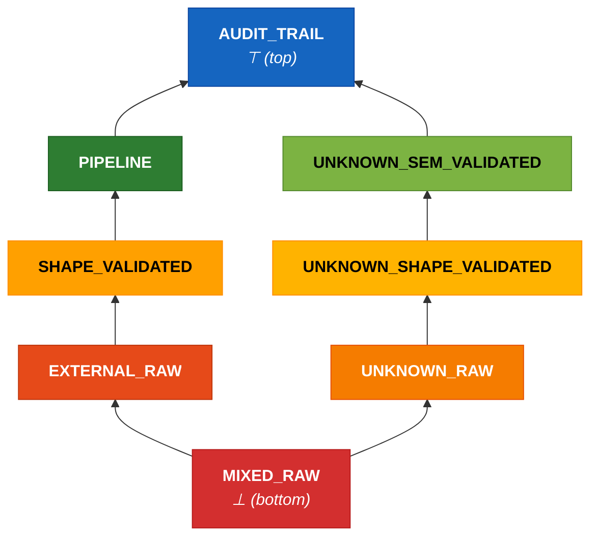

This page specifies the enforcement implementation of the four-tier [authority model](). Tool implementers, scanner developers, and security assessors need this page; adopters and governance leads may skip to [Annotation vocabulary]().

## Trust classification and validation status

The four tiers describe semantic authority. The eight effective states describe the enforcement contexts required to grade pattern severity.

The tier model combines two orthogonal dimensions — trust classification (what guarantees the system may assume) and validation status (what processing the data has received) — to produce eight effective states.

| State | Trust Classification | Validation Status |
|-------|---------------------|-------------------|
| Audit Trail | Tier 1 | Not Applicable |
| Pipeline | Tier 2 | Not Applicable |
| Shape-Validated | Tier 3 | Shape-Validated |
| External Raw | Tier 4 | Raw |
| Unknown Raw | Unknown | Raw |
| Unknown Shape-Validated | Unknown | Shape-Validated |
| Unknown Semantically-Validated | Unknown | Semantically Validated |
| Mixed Raw | Mixed | Raw |

These eight states determine finding severity when pattern rules are evaluated: the same pattern may be an error in one state and suppressed in another.

**Canonical tokens.** The following identifiers are normative and MUST be used consistently in manifest schemas, SARIF output, configuration files, and implementation code: `AUDIT_TRAIL`, `PIPELINE`, `SHAPE_VALIDATED`, `EXTERNAL_RAW`, `UNKNOWN_RAW`, `UNKNOWN_SHAPE_VALIDATED`, `UNKNOWN_SEM_VALIDATED`, `MIXED_RAW`. Prose may use the human-readable labels from the table above; machine-facing artefacts MUST use these tokens. The token names are canonical labels, not scope restrictions — `AUDIT_TRAIL` encompasses all Tier 1 authoritative internal data (audit records, internal state, configuration), not only audit trails specifically. Similarly, `PIPELINE` encompasses all Tier 2 semantically validated data, not only pipeline-processed data.

## Join operation

When data from two different taint states merges at a program point (assignment, function parameter, container construction), the resulting state is determined by the join. The general rule: any merge of values from different trust classifications produces MIXED_RAW. The validation status of the result is RAW regardless of the inputs' validation status — mixing data resets the validation dimension because the composite's structural guarantees are weaker than those of its strongest input.

Specific join rules (the join is commutative — operand order does not matter):

| Operand A | Operand B | Result | Examples |
|-----------|-----------|--------|----------|
| Any classified state | Different classified state | MIXED_RAW | join(AUDIT_TRAIL, PIPELINE), join(PIPELINE, EXTERNAL_RAW), join(SHAPE_VALIDATED, PIPELINE) |
| Any state | UNKNOWN_RAW | MIXED_RAW | join(PIPELINE, UNKNOWN_RAW), join(AUDIT_TRAIL, UNKNOWN_RAW), join(SHAPE_VALIDATED, UNKNOWN_RAW) |
| Any state | UNKNOWN_SHAPE_VALIDATED | MIXED_RAW | join(EXTERNAL_RAW, UNKNOWN_SHAPE_VALIDATED), join(PIPELINE, UNKNOWN_SHAPE_VALIDATED) |
| Any state | UNKNOWN_SEM_VALIDATED | MIXED_RAW | join(SHAPE_VALIDATED, UNKNOWN_SEM_VALIDATED), join(AUDIT_TRAIL, UNKNOWN_SEM_VALIDATED) |
| UNKNOWN_RAW | UNKNOWN_RAW | UNKNOWN_RAW | join(UNKNOWN_RAW, UNKNOWN_RAW) — provenance equally unknown |
| UNKNOWN_RAW | UNKNOWN_SHAPE_VALIDATED | UNKNOWN_RAW | join(UNKNOWN_RAW, UNKNOWN_SHAPE_VALIDATED) — validated status lost |
| UNKNOWN_RAW | UNKNOWN_SEM_VALIDATED | UNKNOWN_RAW | join(UNKNOWN_RAW, UNKNOWN_SEM_VALIDATED) — validated status lost |
| UNKNOWN_SHAPE_VALIDATED | UNKNOWN_SHAPE_VALIDATED | UNKNOWN_SHAPE_VALIDATED | Identity — provenance equally unknown, same validation level |
| UNKNOWN_SHAPE_VALIDATED | UNKNOWN_SEM_VALIDATED | UNKNOWN_SHAPE_VALIDATED | Semantic status lost to the weaker validation |
| UNKNOWN_SEM_VALIDATED | UNKNOWN_SEM_VALIDATED | UNKNOWN_SEM_VALIDATED | Identity — provenance equally unknown, same validation level |
| Any state | MIXED_RAW | MIXED_RAW | MIXED absorbs further merges |
| X | X | X | join(PIPELINE, PIPELINE) = PIPELINE |

**Design rationale for UNKNOWN joins.** UNKNOWN is treated as a distinct classification for join purposes — it is *not* equivalent to the other operand. Merging known-provenance data with unknown-provenance data produces a composite whose provenance is genuinely mixed, not merely unknown. This prevents UNKNOWN from silently inheriting a classification it has not earned. Within the UNKNOWN classification itself, merging two unknown-origin values does not create mixed provenance — both are equally unknown — and the validation status demotes to the weaker of the two (raw beats shape-validated, shape-validated beats semantically-validated).

This join definition is REQUIRED for consistent taint propagation across implementations.

### Join operators: `join_fuse` and `join_product`

The join table above applies uniformly to all merge operations in the current framework. However, not all merge operations are semantically equivalent. The framework distinguishes two conceptual join operators. Note: the distinction introduced here does not add a ninth framework state — the eight-state model and 8x8 severity matrix are unchanged. The `MIXED_TRACKED` extension described below is a binding-level capability that individual language bindings MAY implement.

- **`join_fuse`** applies to operations that genuinely merge data into a single artefact where the contributing components lose their individual identity: string concatenation, dict merge (`{**a, **b}`), list extension, format-string interpolation. The result is a fused artefact whose provenance is inseparable. `join_fuse` produces MIXED_RAW when the operands span different trust classifications — this is the current behaviour, unchanged.

- **`join_product`** applies to operations that compose data into a product-type structure where each component retains its identity: dataclass construction, named-tuple packing, record/POJO construction, typed constructor invocation. The components are individually addressable after construction — `record.audit_field` and `record.external_field` remain distinct access paths.

At the framework level, `join_product` is treated identically to `join_fuse` — both produce MIXED_RAW when operands span different trust classifications. The eight-state model and the 8x8 severity matrix are unchanged.

**Binding extension: MIXED_TRACKED.** Language bindings MAY define a `MIXED_TRACKED` extension state for `join_product` on named product types where the binding can statically resolve field membership. In `MIXED_TRACKED`, each field retains its individual taint state; the composite carries a summary taint (the join of all fields) for contexts where field-level resolution is not available — e.g., when the composite is passed to a function that accepts a generic type, or when field-level tracking is lost through an untyped intermediary.

Bindings that implement `MIXED_TRACKED` SHOULD declare which named product types they can track at field level. Product types whose field membership cannot be statically resolved (e.g., dynamically constructed classes, untyped dicts, raw tuples) remain subject to `join_fuse` semantics and produce MIXED_RAW.

Bindings that do not implement field sensitivity treat `join_product` as `join_fuse` — conservative fallback to MIXED_RAW. This is the current behaviour and remains conformant. Field-sensitive taint is a binding requirement (SHOULD), not a framework invariant (MUST).

**Severity matrix extension for MIXED_TRACKED.** The framework severity matrix remains 8x8. Bindings that implement `MIXED_TRACKED` extend the matrix with a ninth column whose severity inherits from the MIXED_RAW column unless the binding explicitly narrows it. Narrowing is permitted (a binding MAY reduce severity where field-level resolution eliminates false positives); widening is not (a binding MUST NOT assign higher severity in the MIXED_TRACKED column than in the corresponding MIXED_RAW cell). This follows the overlay narrowing principle.

**Deferred: framework-level ninth state.** Full elevation of `MIXED_TRACKED` to a ninth framework state — with corresponding changes to the join table, cross-product table, and severity matrix — is deferred until at least one binding demonstrates field-sensitive taint tracking with specimen-level evidence and a worked example in its golden corpus. The binding refinement approach was chosen to reduce cascade cost: the conceptual split lands in Part I; bindings operationalise it at their own pace; the framework promotes the extension when binding-level evidence supports it.

## Lattice structure (Hasse diagram)

The eight effective states form a partial order under the join. States connected by an upward path are ordered; states on separate branches are incomparable (their join produces a lower state).

**Lattice orientation note.** This diagram uses the mathematical convention where "bottom" (perpendicular) denotes the element that every other element joins toward — the most restrictive enforcement state, not the lowest trust level. MIXED_RAW is bottom because any merge of unlike states reaches it, and it cannot be escaped through ordinary validation. AUDIT_TRAIL is top because it is the most authoritative state.

Two properties to note: (1) MIXED_RAW is the absorbing element — any cross-classification merge reaches it, and further merges stay there. (2) The UNKNOWN chain (UNKNOWN_RAW to UNKNOWN_SHAPE_VALIDATED to UNKNOWN_SEM_VALIDATED) and the classified chain (EXTERNAL_RAW to SHAPE_VALIDATED to PIPELINE) are parallel — validation can advance within either chain but cannot cross between them without a trust classification decision (which is a governance act, not a validation act). AUDIT_TRAIL is the unique top element, reachable only through the Tier 2 to Tier 1 construction transition.

### UNKNOWN and MIXED states

**UNKNOWN** is data whose trust classification cannot be determined from available annotations.

- **Entry conditions:** The data enters a scope with no wardline annotation declaring its trust classification, or it is produced by an unannotated function whose inputs span multiple tiers.
- **Invariants:** UNKNOWN data receives conservative enforcement (equivalent to or stricter than EXTERNAL_RAW for most rules). UNKNOWN data that passes shape validation transitions to UNKNOWN_SHAPE_VALIDATED; UNKNOWN data that passes semantic validation transitions to UNKNOWN_SEM_VALIDATED. Neither transition grants a trust classification — the data remains unknown-origin.

**MIXED** is data derived from inputs spanning multiple authority tiers.

- **Entry conditions:** A function or expression combines inputs from two or more distinct trust classifications (e.g., Tier 1 audit data merged with Tier 4 external input).
- **Invariants:** MIXED data activates the pattern rules of every contributing tier — the enforcement burden is the union of all contributing tiers' restrictions. MIXED data cannot transition to a single-tier classification through ordinary validation, because validation establishes structural and semantic properties but does not decompose provenance. A declared normalisation boundary may collapse mixed inputs into a new Tier 2 artefact — the normalisation step is semantically a new construction, not a passthrough of the original mixed data.

**The distinction between UNKNOWN and MIXED:** MIXED means the analysis *can show* that a real cross-tier combination occurred — the contributing tiers are known but heterogeneous. UNKNOWN means the analysis *cannot determine* the provenance at all — the tier is absent, not mixed. An unannotated function that combines Tier 1 and Tier 4 inputs produces MIXED (the analysis sees both tiers). An unannotated function whose inputs are themselves unannotated produces UNKNOWN (the analysis has no tier information to combine).

### Cross-product analysis

The following table shows which of the 24 theoretical state combinations are reachable and which are impossible or collapsed. The full cross-product of six trust classifications (TIER_1, TIER_2, TIER_3, TIER_4, UNKNOWN, MIXED) and four validation statuses (NOT_APPLICABLE, RAW, SHAPE_VALIDATED, SEMANTICALLY_VALIDATED) yields 24 theoretical combinations. Eight are reachable as effective states; sixteen are impossible or collapsed:

| Classification | Not Applicable | Raw | Shape-Validated | Sem.-Val. | Rationale |
|----------------|----------------|-----|-----------------|----------------|-----------|
| Tier 1 | **Audit Trail** | Impossible | Impossible | Impossible | Tier 1 artefacts are produced under institutional rules — they are not raw and validation is not applicable to them. |
| Tier 2 | **Pipeline** | Impossible | Collapsed to Pipeline | Collapsed to Pipeline | Tier 2 *is* the result of semantic validation — raw Tier 2 is contradictory; shape-only Tier 2 is contradictory; sem-validated Tier 2 is redundant. |
| Tier 3 | Impossible | Impossible | **Shape-Validated** | Collapsed to Pipeline | Tier 3 *is* the result of shape validation — raw Tier 3 is contradictory; semantically validated Tier 3 becomes Tier 2. |
| Tier 4 | Impossible | **External Raw** | Collapsed to Shape-Validated | Collapsed to Pipeline | Tier 4 is by definition raw external data; shape-validated Tier 4 becomes Tier 3; semantically validated Tier 4 becomes Tier 2. |
| Unknown | Impossible | **Unknown Raw** | **Unknown Shape-Validated** | **Unknown Semantically-Validated** | Not Applicable is reserved for data produced under institutional rules. Both validated states are reachable because validation establishes properties without resolving provenance. |
| Mixed | Impossible | **Mixed Raw** | Collapsed to Mixed Raw | Collapsed to Mixed Raw | Ordinary validation does not resolve mixed provenance. A declared normalisation boundary may produce a new T2 artefact from mixed inputs. |

All sixteen non-reachable combinations are accounted for by the Impossible or Collapsed entries.

## Transition semantics

Tier transitions are directional and constrained:

```mermaid
graph LR
    T4["<b>Tier 4</b><br/>Raw Observation"]
    T3["<b>Tier 3</b><br/>Shape-Validated Representation"]
    T2["<b>Tier 2</b><br/>Semantically Validated Representation"]
    T1["<b>Tier 1</b><br/>Trusted Assertion"]
    RAW["Raw Representation<br/><i>(serialised bytes)</i>"]

    T4 -->|"Shape validation<br/>(structural establishment)"| T3
    T3 -->|"Semantic validation<br/>(domain establishment)"| T2
    T2 -->|"Trusted construction<br/>(institutional rules)"| T1
    T1 -->|"Serialisation<br/>(sheds direct authority)"| RAW
    RAW -->|"Trusted restoration<br/>(evidence categories)"| T1
    RAW -.->|"Shape validation only<br/>(no provenance claim)"| USV["UNKNOWN_SHAPE_VALIDATED"]
    USV -.->|"Semantic validation<br/>(no provenance claim)"| USEV["UNKNOWN_SEM_VALIDATED"]

    style T1 fill:#2C3E5D,color:#fff,stroke:#2C3E5D
    style T2 fill:#4A6FA5,color:#fff,stroke:#4A6FA5
    style T3 fill:#6B8EC2,color:#fff,stroke:#6B8EC2
    style T4 fill:#8B9DC3,color:#fff,stroke:#8B9DC3
    style RAW fill:#D4D4D4,color:#333,stroke:#999
    style USV fill:#D4D4D4,color:#333,stroke:#999,stroke-dasharray: 5 5
    style USEV fill:#D4D4D4,color:#333,stroke:#999,stroke-dasharray: 5 5
```

- **T4 to T3 — structural establishment.** Via shape validation: the data passes through a defined validation boundary that guarantees structural properties — required fields present, types correct, data conforms to its declared structural contract. Shape-validated Tier 4 data *becomes* Tier 3. There is no "shape-validated Tier 4" state — shape validation is the mechanism by which raw observations become shaped representations. After this transition, the data is safe to handle (field access will not crash) but its values are not yet verified for domain use.
- **T3 to T2 — domain establishment.** Via semantic validation: the data passes through a validation boundary that establishes domain-constraint satisfaction for every intended use within the declared bounded context. Semantically validated Tier 3 data *becomes* Tier 2. Bounded-context adequacy is expressed through named boundary contracts (e.g., `"landscape_recording"`, `"partner_reporting"`) that specify what data crosses the boundary and at what tier, rather than through fully qualified function names. Each contract declares a stable semantic identifier, the data tier expected, and the direction of flow. The semantic validator MUST satisfy the constraints of every contract declared in its bounded context.
- **T2 to T1 — trusted construction.** The transition is an act of institutional interpretation: only via explicit trusted construction under institutional rules. A Tier 1 artefact is a new semantic object — an audit entry, a decision record, a fact assertion — produced from Tier 2 inputs under governed logic. The source inputs remain Tier 2 after the Tier 1 artefact is produced.

**Combined validation boundaries.** A single function may perform both shape and semantic validation (T4 to T2) — this is a common pattern for simple data types where the structural and semantic checks are naturally interleaved. The model treats this as two logical transitions occurring within one function body. Combined validation boundaries are declared with a combined-validation annotation (see [Annotation vocabulary](), Group 1).

### Seven invariants

1. **Shape-validated T4 becomes T3.** Shape validation establishes structure — field presence, type correctness, schema conformance — not domain meaning. There is no intermediate state.
2. **Semantically validated T3 becomes T2.** Semantic validation establishes domain-constraint satisfaction for every intended use within the declared bounded context. There is no "partially validated" state.
3. **Shape validation must precede semantic validation.** Semantic validation operates on structurally sound data. A function that performs both checks in a single body satisfies this invariant internally; two separate functions must be ordered correctly.
4. **T2 does not automatically upgrade to T1.** Tier 1 artefacts are new semantic objects produced under institutional rules, not Tier 2 data with a higher label.
5. **Serialisation sheds direct authority at the representation layer.** A Tier 1 artefact written to storage becomes a raw representation.
6. **Trusted restoration may reinstate prior authority.** A raw representation may be restored to Tier 1 only through a declared trusted restoration boundary with provenance and integrity guarantees.
7. **Tier assignment is not contagious.** Authority assigned to a derived Tier 1 artefact does not retroactively alter the trust classification of its source inputs. This prevents laundering lower tiers into higher tiers by accident.

## Trusted restoration boundaries

The serialisation/restoration model distinguishes *construction* from *restoration*. Construction produces a new Tier 1 artefact from Tier 2 inputs under institutional rules. Restoration reconstitutes a previously serialised Tier 1 artefact from its raw representation. The distinguishing criterion: restoration requires an evidence-backed provenance claim supported by institutional attestation.

Four categories of provenance evidence support restoration boundary declarations, each progressively harder to verify technically. The evidence requirements are cumulative — each restoration tier requires all evidence categories of the tiers below it:

1. **Structural evidence (REQUIRED for any restoration above raw).** The raw representation must pass shape validation — schema conformance, field completeness, type correctness. This is the minimum requirement and is machine-verifiable.
2. **Semantic evidence (REQUIRED for restoration to Tier 2 or above).** The restored data must pass semantic validation — domain constraints satisfied for every intended use within the declared bounded context. This is particularly important for restoration because domain constraints may have changed since serialisation.
3. **Integrity evidence (REQUIRED for restoration to Tier 1).** Cryptographic or structural integrity checks that the representation has not been modified since serialisation — checksums, signatures, or equivalent mechanisms. Integrity evidence may be absent by exception only, under STANDARD exception governance with explicit rationale.
4. **Provenance-institutional evidence (REQUIRED for restoration to any known-provenance tier).** Institutional attestation that the storage boundary is trustworthy — that the file, database, or message queue is under the organisation's control. This evidence is explicitly institutional, not technical.

The four evidence categories determine the restored tier:

| Structural | Semantic | Integrity | Institutional | Restored Tier |
|:---:|:---:|:---:|:---:|---|
| Yes | Yes | Yes | Yes | **Tier 1** — full restoration. All four categories present. |
| Yes | Yes | -- | Yes | **Tier 2 maximum.** Structure and domain validity verified, provenance attested, but integrity since serialisation not established. |
| Yes | -- | -- | Yes | **Tier 3 maximum.** Structure verified and provenance attested, but domain constraints not re-verified since serialisation. |
| Yes | Yes | -- | -- | **UNKNOWN_SEM_VALIDATED.** Structure and domain constraints verified, but no institutional attestation of provenance. |
| Yes | -- | -- | -- | **UNKNOWN_SHAPE_VALIDATED.** Structure verified but no provenance claim and no semantic re-verification. |
| -- | -- | -- | -- | **UNKNOWN_RAW.** No evidence present. Not Tier 4 (EXTERNAL_RAW) — a raw representation with no evidence is of indeterminate origin, not necessarily external. |

The key distinction: institutional evidence is the gate between known-provenance tiers (T1–T3) and unknown-provenance states (UNKNOWN_*). A mere assertion of internal provenance — without institutional attestation — does not elevate data above unknown-origin status.

## Cross-language taint propagation

In polyglot applications where data crosses language boundaries (e.g., a Python service calling a Go microservice, or a shared database accessed by multiple language runtimes), the receiving language's enforcement tool cannot verify the emitting language's taint assertions. Data crossing a language boundary resets to UNKNOWN_RAW in the receiving binding. The receiving binding MAY preserve taint state if it can independently verify the emitting binding's taint assertion — for example, through a shared wardline manifest that declares the cross-language interface as a typed trust boundary with both bindings enforcing the same tier assignment.

This is conservative: it may over-taint data that was well-classified in the emitting language. The alternative — trusting cross-language taint assertions without verification — would allow a weaker binding to launder taint state through a language boundary.

**Scope clarification.** This section applies to cross-*binding* boundaries — where data passes between different language runtimes, each with its own enforcement tool. It does not apply to serialisation boundaries within the same binding (e.g., a Python application reading from a database that the same Python application wrote to). Serialisation boundaries within a single binding are governed by the restoration boundary model using the restoration boundary annotation (see [Annotation vocabulary](), Group 17).

## Third-party in-process dependency taint

In-process calls to third-party libraries — code that executes within the same runtime but is not under the deploying organisation's governance — present an analogous problem to cross-language boundaries. The enforcement tool cannot verify a third-party library's internal validation logic, taint handling, or failure semantics, because the library's code is outside the wardline's annotation surface and governance perimeter. A third-party library function that performs internal validation does not constitute a wardline validation boundary.

Data returned from a third-party library call defaults to UNKNOWN_RAW unless a `dependency_taint` declaration assigns a specific taint state with governance rationale. Functions not declared in `dependency_taint` and not carrying wardline annotations receive UNKNOWN_RAW by default.

The correct application architecture validates data at *your* boundary regardless of what the library does internally. A third-party library that performs shape validation is defence in depth — the application's own `@validates_shape` boundary re-establishes structural guarantees under governance.

The "both must agree" constraint — which requires manifest boundary declarations to have corresponding code annotations — does not apply to `dependency_taint` declarations. These are taint source declarations about code outside the governance perimeter, not boundary declarations within it.

**Compound call patterns.** The `dependency_taint` mechanism matches direct calls to declared function paths. Four compound patterns require additional specification:

- **Method chaining** (`lib.fetch().transform().validate()`): Each method in the chain is resolved independently against `dependency_taint` entries. If `lib.fetch` is declared but `transform` is not, the return of `fetch()` receives the declared taint, and the return of `.transform()` SHOULD inherit the taint of its receiver unless `.transform` has its own `dependency_taint` declaration.
- **Generators and iterators** (`for item in lib.stream()`): Each value yielded by a declared generator function SHOULD receive the taint declared for that function's return. The taint applies per-element, not to the iterator object itself.
- **Context managers** (`with lib.connection() as conn`): The bound variable (`conn`) SHOULD receive the taint declared for the context manager function's return.
- **Async iterators** (`async for item in lib.stream()`): The same rule as synchronous generators — per-element taint from the declared function. Implementations that cannot reliably track taint through `__aiter__`/`__anext__` protocols SHOULD fall back to UNKNOWN_RAW.

Where an implementation cannot resolve a compound call pattern against `dependency_taint` entries, the conservative fallback is UNKNOWN_RAW.

## Enforcement layers

A wardline can be enforced at three layers, each catching different classes of violation. The layers are orthogonal: each catches things the others cannot. A single tool that implements only one layer still gains value; the combination closes residual risk surfaces that any single layer leaves open. In most language ecosystems, different tools will implement different layers — a type checker handles the type-system layer, a linter or pattern-matching tool handles static analysis, and a CI orchestrator handles governance.

These three layers implement a natural escalation path: institutional knowledge that is *machine-readable* (the wardline manifest) becomes *machine-checkable* (type system enforcement at development time) and *machine-enforceable* (static analysis at CI time, runtime structural enforcement at access time).

### Requirement taxonomy

Requirements within each layer are classified using a three-part taxonomy:

- **Framework invariant** — a requirement that any conforming implementation MUST satisfy regardless of language or toolchain. Non-negotiable properties of the wardline model itself.
- **Binding requirement** — a requirement that language-specific bindings SHOULD satisfy using language-native mechanisms. The requirement is stable; the implementation varies by language.
- **Tool quality target** — a desirable property that improves enforcement quality but is not required for conformance.

The MUST/SHOULD/MAY gradient reflects achievability: static analysis is MUST because AST access and pattern matching are achievable in every language with a parser; type system enforcement is SHOULD because type system capabilities vary significantly across languages; runtime structural enforcement is SHOULD/MAY because it depends on the target language's object model and runtime architecture.

### Static analysis (CI/commit time)

| Property | Requirement |
|----------|-------------|
| **Enforcement point** | CI/commit time |
| **What it catches** | Pattern rule violations in annotated code; taint flow between declared boundaries |
| **Language requirement** | Parse tree or AST access; ability to read annotation metadata |

Requirements:

- MUST detect the six active pattern rules ([WL-001]() through [WL-006]()) within annotated function and method bodies — intraprocedural analysis *(framework invariant)*
- SHOULD detect pattern rule violations that span function boundaries — interprocedural analysis *(binding requirement)*
- MAY provide context-sensitive analysis where a function's findings depend on the tier of its call site *(tool quality target)*
- MUST perform structural verification ([WL-007]()) on all validation boundary functions — shape-validation, semantic-validation, combined-validation, and restoration boundary functions *(framework invariant)*. WL-007 is primarily intraprocedural: a validation function that delegates to a called function for rejection does not satisfy WL-007 unless the delegation is resolvable via two-hop call-graph analysis
- MUST enforce validation ordering ([WL-008]()): data reaching a declared semantic-validation boundary must have passed through a declared shape-validation boundary *(framework invariant)*. Combined validation boundaries (T4 to T2) satisfy this requirement internally
- MUST trace explicit-flow taint between declared boundaries — at minimum: direct flows and two-hop through unannotated intermediaries; ideally: full transitive inference across the call graph *(framework invariant for direct flows; tool quality target for full transitive inference)*
- SHOULD distinguish `join_fuse` from `join_product` operations when computing taint joins *(binding requirement)*
- MUST produce deterministic, auditable output in a structured interchange format (SARIF or equivalent) *(binding requirement)*
- SHOULD support incremental analysis — analysing only changed files and their transitive dependents rather than the full codebase on every commit *(binding requirement)*

**Scaling characteristics:** Pattern detection scales linearly with the annotated surface area; taint analysis scales O(V+E) with the call graph.

### Type system (development/compile time)

| Property | Requirement |
|----------|-------------|
| **Enforcement point** | Development/compile time |
| **What it catches** | Tier mismatches in function signatures; unvalidated data reaching typed sinks |
| **Language requirement** | Structural or nominal type system with metadata capabilities |

Requirements:

- SHOULD make tier mismatches visible at development time — passing raw data where shape-validated data is expected, or shape-validated data where semantically validated data is expected, should produce a type error or equivalent diagnostic *(binding requirement)*
- SHOULD support metadata on type annotations that carries tier information (1, 2, 3, 4) through the type system *(binding requirement)*
- SHOULD enable structural typing that distinguishes raw, shape-validated, and semantically validated records — records at different tiers with identical field structures should be distinguishable types *(binding requirement)*

### Runtime structural (definition/access time)

| Property | Requirement |
|----------|-------------|
| **Enforcement point** | Definition/access time |
| **What it catches** | Fabricated defaults on authoritative fields; unannotated subclass methods; serialisation boundary violations |
| **Language requirement** | Object model with descriptor, metaclass, or equivalent structural enforcement machinery |

Requirements:

- SHOULD make fabricated defaults on authoritative (Tier 1) fields structurally impossible — accessing an unset authoritative field raises an error rather than returning a default *(binding requirement)*
- SHOULD enforce that subclasses of protected base classes cannot add unannotated methods — preventing bypass of the wardline through inheritance *(binding requirement)*
- SHOULD make serialisation boundary violations detectable at access time — deserialised data that claims a tier it has not earned produces an error. This includes restoration boundary verification: deserialised data passing through a declared restoration boundary must satisfy the structural evidence requirement *(binding requirement)*
- MAY provide optional runtime enforcement that complements static analysis for contexts where static analysis alone is insufficient *(tool quality target)*

### Orthogonality principle

Static analysis cannot cross serialisation boundaries. Mainstream type systems cannot enforce behavioural constraints (dependent types and session types can, but are not available in the languages this framework targets). Runtime enforcement cannot catch patterns that succeed silently (a `.get()` with a default *works* — it just produces the wrong value). Each layer's blind spots are another layer's coverage area.

The orthogonality principle has a direct structural consequence for implementation: because each layer catches what the others cannot, there is no requirement — and no advantage — in building a single tool that spans all three. A multi-tool enforcement regime where a type checker handles the type system layer, a linter handles static analysis, and a runtime library handles runtime structural enforcement achieves the same coverage as a monolithic tool, with the additional benefit that each component can evolve independently and that adopters can deploy layers incrementally. The [conformance profiles]() (Wardline-Type, Wardline-Core, and Wardline-Governance) correspond to the natural tool boundaries that the orthogonality principle predicts.

### Pre-generation context projection

The three enforcement layers above operate on code that has already been written. A complementary mechanism may operate upstream of generation by projecting the resolved governance state onto a specific file before modification.

The projection is a read-only query over existing wardline state. It is a lens over the enforcement surface, not a control surface itself. It does not modify the manifest, annotations, or exception register, and it introduces no policy artefacts.

#### Projection content

For a given file path, the projection resolves:

- **Taint state summary.** Per-region taint states resolved from the current manifest state and the latest available derived state. Where annotations are absent, the module-level default taint from the governing overlay applies.
- **Active rules.** The severity matrix projected onto the resolved taint states — which rules are active, at what severity, and whether each is UNCONDITIONAL or STANDARD in this context.
- **Live exceptions.** Exceptions from the exception register resolved against the current date. Expired exceptions do not appear.
- **Boundary context.** Any transition boundaries declared in this file, with source and destination tiers.
- **Rationale.** Narrative sufficient to explain the operational significance of active constraints in the current context.
- **Currency.** The commit at which the derived state was last computed, so the consumer can assess alignment between the projection and the current repository state.

#### Relationship to enforcement

Pre-generation projection does not replace post-generation enforcement. The enforcement layers remain the terminal control — an agent or developer that receives the projection may still produce a violation, and the static analysis, type system, and runtime structural layers detect it as before.

The projection reduces the volume of violations that reach those layers. Projecting the governance state at the point of modification reduces reliance on the agent recalling constraints encountered earlier in the generation context. This has a compounding effect: fewer violations at the enforcement gate reduces fix-and-retry cycles, which reduces pressure on human review capacity.

#### Delivery mechanisms

The projection may be delivered through any mechanism that interposes between the agent and the file at read or edit time. MCP tool servers, IDE extensions, editor hooks, and agentic harness hooks are all valid delivery mechanisms.

For agentic development environments, delivery at file-read time is preferable to delivery at edit time. The agent reads the file, forms its editing plan, then modifies the file. Context that arrives at read time shapes the plan; context that arrives at edit time competes with it.

---

## See also

- [Authority tier model]() — the four-tier foundation this enforcement specification implements
- [Annotation vocabulary]() — the declaration surface that enforcement acts on
- [Governance model]() — exception handling and enforcement availability
- [Verification and conformance]() — verification properties and conformance profiles
- [Pattern rules]() — the eight rules the enforcement layers detect
