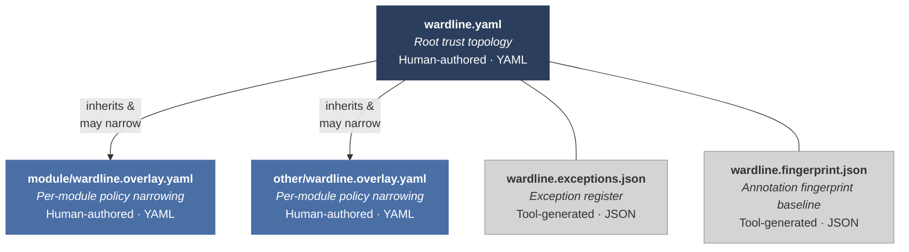

The wardline classification framework is language-neutral — a single `wardline.yaml` serves all language bindings in a polyglot project. The [authority tier model](), [annotation vocabulary](), [pattern rules](), [governance model](), and [verification properties]() are requirements that any language-specific enforcement regime must satisfy. Languages with weaker type systems or object models will have structural gaps requiring compensating controls (see [language evaluation criteria]()).

Two enforcement regimes are currently defined: [Wardline for Python]() and [Wardline for Java]().

## Manifest system

The manifest system is hierarchical, comprising four file types. The root manifest declares the trust topology; overlays narrow policy for specific modules; tool-generated files track exceptions and annotation state.



| File | Format | Authored By | Purpose | Artefact class |
|------|--------|-------------|---------|---------------|
| `wardline.yaml` | YAML | Human | Root trust topology — tier definitions, data source classifications, delegation policy, rule defaults, governance thresholds | Mixed — tier definitions and delegation policy are **policy**; rule defaults and governance thresholds are **enforcement** |
| `wardline.overlay.yaml` | YAML | Human | Per-module policy — boundary locations, rule overrides, module-tier mappings, supplementary group enforcement, default taint for unannotated code | Mixed — boundary declarations and optional-field declarations are **policy**; rule overrides are **enforcement** |
| `wardline.exceptions.json` | JSON | Tool (governance-approved) | Exception register — granted exceptions with reviewer identity, rationale, expiry, provenance | **Policy** |
| `wardline.fingerprint.json` | JSON | Tool | Annotation fingerprint baseline — per-function annotation hash, coverage metrics | **Enforcement** |

Human-authored files use YAML for readability — the manifest is a governance artefact that security assessors must be able to read. All string identifiers MUST be quoted to prevent YAML implicit typing. Tool-generated files use JSON for schema strictness and round-trip fidelity.

> **The Norway problem.** The ISO country code `"NO"` for Norway becomes the boolean `false` when unquoted in YAML 1.1. Many popular libraries default to YAML 1.1 behaviour. Always quote string identifiers in wardline YAML files.

**Location conventions.** The root manifest resides at the repository root: `wardline.yaml`. Overlays reside in module directories: `<module>/wardline.overlay.yaml`. Each enforcement tool discovers manifests by walking up the directory tree from the analysed file, merging overlays with the root manifest. In a multi-tool regime, each tool independently discovers and validates the manifest — defence-in-depth, not redundancy.

**Merge semantics.** Overlays inherit from the root manifest and may narrow but never widen:

- An overlay CANNOT relax a tier assignment (declare Tier 1 data as Tier 2 or lower).
- An overlay CANNOT lower severity (change ERROR to WARNING for a rule).
- An overlay CAN raise severity, add boundaries, or further restrict rule configuration.
- An overlay CANNOT grant exception classes it has not been delegated authority for.

An enforcement tool that encounters a widening override MUST reject the overlay with an error, not a warning.

## Root manifest schema

The root `wardline.yaml` contains five sections:

**Tier definitions.** Named data sources and their authority tier assignment. Each entry declares a data source identifier, its tier (1, 2, 3, or 4), and a description. Custom tiers are not permitted.

**Rule configuration.** Global severity and exceptionability overrides. The default is the framework severity matrix. The root manifest MUST NOT alter UNCONDITIONAL cells. This section also declares precision/recall thresholds and the expedited governance ratio threshold.

**Delegation policy.** Which overlays may grant which exception classes. UNCONDITIONAL findings can never be excepted regardless of delegation.

**Module-tier mappings.** Default taint state for unannotated code within each module. Provides baseline enforcement even before full annotation investment.

**Manifest metadata.** Organisation name, ratifying authority, ratification date, and review interval. The enforcement tool MUST compute ratification age and produce a governance-level finding when the manifest is overdue for review.

**Root manifest example:**

```yaml
# wardline.yaml — root trust topology
wardline:
  version: "0.2.0"

  ratification:
    organisation: "Department of Example"
    authority: "J. Smith, Chief Information Security Officer"
    date: "2026-01-15"
    review_interval_days: 180

  tier_definitions:
    - name: "internal_database"
      tier: 1
      description: "PostgreSQL audit store under institutional control"
    - name: "partner_api"
      tier: 4
      description: "External partner data API"

  rule_configuration:
    overrides: []   # Default severity matrix applies

  delegation:
    default_authority: "RELAXED"
    grants:
      - path: "audit/"
        authority: "NONE"   # All audit exceptions require root-level approval

  module_tier_mappings:
    - module: "audit"
      default_taint: "AUDIT_TRAIL"
    - module: "adapters"
      default_taint: "EXTERNAL_RAW"
```

## Overlay schema

Overlays declare what is *here* — boundaries, local rule tuning, and module-specific policy.

**Overlay identity.** Each overlay declares its governing path (`overlay_for`). The overlay file MUST reside within the directory it claims to govern. The enforcement tool verifies that the overlay's `overlay_for` field is a prefix of the overlay file's actual path.

### Boundary declarations

Boundaries declare where tier transitions happen. Each boundary entry identifies the function (by fully qualified name), the tier transition, and — for restoration boundaries — the four provenance evidence categories. The manifest says "a boundary exists here"; the code annotation says "I am that boundary." Both must agree.

```yaml
boundaries:
  - function: "myproject.adapters.check_partner_structure"
    transition: "shape_validation"
    from_tier: 4
    to_tier: 3
  - function: "myproject.adapters.validate_partner_semantics"
    transition: "semantic_validation"
    from_tier: 3
    to_tier: 2
    bounded_context:
      contracts:
        - name: "landscape_recording"
          data_tier: 2
          direction: "inbound"
          description: "Partner data validated for landscape engine consumption"
        - name: "partner_reporting"
          data_tier: 2
          direction: "inbound"
      description: "Partner data for landscape recording and reporting"
  - function: "myproject.adapters.validate_partner"
    transition: "combined_validation"
    from_tier: 4
    to_tier: 2
    bounded_context:
      contracts:
        - name: "landscape_recording"
          data_tier: 2
          direction: "inbound"
        - name: "partner_reporting"
          data_tier: 2
          direction: "inbound"
      description: "Partner data for landscape recording and reporting"
  - function: "myproject.engine.create_risk_assessment"
    transition: "construction"
    from_tier: 2
    to_tier: 1

  # Restoration boundary
  - function: "myproject.audit.load_audit_record"
    transition: "restoration"
    restored_tier: 1
    provenance:
      structural: true
      semantic: true
      integrity: "checksum"
      institutional: "internal_database"
    bounded_context:
      contracts:
        - name: "landscape_recording"
          data_tier: 1
          direction: "outbound"
      description: "Restored audit records for landscape engine consumption"
```

**Tier-flow boundaries** use `from_tier` and `to_tier`. **Constraint on `to_tier=1`:** Tier 1 construction is valid only when `from_tier: 2`. Skip-promotions to Tier 1 (T4→T1, T3→T1) are schema-invalid.

**Bounded-context declarations.** Every boundary claiming Tier 2 semantics MUST include a `bounded_context` object with named boundary contracts. Each contract declares: `name` (stable semantic identifier), `data_tier`, `direction` (inbound/outbound), and optional `description` and `preconditions`.

**Contract bindings.** The function-level binding — which functions implement each contract — resides separately under `contract_bindings`:

```yaml
contract_bindings:
  - contract: "landscape_recording"
    functions:
      - "myproject.engine.record_to_landscape"
      - "myproject.engine.update_landscape_record"
  - contract: "partner_reporting"
    functions:
      - "myproject.reports.generate_partner_summary"
```

Contract bindings are enforcement artefacts — governed under configuration management, not security policy.

**Restoration boundaries** use a distinct schema: `restored_tier` declares the claimed target, and the `provenance` object declares the four evidence categories.

### Optional-field declarations

Boundaries may declare which fields are optional-by-contract with approved defaults and governance rationale:

```yaml
optional_fields:
  - field: "middle_name"
    approved_default: ""
    rationale: "Middle name is not present in all partner systems"
  - field: "risk_indicators"
    approved_default: []
    rationale: "Some partner APIs do not provide risk indicators"
```

The enforcement tool verifies that every `schema_default()` call in the code has a corresponding `optional_fields` entry.

### Rule overrides

Per-module narrowing of the severity matrix. Overrides specify (rule, taint state, severity) tuples that replace specific cells for code within the overlay's scope. Only narrowing is permitted — raising severity or raising exceptionability (from RELAXED to STANDARD). The enforcement tool rejects lowering overrides.

### Supplementary group enforcement

Bindings define their own enforcement rules for supplementary contract annotations (Groups 5-15). The overlay provides a structured location for these rules — each entry declares the annotation group, the scope (module path or function glob), the enforcement severity, and a description. This gives bindings a place to declare Groups 5-15 enforcement without polluting the core severity matrix, and gives assessors a single location to check which supplementary groups have enforcement rules in each module.

### Dependency taint declarations

Third-party library functions outside the wardline's annotation surface require taint classification:

```yaml
dependency_taint:
  - package: "my-library>=2.0,<3.0"
    functions:
      - function: "my_library.process"
        returns_taint: "UNKNOWN_RAW"
      - function: "my_library.validate_record"
        returns_taint: "SHAPE_VALIDATED"
    rationale: "Source review of v2.3.1 validate_record; structural checks confirmed."
    reviewed: "2026-02-15"
    elimination_path: "Wrap validate_record() return in @validates_shape at app/boundaries.py"
```

Each entry declares:

- `package` — the third-party package name and version constraint. Version pinning is REQUIRED — a taint declaration that applies to an unpinned dependency is a governance risk, because a library update may change the function's validation behaviour without the wardline detecting it.
- `functions` — list of function paths and their declared return taint states. Declaring `returns_taint` above UNKNOWN_RAW requires documented rationale justifying the trust claim.
- `rationale` — documented justification. For entries declaring `returns_taint` above UNKNOWN_RAW, the rationale SHOULD identify: (a) the evidence basis, (b) the scope of review, and (c) whether the review was against the specific pinned version.
- `reviewed` — date of last review. The enforcement tool SHOULD flag declarations whose review date exceeds the manifest's declared review interval.
- `elimination_path` (OPTIONAL) — a brief description of the application-side validation boundary that would eliminate the need for this taint declaration. This field makes visible the gap between the current state (trusting the library's claims via governance declaration) and the target state (independent verification at the application boundary).
- `schema_defaults_reviewed` (OPTIONAL) — a list of model class paths whose schema-level defaults have been reviewed and accepted at the governance level for use in tier-classified flows. When a model class is listed here, the enforcement tool SHOULD suppress per-field WL-001 findings for schema defaults on that model's fields. This mechanism does not suppress WL-001 findings for `.get()` calls on instances of these models — only for schema-level defaults declared in the model class definition itself.

When the installed version of a declared dependency changes, the enforcement tool SHOULD produce a governance-level finding flagging all declarations for that package as potentially stale.

Dependency taint declarations are **policy artefacts** subject to the same governance as tier assignments. They are NOT boundary declarations — they do not activate pattern rules on the library function's body, do not require the library function to carry a code annotation, and do not participate in the "both must agree" coherence check.

## Exception register

Each exception record contains:

- **Identifier** — unique, sequential (e.g., EXC-2026-0042)
- **Rule and taint state** — which finding this exception covers
- **Location** — file, function, and line. Exceptions are specific
- **Exceptionability class** — STANDARD or RELAXED. UNCONDITIONAL exceptions are schema-invalid
- **Severity at grant** — the severity when the exception was approved. If the framework later changes severity, the exception is flagged as stale
- **Rationale** — documented justification
- **Reviewer** — identity, role, and date
- **Temporal bounds** — grant date, expiry date, review interval. Every exception has an expiry
- **Provenance** — governance path (standard/expedited), agent-originated flag
- **Architectural consequence** *(optional but recommended)*:
    - `elimination_path` — what architectural change would eliminate the need for this exception
    - `elimination_cost` — estimated effort

The ratio of exceptions representing *deferred architectural fixes* versus *genuine domain variance* SHOULD be surfaced as a SARIF run-level property (`wardline.deferredFixRatio`).

## Fingerprint baseline interchange format

Each entry records the annotation state of a single function at a point in time:

```json
{
  "version": "0.2.0",
  "generated_at": "2026-01-20T14:30:00Z",
  "functions": [
    {
      "qualified_name": "myproject.adapters.validate_partner_semantics",
      "module": "myproject/adapters.py",
      "decorators": ["@validates_semantic"],
      "annotation_hash": "a3f8c2d1",
      "tier_context": "SHAPE_VALIDATED",
      "boundary_transition": { "from_tier": 3, "to_tier": 2 },
      "last_changed": "2026-01-15T09:12:00Z"
    },
    {
      "qualified_name": "myproject.engine.create_risk_assessment",
      "module": "myproject/engine.py",
      "decorators": ["@authoritative_construction"],
      "annotation_hash": "e7b4a9f0",
      "tier_context": "AUDIT_TRAIL",
      "boundary_transition": { "from_tier": 2, "to_tier": 1 },
      "last_changed": "2026-01-15T09:12:00Z"
    },
    {
      "qualified_name": "myproject.adapters.check_partner_structure",
      "module": "myproject/adapters.py",
      "decorators": ["@validates_shape"],
      "annotation_hash": "c1d5e8a2",
      "tier_context": "EXTERNAL_RAW",
      "boundary_transition": { "from_tier": 4, "to_tier": 3 },
      "last_changed": "2026-01-10T16:45:00Z"
    }
  ],
  "summary": {
    "total_annotated_functions": 47,
    "coverage_by_tier": { "1": 12, "2": 8, "3": 15, "4": 12 }
  }
}
```

The `annotation_hash` is computed from the function's decorator set and arguments — a change to any wardline annotation on the function produces a different hash. The `summary` section supports coverage metrics referenced in the conformance criteria.

## Fingerprint baseline

The fingerprint baseline interchange format is defined in the [governance model](). It is co-located with the exception register and follows the same access model. The fingerprint baseline participates in manifest validation: enforcement tools MUST validate the fingerprint file against its schema before consuming it, and a missing or malformed fingerprint baseline produces a governance-level finding.

## Manifest validation

Enforcement tools MUST validate all manifest files against their respective JSON Schemas before consuming them. Validation failures are hard errors — the tool does not proceed with a malformed manifest. The JSON Schemas for all four file types are normative artefacts of the framework and are versioned alongside this specification. Schema files are not yet published as of DRAFT v0.2.0; they will be co-located with the reference implementation and versioned to match the specification revision. At DRAFT v0.2.0, implementations MAY derive manifest schemas from the field specifications in this section pending publication of normative schemas. Conformance at v1.0 requires validation against published schemas.

---

## See also

- [Governance model]() — exception handling, artefact classification, and control law
- [Verification and conformance]() — verification properties and conformance profiles
- [Wardline framework]() — overview and reading paths
