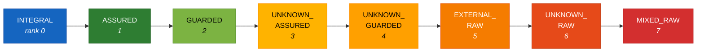

The lattice is the foundation of everything else. A [declaration]() assigns a state in it; a [rule]() reads a state out of it and compares two of them; the severity model modulates by it; the [gate]() fires on the result.

It is also the single largest piece of the designed specification that survived contact with implementation — the eight-state machine shipped one-for-one, under different names. What did *not* survive is the operator that combines those states.

## The eight states

`TRUST_RANK` totally orders them from most trusted (0) to least trusted (7). Values are explicit uppercase strings so that serialised findings, cache keys, and fixtures stay stable across releases.

| Rank | State | Set by | Meaning |
|---:|---|---|---|
| 0 | `INTEGRAL` | You — `@trusted` (default) | Fully trusted data the application produces and relies on |
| 1 | `ASSURED` | You — `@trusted(level="ASSURED")`, `@trust_boundary(to_level="ASSURED")` | Trusted after validation; a notch below integral |
| 2 | `GUARDED` | You — `@trust_boundary(to_level="GUARDED")`; also the bundled stdlib table | Partially checked: passed a shape or format guard, not fully assured |
| 3 | `UNKNOWN_ASSURED` | The engine — **never produced** | Semantically validated, provenance unestablished |
| 4 | `UNKNOWN_GUARDED` | The engine — **never produced** | Shape-validated, provenance unestablished |
| 5 | `EXTERNAL_RAW` | You — `@external_boundary`; also the stdlib table | Raw untrusted data crossing into the system from outside |
| 6 | `UNKNOWN_RAW` | The engine | Trust could not be established: undecorated code, an unresolved call, the fail-closed fallback. **The developer-freedom zone.** |
| 7 | `MIXED_RAW` | The engine — **not produced under the default configuration** | Values of incompatible trust origins were combined. Absorbing top. |

Four states are **declared** (a developer writes them with a decorator). Four are **inferred** — the engine's honest record of what it could and could not establish. No decorator can assign an `UNKNOWN_*` or `MIXED_RAW` state; there is no syntax for it.



`RAW_ZONE` — `{EXTERNAL_RAW, UNKNOWN_RAW, MIXED_RAW}` — is the single source of truth for the raw-tier gates in `PY-WL-101`, `106`, `107`, `108`, and `109`, so a future raw-zone state cannot drift between rule modules.

## The renaming

The designed specification's eight effective states map one-for-one onto the implemented ones:

| Designed specification (archived) | Implementation | Changed? |
|---|---|---|
| `AUDIT_TRAIL` | `INTEGRAL` | Name only |
| `PIPELINE` | `ASSURED` | Name only |
| `SHAPE_VALIDATED` | `GUARDED` | Name only |
| `UNKNOWN_SEM_VALIDATED` | `UNKNOWN_ASSURED` | Name only |
| `UNKNOWN_SHAPE_VALIDATED` | `UNKNOWN_GUARDED` | Name only |
| `EXTERNAL_RAW` | `EXTERNAL_RAW` | Unchanged |
| `UNKNOWN_RAW` | `UNKNOWN_RAW` | Unchanged |
| `MIXED_RAW` | `MIXED_RAW` | Unchanged |

The renaming was not cosmetic. The designed names encoded a *derivation story* (`AUDIT_TRAIL` meant "Tier 1, produced under institutional rules") and then required a paragraph explaining that `AUDIT_TRAIL` did not actually mean audit trails. The implemented names describe the *state of the value*, which is what a rule can read. The change also drops the two-dimensional derivation (trust classification × validation status) that produced twenty-four theoretical combinations, sixteen of which had to be argued impossible. **The implementation has one dimension: trust rank.**

## Combination: two operators, one in use

### `least_trusted` — the rank meet. This is the operator the engine uses.

```python
least_trusted(a, b) = a if TRUST_RANK[a] >= TRUST_RANK[b] else b
```

Returns the less-trusted of its two inputs — always one of the inputs, never a new state. Commutative, associative, and idempotent, so folding a set of states gives a result independent of visitation order. Every combination, merge, aggregation, and alternative site in the live engine resolves to it under the default configuration.

| Shape | Example | Why the weakest link is right |
|---|---|---|
| **Alternative** — the value is exactly one of N | `x = a if c else b`; `if`/`else`; loop back-edges; `try`/`except`; `match` arms | At the merge the variable holds exactly one branch's value; weakest-link is the sound and precise bound |
| **Aggregation** — a summary of a set | a function's callee-set taint; container literals | Summarising the influence of a set of callees is a weakest-link summary, not a merge of provenances |
| **Value-merge** — one value built from several | `a + b`; `",".join(parts)`; f-strings; `.format()` | See *why the designed join was wrong*, below |

### `taint_join` — the provenance-clash join. Documented, and off by default.

```python
taint_join(INTEGRAL, ASSURED) == MIXED_RAW    # different families clash
least_trusted(INTEGRAL, ASSURED) == ASSURED   # weakest link wins
```

`taint_join` models provenance *compatibility*: same-family values yield that family's weaker member; different-family values collapse to the absorbing top `MIXED_RAW`. This is, almost exactly, the join table of the designed specification.

**It has no call site under the default configuration.** Three migrations replaced every combination site with `least_trusted` — the L2 expression combiners, the L2 control-flow merges, and the L3 callee combinations. It is retained deliberately as the documented contrast operator, with a dated audit (31 May 2026) and an accepted architecture decision record as the account. Around eighteen regression-guard comments across the test suite cite `taint_join` by name as the operator the engine deliberately does *not* use.

### The switch, and why it is off

Every combination site calls a third function, `combine`, returning `taint_join(a, b)` when a provenance-clash flag is set and `least_trusted(a, b)` otherwise.

| | |
|---|---|
| **Key** | `provenance_clash` in the `[wardline]` table of `weft.toml` |
| **Default** | `false` |
| **CLI flag** | none |
| **Under `--strict-defaults`** | unreachable — the configuration file is never read |

Enabling it does **not** buy a stricter analysis. It re-creates precisely the false-positive class the migrations removed (`MIXED_RAW` becomes producible, and a clean value-merge of two different families lands in the firing raw zone) while simultaneously *suppressing* findings in any function whose own resolved tier collapses to `MIXED_RAW`, which the severity model treats as the freedom zone. **It moves the analysis in both directions at once, and neither direction is an improvement.** Treat the key as experimental and leave it alone.

### Why the designed join was wrong

The non-obvious case is the genuine value-merge. Two *clean* operands of different families — an `ASSURED` validated value concatenated with an `INTEGRAL` constant separator — clash to `MIXED_RAW` under `taint_join`. `MIXED_RAW` is rank 7, inside the firing raw zone, so the rule fired `PY-WL-101` **on validated, correct code**.

A value built from an `ASSURED` part and an `INTEGRAL` part is no more trusted than `ASSURED`, and no less trusted either. A genuinely raw operand still propagates at its precise rank and still fires. **The precision win carries no soundness cost.**

The generalisable lesson: the designed join table is the one mechanism in the entire specification specified precisely enough to be *tested*. Everything else that failed to survive failed by never being built, which teaches nothing. This one was built, deployed, run against real code, and shown to be wrong — producing a dated audit, four numbered findings, an ADR with its rejected alternative recorded, and a permanent regression-guard trail. Its designer had modelled provenance mixing as the dangerous case; real code showed the dangerous case is *raw data*, and that mixing clean data of different origins is ordinary programming.

## Clamps, floors, and anchors

All clamps move toward less-trusted, never toward more-trusted.

- **Floor** — pins a function's refined taint to be no more trusted than its L1 seed (its body-evaluation tier). Floors clamp down; they never promote.
- **Monotonicity** — the L3 project fixed point is monotone: a non-anchored function only ever moves toward less-trusted during propagation. A strict move toward more-trusted indicates a transfer-function bug, trips the `L3_MONOTONICITY_VIOLATION` diagnostic (surfaced as `WLN-L3-MONOTONICITY-VIOLATION` at `ERROR`), and pins the function at its older, safer value.
- **Anchored functions** — those carrying a declaration — are never refined by L3. Their declared tier is authoritative and is asserted after the fixed point converges.

## Reachability: five states, not eight

> [!WARNING]
> **The implementation declares eight states and produces five.** A reader who assumes all eight are live will misread the rule catalogue and the residual risks.

The only states any source can introduce into the live pipeline:

```
{INTEGRAL, ASSURED, GUARDED, EXTERNAL_RAW, UNKNOWN_RAW}
```

They arrive from exactly four entry points: the decorator provider (`EXTERNAL_RAW`, `GUARDED`, `ASSURED`, `INTEGRAL`), the L1 fail-closed fallback (`UNKNOWN_RAW`), the bundled `stdlib_taint.yaml` table (`ASSURED`, `GUARDED`, `EXTERNAL_RAW`, `UNKNOWN_RAW`), and the serialisation-sink override (`UNKNOWN_RAW`). Because `least_trusted` always returns one of its inputs, its closure over that set *is* that set.

The unproduced trio splits into two cases of unequal strength:

| State | Why unproduced |
|---|---|
| `MIXED_RAW` | Unproduced **under the default configuration**. The `provenance_clash` key is the single switch that makes it producible again — which is why every reachability claim is scoped to the default, and why the switch is off. |
| `UNKNOWN_GUARDED`, `UNKNOWN_ASSURED` | **No producer under any configuration.** Their only designed producer was the *trusted restoration boundary*, which was never built. The rooms were specified; the staircase to them never was. |

Three mechanisms hold the invariant rather than leaving it to luck:

1. **Operator closure.** `least_trusted` returns an input, by construction.
2. **Parser guards at the two dynamic entry points.** `stdlib_taint.py` accepts only `{ASSURED, GUARDED, EXTERNAL_RAW, UNKNOWN_RAW}` — a standard-library call cannot mint your `INTEGRAL` data. The summary cache's deserialiser accepts the full reachable set and rejects the trio, with one deliberate carve-out (a cached `MIXED_RAW` is admitted when `provenance_clash` is on, so a cache written under the switch is not mistaken for a tampered one). A corrupt cache file is dropped with a warning, never injected.
3. **Invariant tests.** `tests/unit/core/test_taint_invariants.py` pins both the operator closure and the end-to-end pipeline property: no scan output is ever `MIXED_RAW`, `UNKNOWN_GUARDED`, or `UNKNOWN_ASSURED`.

### Why the trio's unreachability matters

If `MIXED_RAW` became reachable, two rule families would disagree about it. The tier-modulated severity model treats it as the freedom zone and suppresses to `NONE`; `PY-WL-101` fires on it as the actual return of a trusted producer, because at rank 7 it is strictly less trusted than any clean declared tier. **The same state would silence findings *in* a function and generate one *about* it.** That latent inconsistency is the sharpest reason the switch stays off.

The trio and the falsified operator were kept deliberately rather than deleted: the regression-guard record depends on `taint_join` remaining nameable, an enforced invariant is stronger evidence than an absence, and the `UNKNOWN_*` family stays available should a future value-level provenance analysis need it without re-litigating the lattice.

## Interpretation for readers of the parent paper

The parent paper reasons in four authority tiers. **The implementation does not use tier vocabulary anywhere.**

| Parent-paper tier | Lattice state | How it is declared |
|---|---|---|
| Tier 4 — raw observation | `EXTERNAL_RAW` | `@external_boundary` |
| Tier 3 — shape-validated representation | `GUARDED` | `@trust_boundary(to_level="GUARDED")` |
| Tier 2 — semantically validated representation | `ASSURED` | `@trust_boundary(to_level="ASSURED")` or `@trusted(level="ASSURED")` |
| Tier 1 — trusted assertion | `INTEGRAL` | `@trusted` |

> [!NOTE]
> **The mapping is a reading aid, not a specification.** Three cautions:
>
> 1. The tier model's transition semantics — shape validation must precede semantic validation, Tier 2 does not automatically upgrade to Tier 1, serialisation sheds authority — are **not enforced**. Nothing stops a function declaring `@trust_boundary(to_level="ASSURED")` directly over raw input; `PY-WL-102`, `111`, `113`, and `119` check only that such a boundary is capable of rejecting something.
> 2. UNKNOWN and MIXED are engine-inferred states here, not tiers anyone can assign.
> 3. The coding-posture material (offensive, confident, guarded, sceptical) is parent-paper doctrine and has **no representation in the implementation at all**.

## See also

- [Trust Boundaries]() — the parent paper's authority tier model
- [Rules]() — how the lattice modulates severity
- [Roadmap: The Unbuilt]() — trusted restoration boundaries, the missing producer for two states
