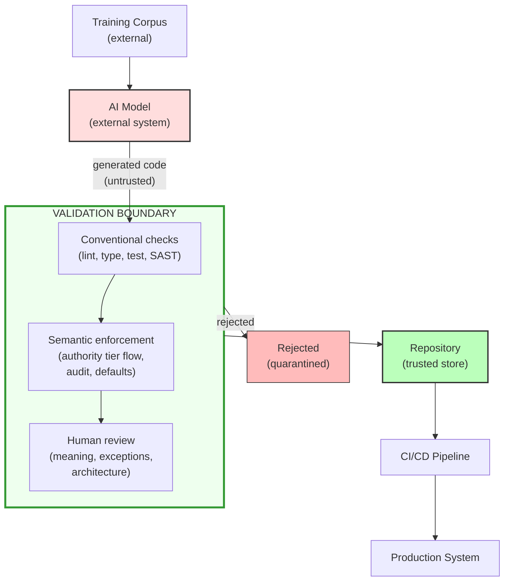

## 3. STRIDE Applied to Agentic Code Output

*This section is a structured threat enumeration — it applies STRIDE to the agentic development workflow to catalogue what can go wrong. Technical practitioners and IRAP assessors will find the category-by-category mapping most useful; policy readers may prefer the compounding scenario in §3.3, which illustrates how the individual failure modes interact.*

### 3.1 Framework selection

STRIDE (Spoofing, Tampering, Repudiation, Information Disclosure, Denial of Service, Elevation of Privilege) is the established threat modelling framework used in Australian government security assessments.[^stride-brief] Applying it to agentic code output uses a structured vocabulary already familiar to policy audiences, rather than introducing unnecessary new terminology.

The standard artefact from a threat model is a **data flow diagram (DFD)**: a schematic showing processes, data stores, data flows, and trust boundaries. The DFD for the agentic development workflow — the system this paper threat-models — is:



**Diagram description (accessibility):** An AI model, informed by an external training corpus, produces untrusted generated code. That code passes through a validation boundary consisting of three sequential layers: conventional checks (lint, type, test, SAST), semantic enforcement (authority-tier flow, audit trail, defaults), and human review (meaning, exceptions, architecture). Code exits either as rejected (quarantined) or as validated into the repository (trusted store), from which it proceeds through CI/CD into production.

The STRIDE analysis that follows applies each threat category to the components and flows in this diagram. The most important observation from the DFD itself is that the AI model is an **external system** producing output that crosses a trust boundary into the repository. This is the same structural position as any external data source, and it warrants the same boundary discipline (§5) — and this observation is visible from the DFD alone, before any STRIDE enumeration.

The application below extends STRIDE to treat **agent-generated code as an input** to the system — analogous to treating user input as untrusted. The agent is not an adversary, but its output has the same authority properties as any external input: it may be well-formed, it may be reasonable, but it has not been validated against the system's security requirements.

Two of the six categories — "fabricated default" (S) and the process-level DoS entries (D) — are **analogical extensions** of STRIDE's original technical-system categories to development-process analysis, proposed here as candidate extensions rather than presented as standard applications. STRIDE-LM (adding Lateral Movement)[^stride-lm] and the emerging ASTRIDE variant (adding AI Agent-Specific Attacks)[^astride] provide precedent for such extensions, but the reader should understand these as novel mappings rather than established STRIDE doctrine.

*A methodology note on the STRIDE mapping — which categories are direct and which are analogical extensions — appears after the six entries below. Readers unfamiliar with STRIDE may wish to read it first.*

### 3.2 Threat categories

#### S — Spoofing: Competence and identity spoofing

**Agentic variant:** Code *appears* to handle data correctly but operates on fabricated or default values, presenting a false picture of data integrity.[^stride-s-traditional]

**Mechanism:** Agents default to defensive patterns that substitute values rather than failing. The code "works" — it produces output, it does not crash — but the output is based on fabricated data rather than actual data. The code spoofs the competence of correct data handling.

**Examples:**

```python
# Fabricates a default rather than surfacing missing data
user_role = getattr(session, "role", "readonly")
# Missing role silently becomes "readonly" — wrong in either direction.

# Substitutes processing time for missing event time
event_time = record.timestamp or datetime.now()
# The audit trail now records when we processed the record, not when
# the event occurred. Temporal provenance has been fabricated.

# Fabricates identity via structural presence
if hasattr(obj, "security_clearance"):
    handle_classified(obj)
# Structural check, not identity check — any object with this attribute passes.
```

**Why existing controls miss it:** The code is syntactically valid, follows common patterns, and passes tests — because the failure is semantic, not syntactic. No existing linter, type checker, or SAST tool is designed to determine whether a default value on a particular field fabricates data that will be treated as authoritative. That judgment requires domain-specific context about the security semantics of each field — context that lives in team culture and project documentation, not in the programming language or any standard tooling. A human reviewer under time pressure may see "defensive coding" — a positive signal — and approve it.

**Risk in government context:** Classification decisions, access control, evidentiary integrity — any domain where "I don't know" and "the default" are different answers with different consequences.[^stride-s-entries]

#### T — Tampering: Authority tier conflation

**Agentic variant:** External (untrusted) data is treated as internal (trusted) data without validation, effectively tampering with the authority tier rather than the data itself.[^stride-t-traditional]

**Mechanism:** Agents do not distinguish between data from different authority tiers because the programming language does not enforce it. A `dict` from a validated database query and a `dict` from an unvalidated API response are the same type. The agent treats them interchangeably.

**Examples:**

```python
# API response used directly without validation boundary
api_response = requests.get(external_url).json()
save_to_internal_database(api_response["records"])
# External data enters the trusted internal store without validation.
# The agent does not see a trust boundary — it sees a dict going into a function.

# Deserialized data assumed trustworthy
config = json.loads(uploaded_config_file.read())
apply_system_settings(config)
# User-uploaded JSON treated as trusted configuration.
```

**Why existing controls miss it:** Type checkers verify shape (`dict`), not provenance. Linters check syntax, not trust-boundary crossings. The defect only becomes visible at the level of semantic boundary enforcement.

**Risk in government context:** Injection attacks through unvalidated external data, data corruption of authoritative records, and compliance failures when data provenance cannot be demonstrated.[^stride-t-entries]

#### R — Repudiation: Audit trail destruction through error handling

**Agentic variant:** Error handling patterns destroy the audit trail by catching, logging, and continuing rather than failing in a way that preserves the error as a first-class audit event.[^stride-r-traditional]

**Mechanism:** Agents generate broad exception handlers that prevent crashes but also prevent errors from being recorded in audit systems. The error is "handled" in the sense that the program continues, but the event that caused the error is lost to the audit trail.

**Examples:**

```python
# Error swallowed — audit trail has a gap
try:
    record_decision(case_id, decision, rationale, evidence)
except Exception as e:
    logger.error(f"Failed to record decision: {e}")
    # Decision was made but not recorded. The audit database shows nothing.

# Partial completion without rollback
try:
    update_classification(document_id, new_level)
    notify_stakeholders(document_id, new_level)
    record_classification_change(document_id, old_level, new_level)
except NotificationError:
    pass  # "Notification is non-critical"
    # Three operations that should be atomic are silently partial.
```

**Why existing controls miss it:** The code handles exceptions — generally considered good practice. The distinction between "handle the error and continue safely" and "swallow the error and destroy evidence" requires understanding which operations are audit-critical, which the agent does not reliably possess.

**Risk in government context:** Regulatory compliance (failure to maintain complete audit trails), legal proceedings (gaps in evidence chains), and IRAP assessment failures (inability to demonstrate complete traceability).[^stride-r-entries]

#### I — Information Disclosure: Verbose error response and stack trace exposure

**Agentic variant:** Agent-generated error handling exposes internal system details in error responses, log messages, or API returns.[^stride-i-traditional]

**Mechanism:** Agents produce "helpful" error messages that include internal state, query parameters, file paths, or stack traces (ACF-I1: Verbose Error Response). This is good practice for development but dangerous in production, and agents do not distinguish between the two contexts. Stack trace exposure — a related pattern well-covered by existing SAST tooling — is not catalogued as a separate ACF entry because existing tools provide adequate detection.

**Examples:**

```python
# Agent-generated "helpful" error handler
except DatabaseError as e:
    return {
        "error": str(e),
        "query": sql_query,         # Exposes database schema
        "connection": str(db_url),  # May contain credentials
        "params": query_params,     # Exposes internal identifiers
    }

# Stack trace in API response
except Exception as e:
    import traceback
    return {"error": traceback.format_exc()}
    # Full stack trace exposes file paths, function names, and library versions.
```

**Why existing controls miss it:** The error handling is syntactically correct and genuinely helpful during development. Detecting that internal details should not appear in production error responses requires understanding the deployment context, not the code structure.

**Risk in government context:** Reconnaissance information for attackers, credential exposure, and violation of need-to-know principles.[^stride-i-entries]

#### D — Denial of Service: Finding flood and review capacity exhaustion (meta-threat)

**Agentic variant:** The volume of agent-generated code overwhelms the review process, degrading review quality to the point where the review is no longer an effective security control.[^stride-d-traditional]

*Note: This extends STRIDE to the development lifecycle. The "service" being denied is the review process — a security control per ISM-2060/2061 — not a user-facing system.*

**Mechanism:** This is not a code pattern — it is a *process* threat that operates at two scales. At individual scale, when agents generate code at multiples of human velocity, the review queue grows proportionally. Reviewers under volume pressure shift from careful semantic review to surface-level scanning. The review process — which is a security control — degrades to a rubber stamp.

At organisational scale, the same dynamic overwhelms the review processes themselves:

- The security team's capacity to evaluate changes
- The IRAP assessment pipeline's ability to keep pace with the rate of system change
- The audit function's ability to maintain meaningful coverage

The degradation compounds: individual reviewers fatigue, which degrades team-level review quality, which degrades the organisational assurance that depends on those reviews.

A secondary mechanism: when automated analysis tools produce too many findings on agent-generated code, reviewers habituate to dismissing findings, and genuine security issues are lost in the noise.

**Why existing controls miss it:** Existing controls assume review capacity scales with code generation rate. In practice, it does not. The control's effectiveness is inversely proportional to the volume it processes — the opposite of how every other component in the pipeline scales.

**Risk in government context:** Security review as a compliance checkbox rather than an effective control, accreditation based on a process that no longer provides the assurance it claims to provide.[^stride-d-entries]

#### E — Elevation of Privilege: Implicit privilege grant

**Agentic variant:** External system assertions are accepted without independent verification, granting privileges based on unvalidated claims — treating an external authority statement as if it were an internal trust decision.[^stride-e-traditional]

**Mechanism:** Closely related to the Tampering category above (ACF-T1/T2), but focussed on the *consequence* rather than the *mechanism*. Where T1 describes the missing validation boundary, E1 describes what happens next: the external system's assertion is acted upon as though it carried internal authority.

The privilege elevation is implicit — no explicit `setRole()` or `grantPermission()` call — because the elevation happens through data flow, not code structure.

**Examples:**

```python
# User-supplied filter used in internal query without validation
def search_records(user_query: dict):
    results = db.query(Record).filter_by(**user_query)
    # Untrusted input unpacked into query — user can filter on internal fields.
    return results

# External system's assertion accepted without verification
partner_response = partner_api.verify_identity(applicant_id)
if partner_response.get("verified", False):
    grant_access(applicant_id)
    # No independent verification, no recording of the basis for the decision.
    # Partner's authority tier silently elevated to internal authority tier.
```

**Why existing controls miss it:** The code follows common integration patterns. Scanners flag explicit privilege-escalation calls (`setRole()`, `grantPermission()`); they have no model for elevation-by-data-flow.

**Risk in government context:** Unauthorised access to classified information, acceptance of unverified identity assertions in federated systems, and compliance failures in inter-agency data sharing.[^stride-e-entries]

**A note on methodology and taxonomy design.** Using a security framework (STRIDE) to categorise what §2.2 characterises as a safety problem is a deliberate pragmatic choice — STRIDE is the vocabulary Australian government security assessments already use. The trade-off is that some mappings are more illuminating than others: T, I, and E map naturally; S is analogical (fabricated data presenting as authoritative, not identity forgery); D is the loosest fit (resource depletion, not an attack). The reader should weigh the individual failure modes on their merits, not on the strength of their STRIDE mapping.

The taxonomy intentionally mixes code-level semantic failures (S, T, I, E) and process-level assurance failures (D), because the paper's central claim is that they interact: code-level failures pass review *because* of process-level failures.

It indexes observable artefacts rather than generative causes, since artefacts are what detection tools and review processes can act on.[^taxonomy-artefacts] The categories above are the failure modes observed to date; the taxonomy is designed for extension.

### 3.3 The compounding effect

These six threat categories do not operate independently. In practice, they compound — and the compounding produces a structural failure condition: agents generate a flood of code that follows established good practice, arriving at review boundaries faster than human assurance processes can absorb it, in the systems that have the least tolerance for those failure modes.

One illustrative scenario:

1. An agent generates code with **authority tier conflation** (ACF-T1), creating the conditions for **implicit privilege grant** (ACF-E1) — external API data used directly without validation.
2. Errors in that data are caught by a broad `except` block, producing **audit trail destruction** (ACF-R1).
3. The handler substitutes a default value rather than surfacing uncertainty — **fabricated default** (ACF-S1). Downstream components treat that fabricated value as authoritative.
4. Review volume pressure means the pattern is not detected before merge — **review capacity exhaustion** (ACF-D2).

Steps 2 and 3 are connected by more than sequence. Under the precondition discipline named in §2.3, a missing or invalid value at a function boundary is definitionally the caller's fault, and the violation itself is the evidence that identifies which upstream component broke the contract. Swallowing the exception (ACF-R1) and then fabricating a default (ACF-S1) are not two independent conveniences that happen to occur together — they destroy the same evidence by two different routes. The audit gap R1 leaves and the confident-looking value S1 manufactures both erase the fact that a contract was violated and, with it, any record of who violated it.

Each individual pattern follows conventions generally regarded as good practice. The broad `except` block is responsible error handling. The default value is defensive programming. The direct API usage is clean integration code. A conventional review could approve each pattern individually, because each follows conventions reviewers are trained to accept. The compound effect is a system that silently produces wrong results, cannot explain why, and passed every review gate — not because the reviewer was negligent, but because every component followed established good practice for the wrong context.

A subtler compounding mechanism operates across time: upstream representational choices can collapse the semantic distinctions that downstream code needs. When a typed contract[^dbc-contract] is flattened into a permissive dictionary structure, downstream defensive access patterns cease to look anomalous and begin to look prudent — upstream looseness manufactures the local conditions under which defensive handling appears justified. §5 develops this as bidirectional authority collapse.

[^dbc-contract]: "Contract" appears throughout this paper in the informal sense used here. The choice of word is not incidental: a typed field is a contract in Meyer's sense (§1.6) — a precondition the caller must satisfy — and flattening it into an untyped dictionary does not remove that obligation, only the enforcement surface that would have made its violation visible. What downstream code experiences as prudence is the disappearance of a contract it can no longer see.

Appendix E presents an incident in which this mechanism produced a latent bug that passed all automated checks and was only surfaced through four rounds of operator challenge. When agents produce these compounding shapes as a recurring characteristic rather than an occasional lapse, dormant but activatable defects accumulate. The resulting risk profile is qualitatively different from the same mistakes appearing sporadically at human velocity.

[^taxonomy-artefacts]: A validation boundary was omitted, authoritative data was fabricated by default, a test was displaced onto mocks, an error handler swallowed an audit event, an authority tier was collapsed.

[^stride-s-entries]: Appendix A expands this STRIDE category into three distinct failure modes: ACF-S1 (Fabricated Default), ACF-S2 (Spurious Field Access), and ACF-S3 (Structural Identity Spoofing), plus provisional candidates ACF-S4 (Type Annotation Erosion) and ACF-S5 (Type Structure Avoidance).

[^stride-t-entries]: Appendix A separates the Tampering category into ACF-T1 (Authority Tier Conflation), ACF-T2 (Silent Coercion), and ACF-T3 (Unstructured Signal Parsing), plus provisional candidate ACF-T4 (Safety Guard Erosion).

[^stride-r-entries]: Appendix A separates the Repudiation category into ACF-R1 (Audit Trail Destruction), ACF-R2 (Partial Completion), ACF-R3 (Verification Displacement), and ACF-R5 (Remediation-Induced Violation), plus provisional candidates ACF-R4 (Context Handover Assumption) and ACF-R6 (Scope-Limited Triage).

[^stride-i-entries]: Appendix A covers ACF-I1 (Verbose Error Response) as the core Information Disclosure entry. Stack trace exposure — a related pattern well-covered by existing SAST tooling — is not catalogued separately.

[^stride-d-entries]: Appendix A separates the Denial of Service category into ACF-D1 (Finding Flood) and ACF-D2 (Review Capacity Exhaustion). They have different upstream drivers and different mitigation strategies, even though both degrade the same security control.

[^stride-e-entries]: Appendix A separates the Elevation of Privilege category into ACF-E1 (Implicit Privilege Grant) and ACF-E2 (Unvalidated Delegation). ACF-E2's structural pattern also extends to the development process layer: agents inherit the operator's system credentials and execute privileged operations without the operator constraining scope — the same unvalidated delegation, expressed at the execution layer rather than the code layer. This process-layer dimension is addressed by graduated execution authority boundaries (§9.17).

[^stride-s-traditional]: **Traditional STRIDE scope:** An entity claims to be something it is not — a forged authentication token, a spoofed IP address, a process impersonating another user. The system accepts the false identity and grants access or trust accordingly.

[^stride-t-traditional]: **Traditional STRIDE scope:** An attacker modifies data in transit or at rest without authorisation — altering a database record, intercepting and changing a message, corrupting a configuration file. The data itself is changed.

[^stride-r-traditional]: **Traditional STRIDE scope:** A user performs an action — a transaction, an access, a deletion — and later denies it. The system lacks sufficient logging, signing, or non-repudiation controls to prove the action occurred. The gap is in the *recording* of events.

[^stride-i-traditional]: **Traditional STRIDE scope:** Sensitive data is exposed to unauthorised parties — through a misconfigured access control, a side-channel leak, an unprotected API endpoint, or data at rest without encryption. The exposure is typically of *stored or transmitted* data.

[^stride-d-traditional]: **Traditional STRIDE scope:** An attacker exhausts a system's resources — network bandwidth, CPU, memory, connection pools — rendering it unable to serve legitimate requests. The attack targets *availability* of a runtime service.

[^stride-e-traditional]: **Traditional STRIDE scope:** A user or process gains capabilities beyond what is authorised — exploiting a kernel vulnerability to move from user to root, leveraging a misconfigured role to access admin functions, or escaping a sandbox to reach the host system. The escalation is of *identity or access rights*.

[^stride-brief]: For readers unfamiliar with threat modelling: the process has three steps — (1) describe the system (actors, data flows, trust boundaries); (2) enumerate what can go wrong systematically using a framework such as STRIDE; (3) decide what to do about each threat. STRIDE is not the only framework — PASTA, LINDDUN, and attack trees serve different analytical purposes — but it is the one most familiar to Australian government security assessments.

[^stride-lm]: Muckin, M. and Fitch, S.C. (2019), "A Threat-Driven Approach to Cyber Security," Lockheed Martin Corporation.

[^astride]: Bandara, E. et al. (2025), "ASTRIDE: A Security Threat Modeling Platform for Agentic-AI Applications," arXiv:2512.04785. Preprint, not peer-reviewed.

---
