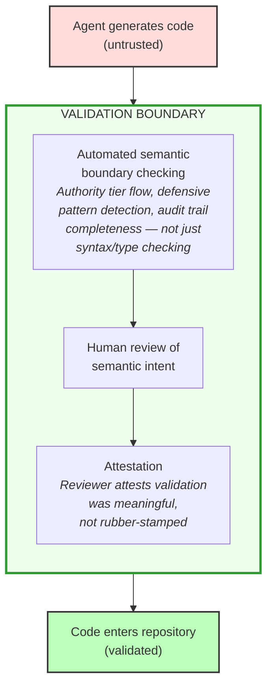

## 5. Agent Output as a Trust Boundary

*This section introduces the paper's core conceptual contribution: the authority tier model and the treatment of agent output as untrusted input requiring boundary validation. It provides the analytical vocabulary that the gap analysis (§6) and response landscape (§7) build on.*

### 5.1 The authority tier model

Data in high-stakes systems can be classified into authority tiers: how much authority the data carries to justify continued execution, and how little latitude the system may give anomalies before it must stop. The tier reflects what guarantees the system is entitled to assume: data the system itself produced is authoritative at source; data from an external source is unvalidated regardless of quality.

The tier governs how the system treats the data. The path governs how the system responds when that data fails.

| Tier | Description | Handling Rule | Example |
|------|-------------|---------------|---------|
| **Tier 1: Authoritative internal data** (trusted assertion) | Data produced by the system's own controlled processes — audit records, internal state, configuration | Treat as authoritative. Missingness, corruption, or contradiction is an integrity failure, not an invitation to default. Halt or reject the current operation; the exact failure response is path-specific | Database audit trail, system configuration, internal state machines |
| **Tier 2: Semantically validated data** (semantically validated representation) | Data that has passed both structural validation and domain-constraint checking — values are present, correctly typed, and satisfy business rules, range constraints, and cross-field invariants | Trust for domain operations once validated. Guard only against cross-cutting concerns (authorisation, concurrency, freshness, state transitions) that value-level validation cannot address | API response after schema validation *and* domain-rule verification, database record promoted through a business-rule gate |
| **Tier 3: Shape-validated data** (shape-validated representation) | Data that entered the system from outside but has passed through only a structural validation boundary — fields are present and types are correct, but values may still be nonsensical, unsafe, or out of domain range | Direct field access is safe; validate domain constraints before using values in business logic, arithmetic, or security-sensitive operations | API response after schema validation, CSV row after type coercion |
| **Tier 4: Unvalidated external data** (raw observation) | Data from outside the system boundary, not yet validated | Do not use in high-stakes code paths until validated. Validate at the boundary and quarantine failures | Raw API responses, user uploads, message queue payloads |

On an audit trail path, an integrity failure may require the process to stop — a corrupted audit record means the system can no longer prove what happened. On an authentication path, a missing username halts the login attempt but the system keeps running, because a failed login does not compromise other operations. Both paths treat the data with zero latitude for corruption or substitution. Both refuse to fabricate a default. But one crashes the process and the other rejects a request. The difference is not in the authority of the data, but in the operational consequences of its failure.

The rationale above is stated in terms of harm — a corrupted audit record means the system can no longer prove what happened. There is a second, complementary rationale: a controlled failure is a feedback loop, and a silent default is not. §2.4(a) establishes that an agent carries no persistent memory of a correction across sessions — the correction has to live somewhere outside the agent, or it is lost entirely. A crash puts it there: it re-surfaces the flaw at the point of failure, on every encounter, whether or not anyone remembers it happened last time. A silently tolerated flaw at Tier 1 offers no such guarantee — it can recur indefinitely without ever being seen, let alone fixed. Tier 1 never silently tolerates a flaw for this reason: loudness is not a side effect of failing safely, it is the mechanism by which a flaw becomes known and therefore fixable.

The principle that external inputs should be validated at the perimeter is standard practice in security engineering. The four-tier taxonomy above is this paper's formalisation of that principle. The distinction between Tier 2 and Tier 3 — semantically validated versus shape-validated — captures a boundary that is critical in practice but invisible to most tooling: data that has the right *shape* (fields present, types correct) can still carry values that violate domain constraints. Treating shape-validated data as though it were semantically validated is a specific and common source of defects in high-stakes code paths. This is Meyer's point about types, restated as a boundary-crossing rule: a type system can guarantee shape — the right fields, present and correctly typed — but only an explicit check against domain constraints can guarantee value — non-empty, within range, drawn from a permitted set, a well-formed classification. Tier 3 is what a type system verifies; Tier 2 is what Design by Contract calls a precondition (§1.6). A semantic defect, in this paper's terms, is exactly a Tier 2 violation that clears Tier 3 — code that has the right shape but the wrong value — which is why type-level tooling (schema validation, static typing, most SAST) cannot detect it: type-level tooling is built to verify Tier 3, and the defect lives one rung higher.

The companion specification maps the four tiers onto the eight-state trust lattice its implementation actually enforces (Part I §4.5). The mapping is a reading aid, not an enforcement claim: the tier model's transition semantics — shape validation before semantic validation, no skip-promotion to Tier 1 — are not enforced by the implementation, and the designed restoration-boundary evidence model (four categories of provenance evidence determining which tier a restored artefact may reach) was never built (Part I §10.2).

One consequence of the tier model that practitioners encounter immediately: serialisation boundaries reset trust. A Tier 1 audit record that is written to a database and later read back enters the read interface at the trust level of unvalidated data — its authority must be re-established through restoration controls (integrity verification, schema conformance) before it can be treated as authoritative again. The designed companion specification distinguished this *restoration* from standard external-data validation: the data's provenance is known, but its integrity across the serialisation boundary is not, so re-establishment may use provenance evidence rather than full Tier 4 validation. Restoration boundaries were never built — the as-built specification records them as designed-not-built (Part I §10.2), and its nearest shipped control is a rule flagging stored or persisted taint that reaches a trusted state without validation. The trust-reset principle stands on its own; only its automated enforcement remains unimplemented.

Uniform defensive patterns collapse the authority model from both directions (§2.2). The formal consequence is bidirectional. Agent-generated code gives Tier 4 (unvalidated external) data more authority than it has earned — defaults and coercion allow unvalidated data to cross inward as though it had been verified. Simultaneously, it treats Tier 1 (authoritative internal) data as more negotiable than the tier model permits — the same `.get()`-with-default and catch-and-continue patterns handle corruption of authoritative records as routine rather than exceptional.

This bidirectional authority collapse is the central mechanism by which one-size-fits-all defensive programming undermines a tiered authority architecture.

### 5.2 Agent code as untrusted input

The authority tier model above describes data flowing through a running system. Agent-generated code is not data in that sense — it is *source code* entering a development workflow — and forcing it into the Tier 3 category overloads a model designed for runtime data authority. But the analogy is instructive: just as external data must not enter the authoritative store without passing through a validation boundary, **agent-generated code must not enter the codebase until it has been reviewed — not only by a human reviewer but also by automated structural and semantic checks.** The principle is the same; the mechanism is different.

This is not a claim about agent quality. Agents produce high-quality code much of the time. It is a claim about *provenance*: assurance is drawn from the organisation's validation process rather than from the tool's statistical quality, because the relevant property is verified correctness, not apparent competence. The agent is an external system. Its output has not been validated against the system's security requirements. The fact that the output is source code rather than JSON or CSV does not change its trust properties — it warrants boundary discipline analogous to what organisations already apply to external data, adapted for the development workflow.

The natural organisational instinct is to treat agent output as carrying the authority of the person who directed the agent. If the chief engineer uses an agent to implement a feature, the resulting code feels like "product of the chief engineer" and inherits the review deference that the chief engineer's own code would receive. This is the wrong model. The chief engineer directed the work, but the code itself was generated by a system that has not validated its output against the project's security requirements.

The appropriate analogy is not "code written by a trusted senior engineer" but "code submitted to the repository by an external contributor whose competence is plausible but unverified."

The directing engineer's authority is relevant to the *decision to accept* the code after review, not to the *trust level of the code before review*. Without this distinction, the authority of the human operator launders the provenance of the machine output — the kind of implicit trust escalation that the tier model is designed to prevent.

An obvious objection: does an agent fine-tuned on the organisation's own codebase deserve a more permissive review posture? It does not. A fine-tuned agent may produce output that is *statistically more likely* to conform to local conventions, but it has not *validated* its output against the system's security requirements. The fine-tuning changes the prior probability of correctness; it does not change the epistemic status of the output. Validated status requires that the output has passed through review and enforcement (§5.3) — an event, not a property of the generating tool — for the same reason that hiring a trustworthy contractor does not eliminate the need for acceptance testing.[^fine-tune-independence]

Treating agent code as untrusted input has specific implications:

| Principle | Application |
|-----------|------------|
| **Validate at the boundary** | Agent output must pass security-aware validation before entering the codebase |
| **Quarantine failures** | Code that fails validation is rejected, not silently corrected |
| **Record original output** | The original agent output is preserved for audit, even if modified during review (§7.1) |
| **No silent coercion** | Agent code is not silently "fixed up" by reviewers — changes are explicit and recorded |

### 5.3 Implications for the development workflow

Because agent output is untrusted, the development workflow must include a **validation boundary** between agent generation and code integration:

**Diagram description (accessibility):** The diagram shows a three-stage flowchart: (1) Agent generates code (untrusted); (2) Code passes through a Validation Boundary containing three sequential steps — automated semantic boundary checking (authority tier flow, defensive pattern detection, audit trail completeness — not just syntax/type checking), human review of semantic intent, and attestation (reviewer attests validation was meaningful, not rubber-stamped); (3) Code enters repository (validated). The key message: code moves from untrusted to validated only after passing through all three validation steps.

The key difference from current practice: **the validation must be semantically aware, not just syntactically or functionally correct.** Current checks ask "does this code work?" and "does it follow known vulnerability patterns?" The failure modes in Appendix A pass both questions. The validation boundary must answer the semantic questions identified in §3 — questions about fabricated defaults, destroyed audit trails, and unvalidated trust-boundary crossings that require knowledge of what the code *means in its operational context*, expressed as repository-enforced rules rather than left in documentation or reviewer memory.

This validation boundary is not one thing. It is a layered stack, and the layers are not interchangeable:

1. **Conventional checks** — syntax, types, linting, unit tests, known vulnerability pattern scanning. These are necessary but insufficient: the core semantic failure modes in Appendix A pass this level.
2. **Semantic enforcement** — purpose-built checks for authority-tier flow, path-appropriate failure behaviour, audit-trail preservation, fabricated defaults, and validation-boundary crossings. This is the missing layer that does not yet exist in standard tooling and that this paper argues must be built.
3. **Human review after semantic pre-screening** — humans adjudicate meaning, exceptions, and architecture: whether the trust topology is correctly declared, whether a validation function is actually correct (not just structurally present), whether an exception to a rule is justified. Machines handle pattern-level detection first; humans focus on semantic adequacy.

This layered structure will be familiar to security practitioners as **defence in depth** — the same principle that governs network architecture and that the ISM embeds throughout its control framework. Each layer catches a different class of failure; no single layer is sufficient; and the layers are not interchangeable, just as a firewall does not substitute for application-level input validation. The difference from network defence in depth is that the middle layer — semantic enforcement — does not yet exist as a standard control category.

Building it is the core technical recommendation of this paper (§7.2). The tooling doctrine is younger than the threat model — one production deployment exists (§8), the companion specification provides a reference design, and several feasible implementation paths are described in §7.2. The specific tools will evolve faster than the underlying requirement.[^terminology-layers]

§7.2 describes how this framing translates into practice: a minimum viable validation boundary can be established at several stages of maturity (Stage 1 through Stage 3), from low-cost rule-and-checklist approaches through to automated semantic enforcement integrated into CI/CD workflows.

[^terminology-layers]: The designed companion specification proposed three enforcement layers — a static analyser, a type-system layer, and a runtime structural layer — as implementation components within this paper's semantic-enforcement layer (layer 2 above), not a competing decomposition of the full validation boundary. The implementation built one of the three: the static analyser. The type-system and runtime structural layers were designed and never built (companion specification, Part I §10.3), and the shipped tool is static-only by declared non-goal.

[^fine-tune-independence]: Appendix F develops a complementary argument: fine-tuned variants of the same base model inherit the training-distribution biases of their parent, so model diversity through fine-tuning should not be assumed to provide meaningful independence (§F.1).

---
