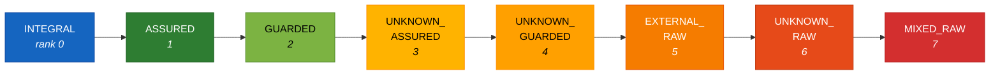

### 4. The trust lattice

The lattice is the foundation of everything that follows. A declaration (§5) assigns a state in it; a rule (§6) reads a state out of it and compares two of them; the severity model modulates by it; the gate (§7) fires on the result.

It is also the single largest piece of the designed specification (archived) that survived contact with implementation — the eight-state machine of the designed §5.1 shipped one-for-one, under different names. What did *not* survive is the operator that combines those states. The designed join algebra was not skipped, deferred, or judged too expensive: it was implemented, run against real code, found to produce false positives on correct code, and taken off the default path, with a dated audit and an accepted architecture decision record as the account. That is the most instructive passage in this document, and §4.3 tells it at length. A specification that is precise enough to be falsified by its own implementation is doing better than most.

#### 4.1 The eight states

`src/wardline/core/taints.py` defines `TaintState` as, in its own docstring, "The 8 canonical taint states". Values are explicit uppercase strings so that serialised findings, cache keys, and conformance fixtures stay stable across releases.

`TRUST_RANK` totally orders them from most trusted (0) to least trusted (7):

| Rank | State | Set by | Meaning |
|---:|---|---|---|
| 0 | `INTEGRAL` | You — `@trusted` (default) | Fully trusted data the application produces and relies on. |
| 1 | `ASSURED` | You —<br>`@trusted` or<br>`@trust_boundary`<br>(ASSURED) | Trusted after validation; a notch below integral. |
| 2 | `GUARDED` | You —<br>`@trust_boundary`<br>(GUARDED); also the bundled stdlib table | Partially checked: passed a shape or format guard, not fully assured. |
| 3 | `UNKNOWN_ASSURED` | The engine (never produced — see §4.4) | Semantically validated, provenance unestablished. |
| 4 | `UNKNOWN_GUARDED` | The engine (never produced — see §4.4) | Shape-validated, provenance unestablished. |
| 5 | `EXTERNAL_RAW` | You — `@external_boundary`; also the stdlib table | Raw untrusted data crossing into the system from outside. |
| 6 | `UNKNOWN_RAW` | The engine | Trust could not be established: undecorated code, an unresolved call, the fail-closed fallback. This is the developer-freedom zone. |
| 7 | `MIXED_RAW` | The engine (not produced under the default configuration — see §4.3–§4.4) | Values of incompatible trust origins were combined. Absorbing top. |

Four states are *declared* — the ones a developer writes with a decorator. Four are *inferred* — the engine's honest record of what it could and could not establish. No decorator can assign an `UNKNOWN_*` or `MIXED_RAW` state; there is no syntax for it.



`RAW_ZONE` — `{EXTERNAL_RAW, UNKNOWN_RAW, MIXED_RAW}` — is defined in the same module as the single source of truth for the raw-tier gates in `PY-WL-101`, `106`, `107`, `108`, and `109`, so that a future raw-zone state cannot drift between rule modules.

#### 4.2 The renaming, and what it changed

The designed specification's eight effective states map one-for-one onto the implemented ones:

| Designed specification (archived) | Implementation | Changed? |
|---|---|---|
| `AUDIT_TRAIL` | `INTEGRAL` | Name only |
| `PIPELINE` | `ASSURED` | Name only |
| `SHAPE_VALIDATED` | `GUARDED` | Name only |
| `UNKNOWN_SEM_VALIDATED` | `UNKNOWN_ASSURED` | Name only |
| `UNKNOWN_SHAPE_VALIDATED` | `UNKNOWN_GUARDED` | Name only |
| `EXTERNAL_RAW` | `EXTERNAL_RAW` | Unchanged |
| `UNKNOWN_RAW` | `UNKNOWN_RAW` | Unchanged |
| `MIXED_RAW` | `MIXED_RAW` | Unchanged |

The renaming was not cosmetic drift. The designed names encoded a *derivation story* — `AUDIT_TRAIL` meant "Tier 1, produced under institutional rules", `SHAPE_VALIDATED` meant "Tier 4 that has passed structural validation" — and the designed specification then had to spend a paragraph explaining that `AUDIT_TRAIL` did not actually mean audit trails and `PIPELINE` did not mean pipelines. The implemented names describe the *state of the value*, which is what a rule can actually read. The change also drops the two-dimensional derivation (trust classification × validation status) that produced twenty-four theoretical combinations of which sixteen had to be argued impossible or collapsed. The implementation has one dimension: trust rank.

#### 4.3 Combination: the operator the engine uses

Two binary operators exist over `TaintState`. They are **not** interchangeable, and the difference between them is the single most consequential engineering decision in the codebase.

**`least_trusted` — the rank meet. This is the operator the engine uses.**

```python
least_trusted(a, b) = a if TRUST_RANK[a] >= TRUST_RANK[b] else b
```

It returns the less-trusted of its two inputs — always one of the inputs, never a new state. It is commutative, associative, and idempotent, so folding a set of states with it gives a result independent of visitation order. Every combination, merge, aggregation, and alternative site in the live engine resolves to it under the default configuration — see *The switch, and why it is off*, below. Three shapes of program point all resolve to it:

| Shape | Example | Why the weakest link is right |
|---|---|---|
| **Alternative** — the value is exactly one of N | `x = a if c else b`; `if`/`else`; loop back-edges; `try`/`except`; `match` arms | At the merge the variable holds exactly one branch's value; weakest-link is the sound and precise bound. |
| **Aggregation** — a summary of a set | a function's callee-set taint; container literals | Summarising the influence of a set of callees is a weakest-link summary, not a merge of provenances. |
| **Value-merge** — one value built from several | `a + b`; `",".join(parts)`; f-strings; `.format()` | See below. |

**`taint_join` — the provenance-clash join. Documented, and off by default.**

```python
taint_join(INTEGRAL, ASSURED) == MIXED_RAW    # different families clash
least_trusted(INTEGRAL, ASSURED) == ASSURED   # weakest link wins
```

`taint_join` models provenance *compatibility*: same-family values yield that family's weaker member, different-family values are a clash and collapse to the absorbing top `MIXED_RAW`. Any pair touching `MIXED_RAW` yields `MIXED_RAW`; within the `UNKNOWN_*` family the join demotes to the weaker validation; every other distinct pair not in its small table collapses to `MIXED_RAW`. This is, almost exactly, the join table of the designed specification's §5.1 — the designed model's general rule was that any merge across trust classifications produces `MIXED_RAW`.

It has **no call site under the default configuration.** Three migrations replaced every combination site with `least_trusted` — the L2 expression combiners, the L2 control-flow merges, and the L3 callee combinations — and it is retained deliberately as the documented contrast operator. The account is `docs/audits/2026-05-31-taint-combination-audit.md` and the accepted architecture decision record `docs/decisions/2026-05-31-wardline-taint-lattice-retain.md`, which resolves that audit's findings F1, F3, F4, and F5. Around eighteen regression-guard comments across the test suite cite `taint_join` by name as the operator the engine deliberately does *not* use, and eight unit-test references pin the clash semantics those comments cite.

**The switch, and why it is off.** Retained is not the same as unreachable, and the distinction should be stated rather than left for a reader to find in the source. Every combination site calls a third function, `combine`, which returns `taint_join(a, b)` when a provenance-clash flag is set and `least_trusted(a, b)` otherwise. The flag is a configuration key — `provenance_clash` in the `[wardline]` table of `weft.toml`, schema-legal and defaulting to `false`. There is no command-line switch for it, and under `--strict-defaults` (§5.7) the configuration file is never read at all, so in that mode it cannot be set. Enabling it does not buy a stricter analysis. It re-creates precisely the false-positive class the migrations removed — `MIXED_RAW` becomes producible, and a clean value-merge of two different families lands in the firing raw zone — while at the same time *suppressing* findings in any function whose own resolved tier collapses to `MIXED_RAW`, which the severity model treats as the freedom zone (§4.4, §6.2). It moves the analysis in both directions at once, and neither direction is an improvement. The key exists so that the falsified operator can still be run against real code for experiment and regression contrast rather than being embalmed as a comment; the default is the analysis this document describes, and Part II-A's operating advice — treat the key as experimental and leave it alone — is the right one.

**Why the designed join was wrong.** The non-obvious case is the genuine value-merge. Provenance-clash semantics look more correct for `a + b`; they are not, and using them there was the false-positive class the migrations fixed. Two *clean* operands of different families — an `ASSURED` validated value concatenated with an `INTEGRAL` constant separator — clash to `MIXED_RAW` under `taint_join`. `MIXED_RAW` is rank 7, inside the firing raw zone, so the rule fired `PY-WL-101` on validated, correct code. A value built from an `ASSURED` part and an `INTEGRAL` part is no more trusted than `ASSURED`, and no less trusted either; there is no honest reason to treat a benign literal as contaminating. A genuinely raw operand still propagates at its precise rank and still fires. The precision win carries no soundness cost.

**Why this matters more than the outcome.** The designed join table is the one mechanism in the entire specification that was specified precisely enough to be *tested*. Everything else that failed to survive — the governance register, the conformance profiles, the enforcement layers — failed by never being built, which teaches nothing. This one was built, deployed, run against real code, and shown to be wrong, in a way that produced a dated audit, four numbered findings, an ADR with its rejected alternative recorded, and a permanent regression-guard trail in the test suite. Its designer had modelled provenance mixing as the dangerous case; real code showed that the dangerous case is *raw data*, and that mixing clean data of different origins is ordinary programming. The correction was not more states, a finer matrix, or a ninth tracked state — all of which the designed specification had already begun sketching. It was a simpler operator that returns one of its inputs.

The generalisable lesson is that specifications ahead of implementations should be written to be falsifiable, and that when one is falsified the record of the falsification is worth more than the mechanism it replaced.

**Clamps, floors, and anchors.** All clamps move toward less-trusted, never toward more-trusted:

- A **floor** pins a function's refined taint to be no more trusted than its L1 seed — its body-evaluation tier. Floors clamp down; they never promote.
- The L3 project fixed point is **monotone**: a non-anchored function only ever moves toward less-trusted during propagation. A strict move toward more-trusted indicates a transfer-function bug, trips the `L3_MONOTONICITY_VIOLATION` diagnostic (surfaced as `WLN-L3-MONOTONICITY-VIOLATION` at `ERROR`), and pins the function at its older, safer value.
- **Anchored** functions — those carrying a declaration — are never refined by L3. Their declared tier is authoritative and is asserted after the fixed point converges.

#### 4.4 Reachability: five states, not eight

The implementation declares eight states and produces five. This is stated here rather than buried, because a reader who assumes all eight are live will misread §6 and §9.

The only states any source can introduce into the live pipeline are:

```
{INTEGRAL, ASSURED, GUARDED, EXTERNAL_RAW, UNKNOWN_RAW}
```

They arrive from exactly four entry points: the decorator provider (`EXTERNAL_RAW`, `GUARDED`, `ASSURED`, `INTEGRAL`), the L1 fail-closed fallback (`UNKNOWN_RAW`), the bundled `stdlib_taint.yaml` table (`ASSURED`, `GUARDED`, `EXTERNAL_RAW`, `UNKNOWN_RAW`), and the serialisation-sink override (`UNKNOWN_RAW`). Because `least_trusted` always returns one of its inputs, its closure over that set *is* that set. The remaining trio — `MIXED_RAW`, `UNKNOWN_GUARDED`, `UNKNOWN_ASSURED` — is not produced, and the two halves of that statement are not equally strong. `UNKNOWN_GUARDED` and `UNKNOWN_ASSURED` have no producer under any configuration: no source mints them, and no operator yields them from inputs that themselves cannot exist. `MIXED_RAW` is unproduced *under the default configuration*; the `provenance_clash` key of §4.3 is the single switch that makes it producible again, which is why every reachability claim below is scoped to the default and why the switch is off.

Three mechanisms hold the invariant rather than leaving it to luck:

- **Operator closure.** `least_trusted` returns an input, by construction.
- **Parser guards at the two dynamic entry points.** `stdlib_taint.py` accepts only `{ASSURED, GUARDED, EXTERNAL_RAW, UNKNOWN_RAW}` — a standard-library call cannot mint your `INTEGRAL` data. `summary_cache.py`'s deserialiser accepts the full reachable set, because a `@trusted` function legitimately caches `INTEGRAL`, and rejects the trio — with one deliberate carve-out, that it admits a cached `MIXED_RAW` when `provenance_clash` is on, so that a cache written under the switch is not mistaken for a tampered one. A corrupt cache file is dropped with a warning, never injected.
- **Invariant tests.** `tests/unit/core/test_taint_invariants.py` pins both the operator closure and the end-to-end pipeline property: no scan output is ever `MIXED_RAW`, `UNKNOWN_GUARDED`, or `UNKNOWN_ASSURED`. The tests do not set `provenance_clash`, so what they pin is the default posture — which is the posture the tool ships with and the one every claim in this document is made against.

**Why the two `UNKNOWN_*` validated states have no producer.** `MIXED_RAW` is out of reach at the default because the operator that would have produced it was falsified and taken off the default path (§4.3). `UNKNOWN_GUARDED` and `UNKNOWN_ASSURED` are unreachable in a stronger and more interesting sense — no configuration brings them back: the mechanism designed to produce them was never built. In the designed specification (archived), the states now called `UNKNOWN_GUARDED` and `UNKNOWN_ASSURED` were the output of a *trusted restoration boundary* — a declared function reconstituting a serialised artefact, whose restored trust level depended on which of four categories of provenance evidence were present. Data that passed structural checks but carried no institutional attestation of its origin landed in `UNKNOWN_SHAPE_VALIDATED`; data that also passed semantic checks landed in `UNKNOWN_SEM_VALIDATED`. Those two rows of the designed §5.3 evidence table were the states' only producer. Restoration boundaries were never built (§10), so the states have no way to come into existence. The rooms were specified; the staircase to them never was.

**Why the trio's unreachability matters.** If `MIXED_RAW` became reachable, two rule families would disagree about it. The tier-modulated severity model treats it as the freedom zone and suppresses to `NONE`; `PY-WL-101` fires on it as the actual return of a trusted producer, because at rank 7 it is strictly less trusted than any clean declared tier and the rule's comparison is on rank. So the same state silences findings *in* a function and generates one *about* it. That disagreement is latent under the default configuration, and it is the sharpest reason the `provenance_clash` switch stays off: turning it on activates a real inconsistency between two rule families rather than a finer analysis. `MIXED_RAW`'s membership in `RAW_ZONE` is inert but carried under either setting — that set gates the *declared* tier, and no one can declare `MIXED_RAW`.

The trio and the falsified operator were kept deliberately rather than deleted. The recorded reasons are that the regression-guard record across the test suite depends on `taint_join` remaining nameable, that an enforced invariant is stronger evidence than an absence, and that the `UNKNOWN_*` family and clash semantics stay available should a future value-level provenance analysis need them without re-litigating the lattice. The accepted cost is an operator no default-configuration scan ever reaches — a documented exception to an otherwise strict no-dead-code stance.

#### 4.5 Interpretation for readers of the parent paper

The parent paper reasons in four authority tiers (*Semantic Defects in AI-Generated Code*, §5.1), and the designed specification (archived) built its whole structure on them. The implementation does not use tier vocabulary anywhere. Readers arriving with the tier model can map it onto the lattice directly:

| Parent-paper tier | Lattice state | How it is declared |
|---|---|---|
| Tier 4 — raw observation | `EXTERNAL_RAW` | `@external_boundary` |
| Tier 3 — shape-validated representation | `GUARDED` | `@trust_boundary(to_level="GUARDED")` |
| Tier 2 — semantically validated representation | `ASSURED` | `@trust_boundary(to_level="ASSURED")` or `@trusted(level="ASSURED")` |
| Tier 1 — trusted assertion | `INTEGRAL` | `@trusted` |

The mapping is a reading aid, not a specification. Three cautions apply. First, the tier model's transition semantics — that shape validation must precede semantic validation, that Tier 2 does not automatically upgrade to Tier 1, that serialisation sheds authority — are *not* enforced by the implementation; nothing stops a function declaring `@trust_boundary(to_level="ASSURED")` directly over raw input, and `PY-WL-102`, `111`, `113`, and `119` check only that such a boundary is capable of rejecting something. Second, the designed model's fifth and sixth classifications, UNKNOWN and MIXED, are engine-inferred states here and not tiers anyone can assign. Third, the coding-posture material that the designed specification attached to the tiers — offensive, confident, guarded, sceptical — is parent-paper doctrine and has no representation in the implementation at all.
