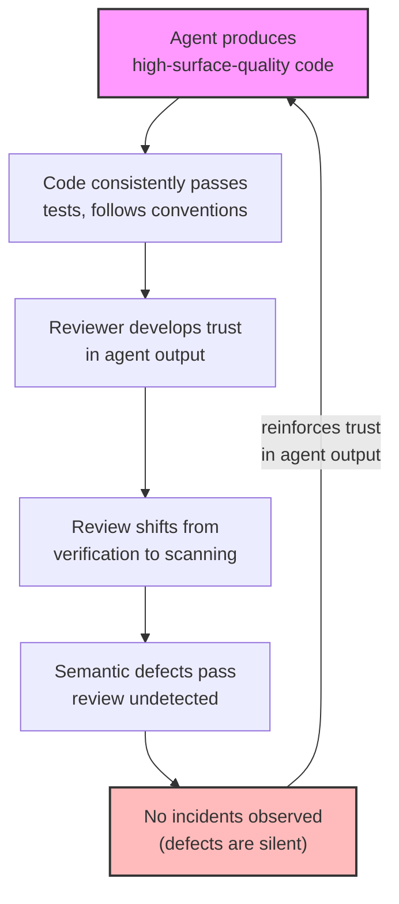
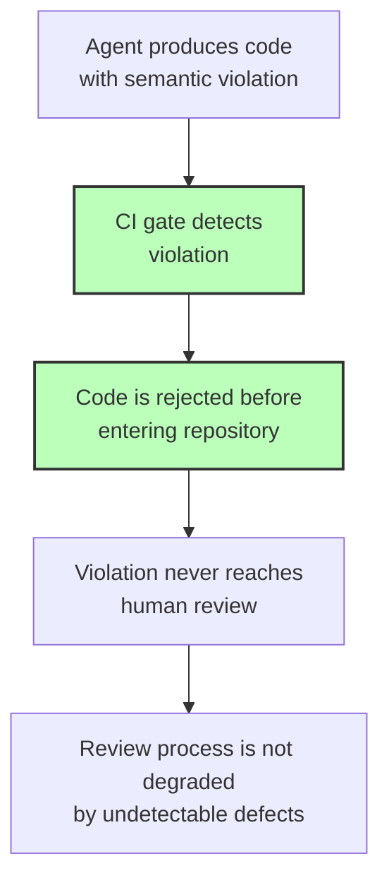
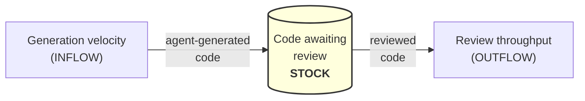
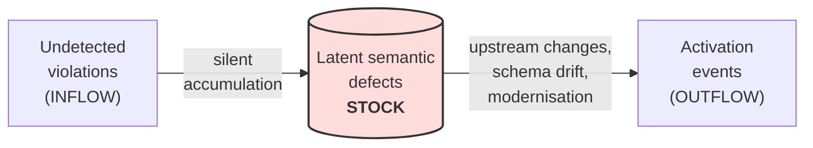

This appendix provides a brief introduction to the systems thinking concepts that underpin the paper's analysis. The paper uses systems-theoretic reasoning throughout — feedback loops, archetypes, stock-flow dynamics, and leverage point analysis — but does not assume the reader is familiar with these frameworks. Readers who already work in systems dynamics or safety engineering may skip this appendix. Readers coming from a security engineering or policy background will find it useful as an interpretive guide to the analytical structure of the preceding sections.

## Why systems thinking, not just security analysis

Security engineering excels at analysing threats with an identifiable adversary. The threat described in this paper does not have one. The agent is not attacking the system. The reviewer is not negligent. Each component is working as designed. The failure emerges from the *interaction* between components — a capable-but-context-blind generator, a volume-constrained review process, and institutional pressure to ship — not from any component being individually broken.

This class of failure — emergent, non-adversarial, arising from system structure rather than component defect — is the domain of **systems thinking** and **safety engineering** (Leveson 2011; Meadows 2008; Senge 1990). The paper's recommendations lean toward the safety engineering side because that is where the threat structure sits: the control law metaphor borrows from fly-by-wire aviation's degradation modes, the validation boundary functions as an interlock rather than an access gate, and the emphasis on environmental controls over behavioural controls follows the safety engineering principle that the safe path should be the easy path. These are safety controls applied to a safety problem that happens to live inside a security governance framework.

The concepts below are adapted to the agentic code context. They are the analytical machinery behind the paper's arguments about why some interventions work and others do not.

## Feedback loops

A feedback loop exists when the output of a process influences its own future input. Two kinds matter for this paper:

**Reinforcing loops (R)** amplify a trend — they make things grow or decline faster. Left unchecked, they produce exponential behaviour.

**Balancing loops (B)** resist a trend — they push a system toward equilibrium or a target. They are the mechanism behind every control, every review process, every governance gate.

The paper's core dynamic is a reinforcing loop that degrades review quality:

**Diagram description (accessibility):** A circular reinforcing loop (R1) with six stages. Agent produces high-surface-quality code, which consistently passes tests and follows conventions, which causes reviewers to develop trust in agent output, which shifts review from verification to scanning, which allows semantic defects to pass review undetected, which produces no observed incidents (because the defects are silent), which reinforces trust in agent output — completing the loop. Each cycle weakens review further.

This is a reinforcing loop (R1) — each cycle makes the next cycle worse. The absence of observable incidents is not evidence of safety; it is the mechanism by which the loop sustains itself. Automated semantic boundary enforcement breaks the loop by inserting a check between "code passes tests" and "reviewer develops trust"; provenance tracking breaks it by making the trust distinction explicit.

The corresponding balancing loop — the one the paper argues must be strengthened — is the enforcement boundary:

**Diagram description (accessibility):** A linear flow showing the balancing mechanism (B1). Agent produces code with a semantic violation, CI gate detects violation, code is rejected before entering the repository, the violation never reaches human review, and the review process is not degraded by undetectable defects. This is the enforcement boundary breaking the reinforcing loop.

This is a balancing loop (B1) — it counteracts the reinforcing loop by catching violations before they can contribute to the habituation effect. The case study reports violations caught at a non-trivial daily rate through this mechanism.

## The "Shifting the Burden" archetype

The paper references the "Shifting the Burden" systems archetype (Senge 1990; Meadows 2008). This subsection explains what an archetype is and why this one matters.

**Systems archetypes** are recurring configurations of feedback loops that produce characteristic behaviour regardless of the specific actors or technologies involved. Recognising an archetype is useful because the interventions that work (and do not work) are already known from other domains.

**"Shifting the Burden"** describes a system with two responses to a problem: a *symptomatic solution* that is fast, visible, and immediately effective, and a *fundamental solution* that is slow, difficult, and addresses the root cause. Over time, the symptomatic solution's success weakens commitment to the fundamental solution — because the problem appears to be managed. The fundamental solution atrophies. When the symptomatic solution eventually fails or is removed, the system is worse off than before because the fundamental capability has degraded.

In the agentic context:

| Element | In the archetype | In this paper |
|---------|-----------------|---------------|
| **Problem** | A recurring difficulty | Semantic defects in code entering the repository |
| **Symptomatic solution** | Fast, visible, immediately effective | Treating surface-quality signals (tests pass, conventions followed, code looks correct) as a proxy for semantic correctness |
| **Fundamental solution** | Slow, difficult, addresses root cause | Thorough human review capable of evaluating semantic correctness in institutional context |
| **Side effect** | Symptomatic solution weakens fundamental solution | Consistent surface quality produces habituation — reviewers shift from verification to scanning |
| **Collapse** | Fundamental solution has atrophied when needed | When a semantic violation arrives, the review process has been degraded by the very consistency that made it appear unnecessary |

The archetype explains why "review harder" is not a viable response — it asks the fundamental solution to reassert itself after the symptomatic solution has spent months weakening it. The viable responses are structural: either strengthen the fundamental solution with tools that do not habituate (automated semantic enforcement), or change the information flows so that the symptomatic solution's side effects become visible (provenance tracking, review quality metrics).

## Stock-flow dynamics

A **stock** is an accumulation — something that can be measured at a point in time. A **flow** is a rate — something measured over time. The relationship between stocks and flows is the source of most non-obvious system behaviour.

The paper's core stock-flow argument is:

**Diagram description (accessibility):** A stock-flow diagram showing generation velocity as the inflow into a stock of code awaiting review, with review throughput as the outflow. When the inflow exceeds the outflow, the stock grows — the review backlog accumulates.

When inflow exceeds outflow, the review backlog grows. Three interventions differ markedly in leverage:

| Intervention | Stock-flow target | Leverage | Assessment |
|-------------|-------------------|----------|------------|
| **Rate-limit agent output** | Reduce inflow | Low — sacrifices the benefit to manage the risk | Not recommended as primary control |
| **Add more reviewers** | Increase outflow capacity | Low-moderate — linear scaling, expensive, still subject to habituation | Necessary but low-leverage |
| **Automate semantic pre-screening** | Increase outflow *processing rate* without adding human capacity | High — changes the structure of the outflow, not its quantity | Core recommendation |

The third is highest-leverage because it changes what kind of review the outflow requires, rather than adjusting a parameter within the existing structure. This is a general principle: interventions that change system structure are more durable than interventions that adjust parameters within an unchanged structure.

A subtler dynamic is the accumulation of latent defects — the "dormant-but-activatable" stockpile:

**Diagram description (accessibility):** A stock-flow diagram showing undetected violations as the inflow into a stock of latent semantic defects, with activation events (upstream changes, schema drift, modernisation) as the outflow. The stock grows silently; the outflow is unpredictable and potentially correlated.

This stock grows silently and drains through activation events: upstream contract changes, schema drift, or integration changes that exercise previously dormant code paths. Unlike the review backlog, this stock is invisible until it drains — and once large, the activation events are unpredictable and potentially correlated. This is why the paper emphasises detection (reducing the inflow) over incident response (managing the outflow).

## Levels of intervention: Meadows' leverage points

Donella Meadows (2008) identified twelve places to intervene in a system, ordered from lowest to highest leverage. Not all twelve are relevant to the agentic code problem, but the hierarchy explains why the controls this paper proposes are not all equally important — and why the most powerful of them are often the least concrete.

The relevant levels, mapped to the controls this paper proposes:

| Meadows Level | Description | Paper's equivalent | Where discussed |
|---------------|-------------|------------------------|-----------------|
| **12. Parameters** | Adjusting numbers within an unchanged structure | "Review harder," "add more test coverage" | Dismissed — parameter changes cannot address structural problems |
| **11. Buffer sizes** | Increasing the capacity of a stock | "Add more reviewers" | Necessary but low-leverage |
| **10. Stock-flow structure** | Changing how stocks and flows are physically connected | CI gate architecture — inserting a new control point in the flow | High leverage, changes the physical structure |
| **9. Delays** | Reducing the time between an action and its consequence | Pre-commit enforcement (immediate feedback) vs post-review advisory (delayed feedback) | "Enforcement at the boundary, not feedback over time" |
| **8. Balancing feedback loops** | Strengthening the loops that correct deviation | Automated semantic enforcement — the B1 loop | Core technical recommendation |
| **7. Reinforcing feedback loops** | Weakening the loops that amplify deviation | Breaking the habituation loop (R1) through provenance tracking and review quality metrics | Makes the degradation visible |
| **6. Information flows** | Changing who has access to what information, and when | Provenance tracking, control law visibility, review quality metrics | High leverage, low cost |
| **5. Rules** | Changing the formal rules that govern the system | ISM extensions, contract clauses, accreditation criteria | Moderate leverage |
| **4. Power to change structure** | Who can change the rules | Addressing the proposals to ASD/ACSC (the bodies with cross-government mandate) | The paper is *requesting* a level-4 intervention |
| **3. Goals** | Redefining what the system is trying to achieve | Reframe from "does the code work?" to "is the code correct for this institutional context?" | The paper's deepest argument |
| **2. Paradigm** | The mindset out of which the goals and rules arise | "Agent output is untrusted input" | A paradigm shift, not a parameter adjustment |

Three observations follow from this mapping:

**First, the paper's most powerful recommendation is to treat agent output as untrusted input.** This is a paradigm-level intervention (level 2). Once the paradigm shifts, the lower-level interventions (ISM extensions, CI gates, provenance tracking) follow naturally. Without it, those interventions are disconnected rules that organisations comply with reluctantly.

**Second, the emphasis on technical controls over behavioural controls** reflects the leverage hierarchy, not arbitrary preference. Behavioural controls operate at level 12 (parameters). Procedural controls operate at level 5 (rules). Technical controls operate at levels 8–10 (feedback loops, delays, stock-flow structure). The leverage difference is qualitative, not linear — a level-10 intervention reshapes the system; a level-12 intervention adjusts a dial within the existing shape.

**Third, several of the highest-leverage interventions are also the lowest-cost.** Information flow interventions (level 6) — provenance tracking, control law visibility, review quality metrics — require modest engineering investment but fundamentally change the system's ability to detect its own degradation.

## Connecting the frameworks

These are four views of the same system:

- The **safety engineering frame** tells you *what kind of problem* this is: emergent, non-adversarial, arising from interactions between components each working as designed.
- The **feedback loops** tell you *why the problem self-reinforces*: the habituation loop degrades the very control that should catch the failures.
- The **stock-flow dynamics** tell you *where the risk accumulates*: in the review backlog (visible) and in the latent defect stockpile (invisible until activated).
- The **leverage points** tell you *where to intervene*: not at the parameter level but at the structural and paradigm levels.

Together, they explain the paper's central strategic claim: the response is not intensified ordinary review but a structural change in what the review system checks for, supported by a paradigm shift in how agent output is classified.

**References.** The primary references are: Meadows, D. *Thinking in Systems: A Primer.* Chelsea Green Publishing, 2008. Senge, P. *The Fifth Discipline.* Doubleday/Currency, 1990. Leveson, N.G. *Engineering a Safer World: Systems Thinking Applied to Safety.* MIT Press, 2011. Meadows' leverage points (Chapter 6 of *Thinking in Systems*) provide the intervention hierarchy. Senge's archetypes (Chapters 5–6 of *The Fifth Discipline*) provide the "Shifting the Burden" analysis. Leveson's systems-theoretic accident model provides the safety engineering frame. All three are accessible to non-specialist readers.

## See also

- [Introduction](../../threat-model/introduction/) — the core argument and threat model overview
- [Threat Landscape](../../threat-model/threat-landscape/) — the structural dynamics that systems thinking illuminates
- [Response Landscape](../../threat-model/response-landscape/) — controls and interventions mapped to leverage points
