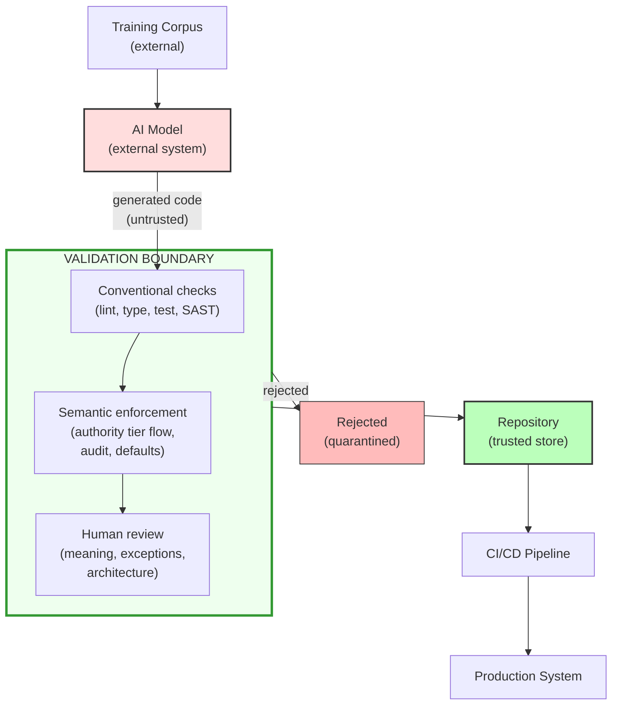

STRIDE (Spoofing, Tampering, Repudiation, Information Disclosure, Denial of Service, Elevation of Privilege) is an established threat-modelling framework used in Australian government security assessments. Applying it to agentic code output uses a vocabulary already familiar to policy audiences.

The application here treats **agent-generated code as an input** to the system, analogous to treating user input as untrusted. The agent is not an adversary, but its output has the same authority properties as any external input: it may be well-formed and reasonable, but it has not been validated against the system's security requirements.

Two categories — fabricated default under Spoofing and the process-level Denial of Service entries — are **analogical extensions** of STRIDE's original technical-system categories. They are candidate extensions rather than standard applications. The reader should understand them as novel mappings and weigh each failure mode on its own merits.

## Data flow diagram

The standard artefact from a threat model is a **data flow diagram (DFD)** showing processes, data stores, data flows, and trust boundaries. The DFD for the agentic development workflow is:

**Diagram description:** An AI model, informed by an external training corpus, produces untrusted generated code. That code passes through a validation boundary consisting of three sequential layers: conventional checks, semantic enforcement, and human review. Code exits either as rejected and quarantined, or as validated into the trusted repository, from which it proceeds through CI/CD into production.

The most important observation is visible before any category-by-category enumeration: the AI model is an **external system** producing output that crosses a trust boundary into the repository. It occupies the same structural position as any external data source and warrants the same boundary discipline.

## Threat categories

| Category | ACF entries | Characterisation |
| --- | --- | --- |
| [Spoofing](./spoofing/) | ACF-S1 through ACF-S5 | 5 entries: 3 core, 2 provisional; fabricated competence signals and structural identities |
| [Tampering](./tampering/) | ACF-T1 through ACF-T4 | 4 entries: 3 core, 1 provisional; includes Critical-rated authority tier conflation |
| [Repudiation](./repudiation/) | ACF-R1 through ACF-R6 | 6 entries: 4 core, 2 provisional; audit trail destruction and verification displacement |
| [Information Disclosure](./information-disclosure/) | ACF-I1 | 1 core entry; verbose error responses |
| [Denial of Service](./denial-of-service/) | ACF-D1 and ACF-D2 | 2 core entries; finding flood and review capacity exhaustion |
| [Elevation of Privilege](./elevation-of-privilege/) | ACF-E1 and ACF-E2 | 2 core entries; includes Critical-rated implicit privilege grant |

## The compounding effect

The six categories do not operate independently. In practice, they compound: agents generate a flood of code that follows established good practice, arriving at review boundaries faster than human assurance processes can absorb it, in systems with the least tolerance for those failure modes.

One illustrative sequence is:

1. Authority tier conflation ([ACF-T1](../../acf/t1-authority-tier-conflation/)) creates the conditions for implicit privilege grant ([ACF-E1](../../acf/e1-implicit-privilege-grant/)): external API data is used directly without validation.
2. A broad exception handler catches errors in that data, producing audit trail destruction ([ACF-R1](../../acf/r1-audit-trail-destruction/)).
3. The handler substitutes a fabricated default ([ACF-S1](../../acf/s1-fabricated-default/)) instead of surfacing uncertainty.
4. Review capacity exhaustion ([ACF-D2](../../acf/d2-review-capacity-exhaustion/)) allows the compound pattern to pass before merge.

Each part can resemble conventional good practice: responsible error handling, defensive defaults, or clean integration code. Together they produce a system that silently returns wrong results, cannot explain why, and passed every review gate.

A subtler compounding mechanism operates across time: upstream representational choices can collapse the semantic distinctions that downstream code needs. When a typed contract is flattened into a permissive dictionary structure, downstream defensive access patterns cease to look anomalous and begin to look prudent — upstream looseness manufactures the local conditions under which defensive handling appears justified. The [Trust Boundaries](../trust-boundaries/) section develops this as bidirectional authority collapse.

The [case study evidence](../../respond/case-study/) in Appendix E presents an incident in which this mechanism produced a latent bug that passed all automated checks and was only surfaced through four rounds of operator challenge. When agents produce these compounding shapes as a recurring characteristic rather than an occasional lapse, dormant but activatable defects accumulate. The resulting risk profile is qualitatively different from the same mistakes appearing sporadically at human velocity.

## Methodology note

Using a security framework to categorise what is fundamentally a safety problem is a deliberate pragmatic choice. T, I, and E map naturally; S is analogical because fabricated data presents as authoritative rather than forging an identity; D is the loosest fit because it concerns depletion of a security control rather than an attack on a runtime service.

The taxonomy intentionally mixes code-level semantic failures with process-level assurance failures because they interact: code-level failures pass review *because* of process-level failures. It indexes observable artefacts rather than generative causes, since artefacts are what detection tools and review processes can act on.

For the complete catalogue, see the [ACF Taxonomy Registry](../../acf/).
