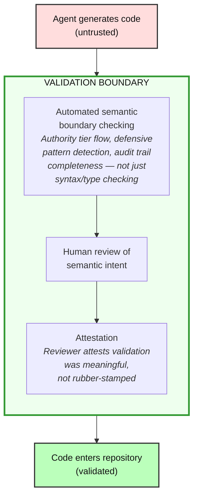

This section introduces the authority-tier model and the treatment of agent output as untrusted input requiring boundary validation. It provides the analytical vocabulary that the [guidance gap analysis](../guidance-gap/) and [response landscape](../response-landscape/) build on.

## The authority-tier model

Data in high-stakes systems can be classified into authority tiers: how much authority the data carries to justify continued execution, and how little latitude the system may give anomalies before it must stop. The tier reflects what guarantees the system is entitled to assume: data the system itself produced is authoritative at source; data from an external source is unvalidated regardless of quality.

The tier governs how the system treats the data. The path governs how the system responds when that data fails.

| Tier | Description | Handling rule | Example |
|------|-------------|---------------|---------|
| **Tier 1: Authoritative internal data** (trusted assertion) | Data produced by the system's own controlled processes — audit records, internal state, configuration | Treat as authoritative. Missingness, corruption, or contradiction is an integrity failure, not an invitation to default. Halt or reject the current operation; the exact failure response is path-specific | Database audit trail, system configuration, internal state machines |
| **Tier 2: Semantically validated data** (semantically validated representation) | Data that has passed both structural validation and domain-constraint checking — values are present, correctly typed, and satisfy business rules, range constraints, and cross-field invariants | Trust for domain operations once validated. Guard only against cross-cutting concerns (authorisation, concurrency, freshness, state transitions) that value-level validation cannot address | API response after schema validation *and* domain-rule verification, database record promoted through a business-rule gate |
| **Tier 3: Shape-validated data** (shape-validated representation) | Data that entered the system from outside but has passed through only a structural validation boundary — fields are present and types are correct, but values may still be nonsensical, unsafe, or out of domain range | Direct field access is safe; validate domain constraints before using values in business logic, arithmetic, or security-sensitive operations | API response after schema validation, CSV row after type coercion |
| **Tier 4: Unvalidated external data** (raw observation) | Data from outside the system boundary, not yet validated | Do not use in high-stakes code paths until validated. Validate at the boundary and quarantine failures | Raw API responses, user uploads, message queue payloads |

On an audit-trail path, an integrity failure may require the process to stop — a corrupted audit record means the system can no longer prove what happened. On an authentication path, a missing username halts the login attempt but the system keeps running, because a failed login does not compromise other operations. Both paths treat the data with zero latitude for corruption or substitution. Both refuse to fabricate a default. But one crashes the process and the other rejects a request. The difference is not in the authority of the data, but in the operational consequences of its failure.

The principle that external inputs should be validated at the perimeter is standard security engineering. The four-tier taxonomy formalises that principle. The distinction between Tier 2 and Tier 3 — semantically validated versus shape-validated — captures a boundary that is critical in practice but invisible to most tooling: data with the right *shape* can still carry values that violate domain constraints. Treating shape-validated data as semantically validated is a common source of defects in high-stakes code paths.

The as-built Wardline specification maps the four tiers onto the [eight-state trust lattice](../../wardline/trust-lattice/#interpretation-for-readers-of-the-parent-paper) that its implementation actually enforces. The mapping is a reading aid, not an enforcement claim: the tier model's transition semantics — shape validation before semantic validation, with no skip-promotion to Tier 1 — are not enforced by the implementation, and the designed restoration-boundary evidence model was [never built](../../wardline/roadmap-the-unbuilt/#trusted-restoration-boundaries).

One consequence of the tier model that practitioners encounter immediately is that **serialisation boundaries reset trust**. A Tier 1 audit record written to a database and later read back enters the read interface at the trust level of unvalidated data. Its authority must be re-established through restoration controls such as integrity verification and schema conformance before it can be treated as authoritative again. The designed restoration model distinguished this from ordinary external-data validation: provenance is known, but integrity across the serialisation boundary is not, so re-establishment may use provenance evidence rather than full Tier 4 validation. That model was never implemented; the nearest shipped control conservatively flags stored or persisted taint that reaches a trusted state without validation.

Uniform defensive patterns collapse the authority model from both directions. Agent-generated code gives Tier 4 data more authority than it has earned: defaults and coercion allow unvalidated data to cross inward as though verified. Simultaneously, it treats Tier 1 data as more negotiable than the tier permits: the same `.get()`-with-default and catch-and-continue patterns handle corruption of authoritative records as routine rather than exceptional.

This **bidirectional authority collapse** is the central mechanism by which one-size-fits-all defensive programming undermines a tiered authority architecture.

## Agent code as untrusted input

The authority-tier model describes data flowing through a running system. Agent-generated code is not runtime data, and forcing it into Tier 3 would overload the model. But the analogy is instructive: just as external data must not enter an authoritative store without passing through a validation boundary, **agent-generated code must not enter the codebase until it has been reviewed — not only by a human reviewer but also by automated structural and semantic checks.** The principle is the same; the mechanism is different.

This is not a claim about agent quality. Agents produce high-quality code much of the time. It is a claim about *provenance*: assurance comes from the organisation's validation process rather than the tool's statistical quality, because the relevant property is verified correctness, not apparent competence. The agent is an external system. Its output has not been validated against the system's security requirements. The fact that the output is source code rather than JSON or CSV does not change its trust properties.

The natural organisational instinct is to treat agent output as carrying the authority of the person who directed the agent. If the chief engineer uses an agent to implement a feature, the resulting code can feel like the chief engineer's own product and inherit the review deference their code would receive. That is the wrong model. The chief engineer directed the work, but the code was generated by a system that has not validated its output against the project's security requirements.

The appropriate analogy is not "code written by a trusted senior engineer" but "code submitted to the repository by an external contributor whose competence is plausible but unverified."

The directing engineer's authority is relevant to the *decision to accept* the code after review, not to the *trust level of the code before review*. Otherwise the human operator's authority launders the provenance of the machine output — precisely the implicit trust escalation the tier model is designed to prevent.

Fine-tuning does not change that trust level. An agent fine-tuned on the organisation's codebase may be statistically more likely to follow local conventions, but it has not validated its output against security requirements. Fine-tuning changes the prior probability of correctness; it **does not change the epistemic status of the output**. Validated status comes from passing review and enforcement — an event, not a property of the generating tool — just as hiring a trustworthy contractor does not eliminate acceptance testing. Related model-lineage concerns are discussed in the [open questions](../open-questions/).

Treating agent code as untrusted input has specific implications:

| Principle | Application |
|-----------|-------------|
| **Validate at the boundary** | Agent output must pass security-aware validation before entering the codebase |
| **Quarantine failures** | Code that fails validation is rejected, not silently corrected |
| **Record original output** | The original agent output is preserved for audit, even if modified during review |
| **No silent coercion** | Agent code is not silently "fixed up" by reviewers — changes are explicit and recorded |

## Implications for the development workflow

Because agent output is untrusted, the development workflow must include a **validation boundary** between generation and integration:

**Diagram description (accessibility):** The diagram shows a three-stage flowchart: (1) Agent generates code (untrusted); (2) Code passes through a Validation Boundary containing three sequential steps — automated semantic boundary checking (authority tier flow, defensive pattern detection, audit trail completeness — not just syntax/type checking), human review of semantic intent, and attestation (reviewer attests validation was meaningful, not rubber-stamped); (3) Code enters repository (validated). The key message: code moves from untrusted to validated only after passing through all three validation steps.

The key difference from current practice is that **validation must be semantically aware, not just syntactically or functionally correct**. Current checks ask whether code works and follows known vulnerability patterns. The core failures in the [ACF taxonomy](../../acf/) pass both questions. The validation boundary must ask whether defaults fabricate authoritative data, error handlers destroy audit trails, and data crosses a trust boundary without validation. Those questions require knowledge of what code means in its operational context, expressed as repository-enforced rules rather than left in documentation or reviewer memory.

The validation boundary is a layered stack, and the layers are not interchangeable:

1. **Conventional checks** — syntax, types, linting, unit tests, and known-vulnerability scanning. These are necessary but insufficient: the core semantic failure modes pass this level.
2. **Semantic enforcement** — purpose-built checks for authority-tier flow, path-appropriate failure behaviour, audit-trail preservation, fabricated defaults, and validation-boundary crossings. This is the missing layer that does not yet exist in standard tooling.
3. **Human review after semantic pre-screening** — humans adjudicate meaning, exceptions, and architecture: whether trust topology is correctly declared, whether validation is actually correct rather than merely present, and whether an exception is justified. Machines handle pattern-level detection first; humans focus on semantic adequacy.

This structure is **defence in depth** applied to code integration. Each layer catches a different class of failure; no single layer is sufficient; and a conventional check does not substitute for semantic enforcement any more than a firewall substitutes for application-level input validation. The distinction is that the middle layer is not yet a standard control category.

Building that layer is the core technical recommendation developed in the [response landscape](../response-landscape/). One production deployment exists, Wardline provides a shipped static-analysis reference implementation for a subset of the problem, and several feasible implementation paths are available. The specific tools will evolve faster than the underlying requirement. A minimum viable validation boundary can progress from low-cost rule-and-checklist approaches to automated semantic enforcement integrated into CI/CD.

## See also

- [STRIDE Applied to Agentic Code](../stride/) — failure modes classified by threat category
- [ACF-T1: Authority Tier Conflation](../../acf/t1-authority-tier-conflation/) and [ACF-E1: Implicit Privilege Grant](../../acf/e1-implicit-privilege-grant/) — the two Critical-rated failures that exploit trust-boundary weaknesses
- [The Review Problem](../review-problem/) — why human review alone is insufficient
- [The Guidance Gap](../guidance-gap/) — how existing frameworks fall short
- [The Response Landscape](../response-landscape/) — practical responses to agentic code risk
